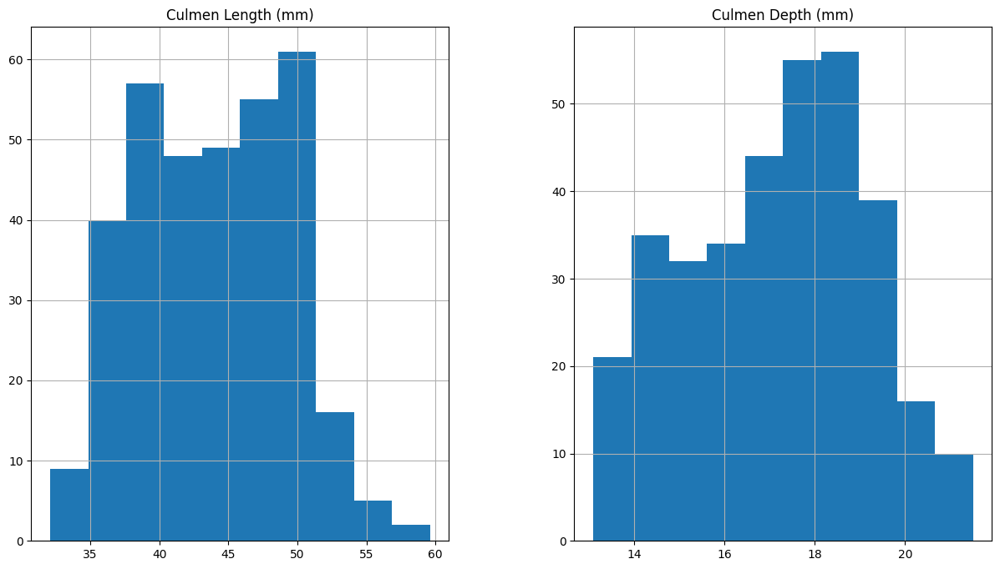
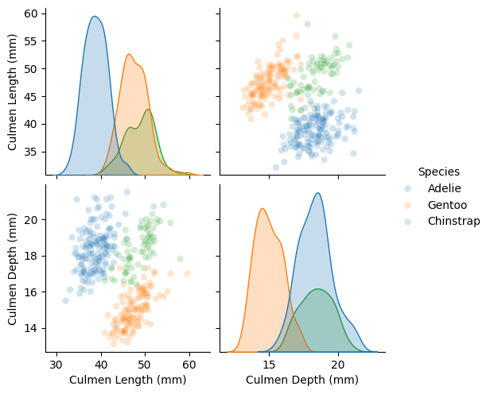
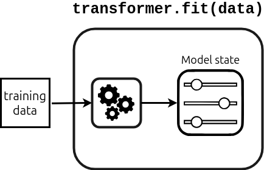
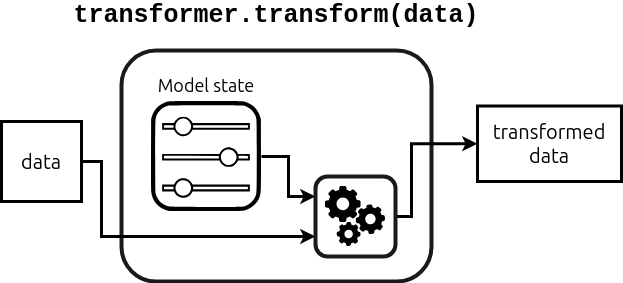
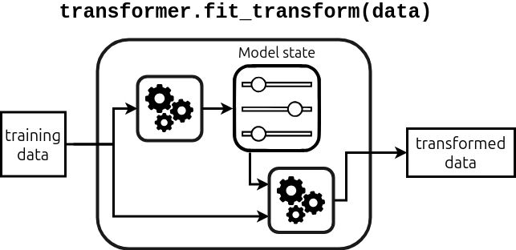
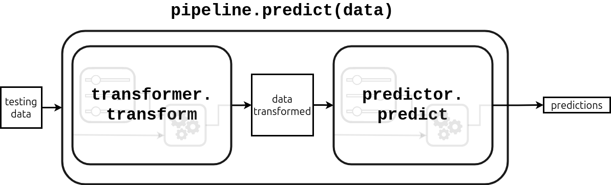
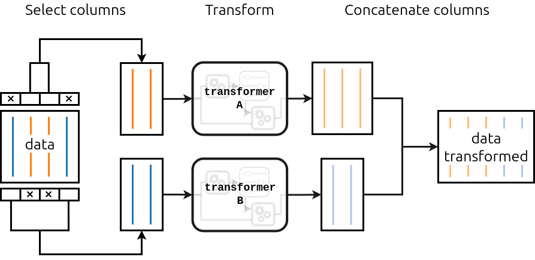

# Tabular data exploration

Careful with
- class imbalance in target data -> needs special treatment. for instance, the model may learn to predict the majority class just because it's the majority. 
- class imbalance in predictor (sex) -> model parameters may be dominated by majority group, leading to larger prediction errors for minority groups

To get the data 
```bash
wget https://zenodo.org/records/14851649/files/datasets.zip 
unzip datasets.zip
```


```python
import pandas as pd
```


```python
?pd.crosstab
```


    Signature:
    pd.crosstab(
        index,
        columns,
        values=None,
        rownames=None,
        colnames=None,
        aggfunc=None,
        margins: 'bool' = False,
        margins_name: 'Hashable' = 'All',
        dropna: 'bool' = True,
        normalize: "bool | Literal[0, 1, 'all', 'index', 'columns']" = False,
    ) -> 'DataFrame'
    Docstring:
    Compute a simple cross tabulation of two (or more) factors.
    
    By default, computes a frequency table of the factors unless an
    array of values and an aggregation function are passed.
    
    Parameters
    ----------
    index : array-like, Series, or list of arrays/Series
        Values to group by in the rows.
    columns : array-like, Series, or list of arrays/Series
        Values to group by in the columns.
    values : array-like, optional
        Array of values to aggregate according to the factors.
        Requires `aggfunc` be specified.
    rownames : sequence, default None
        If passed, must match number of row arrays passed.
    colnames : sequence, default None
        If passed, must match number of column arrays passed.
    aggfunc : function, optional
        If specified, requires `values` be specified as well.
    margins : bool, default False
        Add row/column margins (subtotals).
    margins_name : str, default 'All'
        Name of the row/column that will contain the totals
        when margins is True.
    dropna : bool, default True
        Do not include columns whose entries are all NaN.
    normalize : bool, {'all', 'index', 'columns'}, or {0,1}, default False
        Normalize by dividing all values by the sum of values.
    
        - If passed 'all' or `True`, will normalize over all values.
        - If passed 'index' will normalize over each row.
        - If passed 'columns' will normalize over each column.
        - If margins is `True`, will also normalize margin values.
    
    Returns
    -------
    DataFrame
        Cross tabulation of the data.
    
    See Also
    --------
    DataFrame.pivot : Reshape data based on column values.
    pivot_table : Create a pivot table as a DataFrame.
    
    Notes
    -----
    Any Series passed will have their name attributes used unless row or column
    names for the cross-tabulation are specified.
    
    Any input passed containing Categorical data will have **all** of its
    categories included in the cross-tabulation, even if the actual data does
    not contain any instances of a particular category.
    
    In the event that there aren't overlapping indexes an empty DataFrame will
    be returned.
    
    Reference :ref:`the user guide <reshaping.crosstabulations>` for more examples.
    
    Examples
    --------
    >>> a = np.array(
    ...     [
    ...         "foo",
    ...         "foo",
    ...         "foo",
    ...         "foo",
    ...         "bar",
    ...         "bar",
    ...         "bar",
    ...         "bar",
    ...         "foo",
    ...         "foo",
    ...         "foo",
    ...     ],
    ...     dtype=object,
    ... )
    >>> b = np.array(
    ...     [
    ...         "one",
    ...         "one",
    ...         "one",
    ...         "two",
    ...         "one",
    ...         "one",
    ...         "one",
    ...         "two",
    ...         "two",
    ...         "two",
    ...         "one",
    ...     ],
    ...     dtype=object,
    ... )
    >>> c = np.array(
    ...     [
    ...         "dull",
    ...         "dull",
    ...         "shiny",
    ...         "dull",
    ...         "dull",
    ...         "shiny",
    ...         "shiny",
    ...         "dull",
    ...         "shiny",
    ...         "shiny",
    ...         "shiny",
    ...     ],
    ...     dtype=object,
    ... )
    >>> pd.crosstab(a, [b, c], rownames=["a"], colnames=["b", "c"])
    b   one        two
    c   dull shiny dull shiny
    a
    bar    1     2    1     0
    foo    2     2    1     2
    
    Here 'c' and 'f' are not represented in the data and will not be
    shown in the output because dropna is True by default. Set
    dropna=False to preserve categories with no data.
    
    >>> foo = pd.Categorical(["a", "b"], categories=["a", "b", "c"])
    >>> bar = pd.Categorical(["d", "e"], categories=["d", "e", "f"])
    >>> pd.crosstab(foo, bar)
    col_0  d  e
    row_0
    a      1  0
    b      0  1
    >>> pd.crosstab(foo, bar, dropna=False)
    col_0  d  e  f
    row_0
    a      1  0  0
    b      0  1  0
    c      0  0  0
    File:      ~/repositories/teaching/sicss-2026/ml_workshop/lib/python3.12/site-packages/pandas/core/reshape/pivot.py
    Type:      function


```python
!ls ../datasets
```

    adult-census.csv	       cps_85_wages.csv
    adult-census-numeric-all.csv   financial-data
    adult-census-numeric.csv       house_prices.csv
    adult-census-numeric-test.csv  penguins_classification.csv
    ames_housing_no_missing.csv    penguins.csv
    bike_rides.csv		       penguins_regression.csv
    blood_transfusion.csv	       README.md


## Exercise M1.01


```python
penguins = pd.read_csv("../datasets/penguins_classification.csv")
```


```python
penguins.head()
```


<div>
<style scoped>
    .dataframe tbody tr th:only-of-type {
        vertical-align: middle;
    }

    .dataframe tbody tr th {
        vertical-align: top;
    }

    .dataframe thead th {
        text-align: right;
    }
</style>
<table border="1" class="dataframe">
  <thead>
    <tr style="text-align: right;">
      <th></th>
      <th>Culmen Length (mm)</th>
      <th>Culmen Depth (mm)</th>
      <th>Species</th>
    </tr>
  </thead>
  <tbody>
    <tr>
      <th>0</th>
      <td>39.1</td>
      <td>18.7</td>
      <td>Adelie</td>
    </tr>
    <tr>
      <th>1</th>
      <td>39.5</td>
      <td>17.4</td>
      <td>Adelie</td>
    </tr>
    <tr>
      <th>2</th>
      <td>40.3</td>
      <td>18.0</td>
      <td>Adelie</td>
    </tr>
    <tr>
      <th>3</th>
      <td>36.7</td>
      <td>19.3</td>
      <td>Adelie</td>
    </tr>
    <tr>
      <th>4</th>
      <td>39.3</td>
      <td>20.6</td>
      <td>Adelie</td>
    </tr>
  </tbody>
</table>
</div>


- numerical: culmen length/depth
- categorical: species


```python
penguins["Species"].value_counts()
```


    Species
    Adelie       151
    Gentoo       123
    Chinstrap     68
    Name: count, dtype: int64


```python
numerical_columns = penguins.columns[:2]
numerical_columns
```


    Index(['Culmen Length (mm)', 'Culmen Depth (mm)'], dtype='str')


```python
_ = penguins[numerical_columns].hist(figsize=(40,8), layout=(1,5))
```


    

    


```python
import seaborn as sns
```


```python
penguins.head()
```


<div>
<style scoped>
    .dataframe tbody tr th:only-of-type {
        vertical-align: middle;
    }

    .dataframe tbody tr th {
        vertical-align: top;
    }

    .dataframe thead th {
        text-align: right;
    }
</style>
<table border="1" class="dataframe">
  <thead>
    <tr style="text-align: right;">
      <th></th>
      <th>Culmen Length (mm)</th>
      <th>Culmen Depth (mm)</th>
      <th>Species</th>
    </tr>
  </thead>
  <tbody>
    <tr>
      <th>0</th>
      <td>39.1</td>
      <td>18.7</td>
      <td>Adelie</td>
    </tr>
    <tr>
      <th>1</th>
      <td>39.5</td>
      <td>17.4</td>
      <td>Adelie</td>
    </tr>
    <tr>
      <th>2</th>
      <td>40.3</td>
      <td>18.0</td>
      <td>Adelie</td>
    </tr>
    <tr>
      <th>3</th>
      <td>36.7</td>
      <td>19.3</td>
      <td>Adelie</td>
    </tr>
    <tr>
      <th>4</th>
      <td>39.3</td>
      <td>20.6</td>
      <td>Adelie</td>
    </tr>
  </tbody>
</table>
</div>


```python
target_column = penguins["Species"]
```


```python
sns.pairplot(
    data=penguins,
    vars=numerical_columns,
    hue="Species",
    plot_kws={"alpha": 0.2},
)
    
```


    <seaborn.axisgrid.PairGrid at 0x7eb614f98a40>


    

    


# Preprocessing numerical features

### Goal
- Previously oversimplified -- only numerical features, train-test split not automatic

Now
- automatically separate train-test splits
- train & evaluate more complex scikit-learn model
- show an example of preprocessing
- use a scikit-learn *pipeline* to chain processing and evaluation


```python
# load the entire dataset
import pandas as pd 
adult_census = pd.read_csv("../datasets/adult-census.csv")
```


```python
# drop duplicated column as stated in the slides
adult_census = adult_census.drop(columns="education-num")

```


```python
data = adult_census.drop(columns="class") # commonly named X in sklearn
target = adult_census["class"] # commonly named y in sklearn
```

Identifying numerical data
- numerical data are measurable -- age, number of hours worked
- they are represented by numbers -- but not all numerical columns represent numerical data!


```python
data[["age", "hours-per-week", "sex", "race"]].dtypes
```


    age               int64
    hours-per-week    int64
    sex                 str
    race                str
    dtype: object


```python
data[["age", "hours-per-week", "sex", "race"]].head()
```


<div>
<style scoped>
    .dataframe tbody tr th:only-of-type {
        vertical-align: middle;
    }

    .dataframe tbody tr th {
        vertical-align: top;
    }

    .dataframe thead th {
        text-align: right;
    }
</style>
<table border="1" class="dataframe">
  <thead>
    <tr style="text-align: right;">
      <th></th>
      <th>age</th>
      <th>hours-per-week</th>
      <th>sex</th>
      <th>race</th>
    </tr>
  </thead>
  <tbody>
    <tr>
      <th>0</th>
      <td>25</td>
      <td>40</td>
      <td>Male</td>
      <td>Black</td>
    </tr>
    <tr>
      <th>1</th>
      <td>38</td>
      <td>50</td>
      <td>Male</td>
      <td>White</td>
    </tr>
    <tr>
      <th>2</th>
      <td>28</td>
      <td>40</td>
      <td>Male</td>
      <td>White</td>
    </tr>
    <tr>
      <th>3</th>
      <td>44</td>
      <td>40</td>
      <td>Male</td>
      <td>Black</td>
    </tr>
    <tr>
      <th>4</th>
      <td>18</td>
      <td>30</td>
      <td>Female</td>
      <td>White</td>
    </tr>
  </tbody>
</table>
</div>


```python
# depending on your version of pandas, you may see "object" instead of "str" (pandas < 3.0)
```


```python
# let's select only the numerical columns now
numerical_columns = ["age", "capital-gain", "capital-loss", "hours-per-week"]
data[numerical_columns].head()
```


<div>
<style scoped>
    .dataframe tbody tr th:only-of-type {
        vertical-align: middle;
    }

    .dataframe tbody tr th {
        vertical-align: top;
    }

    .dataframe thead th {
        text-align: right;
    }
</style>
<table border="1" class="dataframe">
  <thead>
    <tr style="text-align: right;">
      <th></th>
      <th>age</th>
      <th>capital-gain</th>
      <th>capital-loss</th>
      <th>hours-per-week</th>
    </tr>
  </thead>
  <tbody>
    <tr>
      <th>0</th>
      <td>25</td>
      <td>0</td>
      <td>0</td>
      <td>40</td>
    </tr>
    <tr>
      <th>1</th>
      <td>38</td>
      <td>0</td>
      <td>0</td>
      <td>50</td>
    </tr>
    <tr>
      <th>2</th>
      <td>28</td>
      <td>0</td>
      <td>0</td>
      <td>40</td>
    </tr>
    <tr>
      <th>3</th>
      <td>44</td>
      <td>7688</td>
      <td>0</td>
      <td>40</td>
    </tr>
    <tr>
      <th>4</th>
      <td>18</td>
      <td>0</td>
      <td>0</td>
      <td>30</td>
    </tr>
  </tbody>
</table>
</div>


```python
# create a new dataframe for this subset of columns
data_numeric = data[numerical_columns]
```

### Train-test split the dataset
- we can do this automatically
- it is useful for building bigger pipelines with sklearn


```python
from sklearn.model_selection import train_test_split

data_train, data_test, target_train, target_test = train_test_split(
    data_numeric, target, random_state=42, test_size=0.25
)
# random_state -> deterministic results (same samples)
# test_size -> 1/4 of data are in test set
```

### Model fitting without pre-processing
- we'll use logistic regression instead of k-nearest neighbors
- it's a kind of linear model; more widely used than KNN

example rule: if `0.1 * age + 3.3 * hours-per-week - 15.1 > 0`, predict `high-income`


```python
from sklearn.linear_model import LogisticRegression
model = LogisticRegression()
```


```python
# use it as before
model.fit(data_train, target_train)
```


<style>.sk-global {
  /* Definition of color scheme common for light and dark mode */
  --sklearn-color-text: #000;
  --sklearn-color-text-muted: #666;
  --sklearn-color-line: gray;
  /* Definition of color scheme for unfitted estimators */
  --sklearn-color-unfitted-level-0: #fff5e6;
  --sklearn-color-unfitted-level-1: #f6e4d2;
  --sklearn-color-unfitted-level-2: #ffe0b3;
  --sklearn-color-unfitted-level-3: chocolate;
  /* Definition of color scheme for fitted estimators */
  --sklearn-color-fitted-level-0: #f0f8ff;
  --sklearn-color-fitted-level-1: #d4ebff;
  --sklearn-color-fitted-level-2: #b3dbfd;
  --sklearn-color-fitted-level-3: cornflowerblue;
}

.sk-global.light {
  /* Specific color for light theme */
  --sklearn-color-text-on-default-background: black;
  --sklearn-color-background: white;
  --sklearn-color-border-box: black;
  --sklearn-color-icon: #696969;
}

.sk-global.dark {
  --sklearn-color-text-on-default-background: white;
  --sklearn-color-background: #111;
  --sklearn-color-border-box: white;
  --sklearn-color-icon: #878787;
}

.sk-global {
  color: var(--sklearn-color-text);
}

.sk-global pre {
  padding: 0;
}

.sk-global input.sk-hidden--visually {
  border: 0;
  clip-path: inset(100%);
  height: 1px;
  margin: -1px;
  overflow: hidden;
  padding: 0;
  position: absolute;
  width: 1px;
}

.sk-global div.sk-dashed-wrapped {
  border: 1px dashed var(--sklearn-color-line);
  margin: 0 0.4em 0.5em 0.4em;
  box-sizing: border-box;
  padding-bottom: 0.4em;
  background-color: var(--sklearn-color-background);
}

.sk-global div.sk-container {
  /* jupyter's `normalize.less` sets `[hidden] { display: none; }`
     but bootstrap.min.css set `[hidden] { display: none !important; }`
     so we also need the `!important` here to be able to override the
     default hidden behavior on the sphinx rendered scikit-learn.org.
     See: https://github.com/scikit-learn/scikit-learn/issues/21755 */
  display: inline-block !important;
  position: relative;
}

.sk-global div.sk-text-repr-fallback {
  display: none;
}

div.sk-parallel-item,
div.sk-serial,
div.sk-item {
  /* draw centered vertical line to link estimators */
  background-image: linear-gradient(var(--sklearn-color-text-on-default-background), var(--sklearn-color-text-on-default-background));
  background-size: 2px 100%;
  background-repeat: no-repeat;
  background-position: center center;
}

/* Parallel-specific style estimator block */

.sk-global div.sk-parallel-item::after {
  content: "";
  width: 100%;
  border-bottom: 2px solid var(--sklearn-color-text-on-default-background);
  flex-grow: 1;
}

.sk-global div.sk-parallel {
  display: flex;
  align-items: stretch;
  justify-content: center;
  background-color: var(--sklearn-color-background);
  position: relative;
}

.sk-global div.sk-parallel-item {
  display: flex;
  flex-direction: column;
}

.sk-global div.sk-parallel-item:first-child::after {
  align-self: flex-end;
  width: 50%;
}

.sk-global div.sk-parallel-item:last-child::after {
  align-self: flex-start;
  width: 50%;
}

.sk-global div.sk-parallel-item:only-child::after {
  width: 0;
}

/* Serial-specific style estimator block */

.sk-global div.sk-serial {
  display: flex;
  flex-direction: column;
  align-items: center;
  background-color: var(--sklearn-color-background);
  padding-right: 1em;
  padding-left: 1em;
}


/* Toggleable style: style used for estimator/Pipeline/ColumnTransformer box that is
clickable and can be expanded/collapsed.
- Pipeline and ColumnTransformer use this feature and define the default style
- Estimators will overwrite some part of the style using the `sk-estimator` class
*/

/* Pipeline and ColumnTransformer style (default) */

.sk-global div.sk-toggleable {
  /* Default theme specific background. It is overwritten whether we have a
  specific estimator or a Pipeline/ColumnTransformer */
  background-color: var(--sklearn-color-background);
}

/* Toggleable label */
.sk-global label.sk-toggleable__label {
  cursor: pointer;
  display: flex;
  width: 100%;
  margin-bottom: 0;
  padding: 0.5em;
  box-sizing: border-box;
  text-align: center;
  align-items: center;
  justify-content: center;
  gap: 0.5em;
}

.sk-global label.sk-toggleable__label .caption {
  font-size: 0.6rem;
  font-weight: lighter;
  color: var(--sklearn-color-text-muted);
}

.sk-global label.sk-toggleable__label-arrow:before {
  /* Arrow on the left of the label */
  content: "▸";
  float: left;
  margin-right: 0.25em;
  color: var(--sklearn-color-icon);
}

.sk-global label.sk-toggleable__label-arrow:hover:before {
  color: var(--sklearn-color-text);
}

/* Toggleable content - dropdown */

.sk-global div.sk-toggleable__content {
  display: none;
  text-align: left;
  /* unfitted */
  background-color: var(--sklearn-color-unfitted-level-0);
}

.sk-global div.sk-toggleable__content.fitted {
  /* fitted */
  background-color: var(--sklearn-color-fitted-level-0);
}

.sk-global div.sk-toggleable__content pre {
  margin: 0.2em;
  border-radius: 0.25em;
  color: var(--sklearn-color-text);
  /* unfitted */
  background-color: var(--sklearn-color-unfitted-level-0);
}

.sk-global div.sk-toggleable__content.fitted pre {
  /* unfitted */
  background-color: var(--sklearn-color-fitted-level-0);
}

.sk-global input.sk-toggleable__control:checked~div.sk-toggleable__content {
  /* Expand drop-down */
  display: block;
  width: 100%;
  overflow: visible;
}

.sk-global input.sk-toggleable__control:checked~label.sk-toggleable__label-arrow:before {
  content: "▾";
}

/* Pipeline/ColumnTransformer-specific style */

.sk-global div.sk-label input.sk-toggleable__control:checked~label.sk-toggleable__label {
  color: var(--sklearn-color-text);
  background-color: var(--sklearn-color-unfitted-level-2);
}

.sk-global div.sk-label.fitted input.sk-toggleable__control:checked~label.sk-toggleable__label {
  background-color: var(--sklearn-color-fitted-level-2);
}

/* Estimator-specific style */

/* Colorize estimator box */
.sk-global div.sk-estimator input.sk-toggleable__control:checked~label.sk-toggleable__label {
  /* unfitted */
  background-color: var(--sklearn-color-unfitted-level-2);
}

.sk-global div.sk-estimator.fitted input.sk-toggleable__control:checked~label.sk-toggleable__label {
  /* fitted */
  background-color: var(--sklearn-color-fitted-level-2);
}

.sk-global div.sk-label label.sk-toggleable__label,
.sk-global div.sk-label label {
  /* The background is the default theme color */
  color: var(--sklearn-color-text-on-default-background);
}

/* On hover, darken the color of the background */
.sk-global div.sk-label:hover label.sk-toggleable__label {
  color: var(--sklearn-color-text);
  background-color: var(--sklearn-color-unfitted-level-2);
}

/* Label box, darken color on hover, fitted */
.sk-global div.sk-label.fitted:hover label.sk-toggleable__label.fitted {
  color: var(--sklearn-color-text);
  background-color: var(--sklearn-color-fitted-level-2);
}

/* Estimator label */

.sk-global div.sk-label label {
  font-family: monospace;
  font-weight: bold;
  line-height: 1.2em;
}

.sk-global div.sk-label-container {
  text-align: center;
}

/* Estimator-specific */
.sk-global div.sk-estimator {
  font-family: monospace;
  border: 1px dotted var(--sklearn-color-border-box);
  border-radius: 0.25em;
  box-sizing: border-box;
  margin-bottom: 0.5em;
  /* unfitted */
  background-color: var(--sklearn-color-unfitted-level-0);
}

.sk-global div.sk-estimator.fitted {
  /* fitted */
  background-color: var(--sklearn-color-fitted-level-0);
}

/* on hover */
.sk-global div.sk-estimator:hover {
  /* unfitted */
  background-color: var(--sklearn-color-unfitted-level-2);
}

.sk-global div.sk-estimator.fitted:hover {
  /* fitted */
  background-color: var(--sklearn-color-fitted-level-2);
}

/* Specification for estimator info (e.g. "i" and "?") */

/* Common style for "i" and "?" */

.sk-estimator-doc-link,
a:link.sk-estimator-doc-link,
a:visited.sk-estimator-doc-link {
  float: right;
  font-size: smaller;
  line-height: 1em;
  font-family: monospace;
  background-color: var(--sklearn-color-unfitted-level-0);
  border-radius: 1em;
  height: 1em;
  width: 1em;
  text-decoration: none !important;
  margin-left: 0.5em;
  text-align: center;
  /* unfitted */
  border: var(--sklearn-color-unfitted-level-3) 1pt solid;
  color: var(--sklearn-color-unfitted-level-3);
}

.sk-estimator-doc-link.fitted,
a:link.sk-estimator-doc-link.fitted,
a:visited.sk-estimator-doc-link.fitted {
  /* fitted */
  background-color: var(--sklearn-color-fitted-level-0);
  border: var(--sklearn-color-fitted-level-3) 1pt solid;
  color: var(--sklearn-color-fitted-level-3);
}

/* On hover */
div.sk-estimator:hover .sk-estimator-doc-link:hover,
.sk-estimator-doc-link:hover,
div.sk-label-container:hover .sk-estimator-doc-link:hover,
.sk-estimator-doc-link:hover {
  /* unfitted */
  background-color: var(--sklearn-color-unfitted-level-3);
  border: var(--sklearn-color-fitted-level-0) 1pt solid;
  color: var(--sklearn-color-unfitted-level-0);
  text-decoration: none;
}

div.sk-estimator.fitted:hover .sk-estimator-doc-link.fitted:hover,
.sk-estimator-doc-link.fitted:hover,
div.sk-label-container:hover .sk-estimator-doc-link.fitted:hover,
.sk-estimator-doc-link.fitted:hover {
  /* fitted */
  background-color: var(--sklearn-color-fitted-level-3);
  border: var(--sklearn-color-fitted-level-0) 1pt solid;
  color: var(--sklearn-color-fitted-level-0);
  text-decoration: none;
}

/* Span, style for the box shown on hovering the info icon */
.sk-estimator-doc-link span {
  display: none;
  z-index: 9999;
  position: relative;
  font-weight: normal;
  right: .2ex;
  padding: .5ex;
  margin: .5ex;
  width: min-content;
  min-width: 20ex;
  max-width: 50ex;
  color: var(--sklearn-color-text);
  box-shadow: 2pt 2pt 4pt #999;
  /* unfitted */
  background: var(--sklearn-color-unfitted-level-0);
  border: .5pt solid var(--sklearn-color-unfitted-level-3);
}

.sk-estimator-doc-link.fitted span {
  /* fitted */
  background: var(--sklearn-color-fitted-level-0);
  border: var(--sklearn-color-fitted-level-3);
}

.sk-estimator-doc-link:hover span {
  display: block;
}

/* "?"-specific style due to the `<a>` HTML tag */

.sk-global a.estimator_doc_link {
  float: right;
  font-size: 1rem;
  line-height: 1em;
  font-family: monospace;
  background-color: var(--sklearn-color-unfitted-level-0);
  border-radius: 1rem;
  height: 1rem;
  width: 1rem;
  text-decoration: none;
  /* unfitted */
  color: var(--sklearn-color-unfitted-level-1);
  border: var(--sklearn-color-unfitted-level-1) 1pt solid;
}

.sk-global a.estimator_doc_link.fitted {
  /* fitted */
  background-color: var(--sklearn-color-fitted-level-0);
  border: var(--sklearn-color-fitted-level-1) 1pt solid;
  color: var(--sklearn-color-fitted-level-1);
}

/* On hover */
.sk-global a.estimator_doc_link:hover {
  /* unfitted */
  background-color: var(--sklearn-color-unfitted-level-3);
  color: var(--sklearn-color-background);
  text-decoration: none;
}

.sk-global a.estimator_doc_link.fitted:hover {
  /* fitted */
  background-color: var(--sklearn-color-fitted-level-3);
}

.sk-top-container.sk-global {
  /* pydata-sphinx-theme hides overflow, so scrolling is disabled.
   We need to set it to !important and add tabindex="0" in the HTML
   to allow keyboard-only users to navigate the display. */
  overflow-x: scroll !important;
  max-width: 100%;
}

.estimator-table {
    font-family: monospace;
}

.estimator-table summary {
    padding: .5rem;
    cursor: pointer;
}

.estimator-table summary::marker {
    font-size: 0.7rem;
}

.estimator-table details[open] {
    padding-left: 0.1rem;
    padding-right: 0.1rem;
    padding-bottom: 0.3rem;
}

.estimator-table .parameters-table {
    margin-left: auto !important;
    margin-right: auto !important;
    margin-top: 0;
}

.estimator-table .parameters-table tr:nth-child(odd) {
    background-color: #fff;
}

.estimator-table .parameters-table tr:nth-child(even) {
    background-color: #f6f6f6;
}

.estimator-table .parameters-table tr:hover td {
    background-color: #e0e0e0;
}

.estimator-table table :is(td, th) {
    border: 1px solid rgba(106, 105, 104, 0.232);
}

/*
    `table td`is set in notebook with right text-align.
    We need to overwrite it.
*/
.estimator-table table td.param {
    text-align: left;
    position: relative;
    padding: 0;
}

.user-set td {
    color:rgb(255, 94, 0);
    text-align: left !important;
}

.user-set td.value {
    color:rgb(255, 94, 0);
    background-color: transparent;
}

.default td, .estimator-table th {
    color: black;
    text-align: left !important;
}

.user-set td i,
.default td i {
    color: black;
}

td.fitted-att-type {
    white-space: preserve nowrap;
}

/*
    Styles for parameter documentation links
    We need styling for visited so jupyter doesn't overwrite it
*/
a.param-doc-link,
a.param-doc-link:link,
a.param-doc-link:visited {
    text-decoration: underline dashed;
    text-underline-offset: .3em;
    color: inherit;
    display: block;
    padding: .5em;
}

@supports(anchor-name: --doc-link) {
    a.param-doc-link,
    a.param-doc-link:link,
    a.param-doc-link:visited {
    anchor-name: --doc-link;
    }
}

/* "hack" to make the entire area of the cell containing the link clickable */
a.param-doc-link::before {
    position: absolute;
    content: "";
    inset: 0;
}

.param-doc-description {
    display: none;
    position: absolute;
    z-index: 9999;
    left: 0;
    padding: .5ex;
    margin-left: 1.5em;
    color: var(--sklearn-color-text);
    box-shadow: .3em .3em .4em #999;
    width: max-content;
    text-align: left;
    max-height: 10em;
    overflow-y: auto;

    /* unfitted */
    background: var(--sklearn-color-unfitted-level-0);
    border: thin solid var(--sklearn-color-unfitted-level-3);
}

@supports(position-area: center right) {
    .param-doc-description {
    position-area: center right;
    position: fixed;
    margin-left: 0;
    }
}

/* Fitted state for parameter tooltips */
.fitted .param-doc-description {
    /* fitted */
    background: var(--sklearn-color-fitted-level-0);
    border: thin solid var(--sklearn-color-fitted-level-3);
}

.param-doc-link:hover .param-doc-description {
    display: block;
}

.copy-paste-icon {
    background-image: url(data:image/svg+xml;base64,PHN2ZyB4bWxucz0iaHR0cDovL3d3dy53My5vcmcvMjAwMC9zdmciIHZpZXdCb3g9IjAgMCA0NDggNTEyIj48IS0tIUZvbnQgQXdlc29tZSBGcmVlIDYuNy4yIGJ5IEBmb250YXdlc29tZSAtIGh0dHBzOi8vZm9udGF3ZXNvbWUuY29tIExpY2Vuc2UgLSBodHRwczovL2ZvbnRhd2Vzb21lLmNvbS9saWNlbnNlL2ZyZWUgQ29weXJpZ2h0IDIwMjUgRm9udGljb25zLCBJbmMuLS0+PHBhdGggZD0iTTIwOCAwTDMzMi4xIDBjMTIuNyAwIDI0LjkgNS4xIDMzLjkgMTQuMWw2Ny45IDY3LjljOSA5IDE0LjEgMjEuMiAxNC4xIDMzLjlMNDQ4IDMzNmMwIDI2LjUtMjEuNSA0OC00OCA0OGwtMTkyIDBjLTI2LjUgMC00OC0yMS41LTQ4LTQ4bDAtMjg4YzAtMjYuNSAyMS41LTQ4IDQ4LTQ4ek00OCAxMjhsODAgMCAwIDY0LTY0IDAgMCAyNTYgMTkyIDAgMC0zMiA2NCAwIDAgNDhjMCAyNi41LTIxLjUgNDgtNDggNDhMNDggNTEyYy0yNi41IDAtNDgtMjEuNS00OC00OEwwIDE3NmMwLTI2LjUgMjEuNS00OCA0OC00OHoiLz48L3N2Zz4=);
    background-repeat: no-repeat;
    background-size: 14px 14px;
    background-position: 0;
    display: inline-block;
    width: 14px;
    height: 14px;
    cursor: pointer;
}

.features {
  font-family: monospace;
  cursor: pointer;
  background-color: var(--sklearn-color-unfitted-level-0);
  border: 1px dotted var(--sklearn-color-border-box);
  border-radius: .20em;
  margin-bottom: 0.5em;
  font-size: inherit; /* Needed for jupyter */
}

.features.fitted {
  background-color: var(--sklearn-color-fitted-level-0);
}

.features summary {
  cursor: pointer;
  display: flex;
  margin-bottom: 0;
  text-align: center;
  align-items: center;
  justify-content: center;
  gap: 0.5em;
  padding: .25em;
}

.features details[open] > summary {
  color: var(--sklearn-color-text);
  background-color: var(--sklearn-color-unfitted-level-2);
  border-radius: .20em 0 0 0;
}

.features.fitted details[open] > summary {
  background-color: var(--sklearn-color-fitted-level-2);
  border-radius: .20em 0 0 0;
}

.features details > summary .arrow::before {
  content: "▸";
  color: grey;
}

.features details[open] > summary .arrow::before {
  content: "▾";
}

.features details:hover > summary {
  margin: 0;
  background-color: var(--sklearn-color-unfitted-level-2);
}

.features.fitted details:hover > summary {
  margin: 0;
  background-color: var(--sklearn-color-fitted-level-2);
}

.features .features-container {
  max-width: 15em;
  max-height: 10em;
  overflow: auto;
  scrollbar-width: thin;
  padding: .25em 0.1rem;
  background-color: var(--sklearn-color-unfitted-level-0);
  border-radius: 0 0 .5em .5em;
}

.features.fitted .features-container {
  background-color: var(--sklearn-color-fitted-level-0);
}

.features .image-container {
  block-size: 1em;
  inline-size: 1em;
  padding: 0;
  margin: 0%;
  display: flex;
  justify-content: center;
  align-items: center;
}

.features .copy-paste-icon {
  background-size: 1em 1em;
  width: 1em;
  height: 1em;
  filter: grayscale(100%) opacity(60%);
}

.features .features-container table {
  width: 100%;
  margin: 0.01em;
}

.features .features-container table tr:nth-child(odd) {
  background-color: #fff;
}

.features .features-container table tr:nth-child(even) {
  background-color: #f6f6f6;
}

.features .features-container table tr:hover {
  background-color: #e0e0e0;
}

.features .features-container table {
  table-layout: inherit;
}

.features .features-container table td {
  text-align: left;
  padding: 0 0.5em;
  border: 1px solid rgba(106, 105, 104, 0.232);
  white-space: nowrap;
  color: var(--sklearn-color-text);
}

.total_features {
  display: flex;
  justify-content: center;
  margin-top: 0.5em;
}
</style><body><div id="sk-container-id-1" tabindex="0" class="sk-top-container sk-global"><div class="sk-text-repr-fallback"><pre>LogisticRegression()</pre><b>In a Jupyter environment, please rerun this cell to show the HTML representation or trust the notebook. <br />On GitHub, the HTML representation is unable to render, please try loading this page with nbviewer.org.</b></div><div class="sk-container" hidden><div class="sk-item"><div class="sk-estimator fitted sk-toggleable"><input class="sk-toggleable__control sk-hidden--visually sk-global" id="sk-estimator-id-1" type="checkbox" checked><label for="sk-estimator-id-1" class="sk-toggleable__label fitted sk-toggleable__label-arrow"><div><div>LogisticRegression</div></div><div><a class="sk-estimator-doc-link fitted" rel="noreferrer" target="_blank" href="https://scikit-learn.org/1.9/modules/generated/sklearn.linear_model.LogisticRegression.html">?<span>Documentation for LogisticRegression</span></a><span class="sk-estimator-doc-link fitted">i<span>Fitted</span></span></div></label><div class="sk-toggleable__content fitted" data-param-prefix="">
        <div class="estimator-table">
            <details>
                <summary>Parameters</summary>
                <table class="parameters-table">
                  <tbody>

        <tr class="default">
            <td><i class="copy-paste-icon"
                 onclick="copyToClipboard('penalty',
                          this.parentElement.nextElementSibling)"
            ></i></td>
            <td class="param">
        <a class="param-doc-link"
            style="anchor-name: --doc-link-penalty;"
            rel="noreferrer" target="_blank" href="https://scikit-learn.org/1.9/modules/generated/sklearn.linear_model.LogisticRegression.html#:~:text=penalty,-%7B%27l1%27%2C%20%27l2%27%2C%20%27elasticnet%27%2C%20None%7D%2C%20default%3D%27l2%27">
            penalty
            <span class="param-doc-description"
            style="position-anchor: --doc-link-penalty;">
            penalty: {&#x27;l1&#x27;, &#x27;l2&#x27;, &#x27;elasticnet&#x27;, None}, default=&#x27;l2&#x27;<br><br>Specify the norm of the penalty:<br><br>- `None`: no penalty is added;<br>- `&#x27;l2&#x27;`: add an L2 penalty term and it is the default choice;<br>- `&#x27;l1&#x27;`: add an L1 penalty term;<br>- `&#x27;elasticnet&#x27;`: both L1 and L2 penalty terms are added.<br><br>.. warning::<br>   Some penalties may not work with some solvers. See the parameter<br>   `solver` below, to know the compatibility between the penalty and<br>   solver.<br><br>.. versionadded:: 0.19<br>   l1 penalty with SAGA solver (allowing &#x27;multinomial&#x27; + L1)<br><br>.. deprecated:: 1.8<br>   `penalty` was deprecated in version 1.8 and will be removed in 1.10.<br>   Use `l1_ratio` and `C` instead. `l1_ratio=0` for `penalty=&#x27;l2&#x27;`,<br>   `l1_ratio=1` for `penalty=&#x27;l1&#x27;`, `l1_ratio` set to any float between 0 and 1<br>   for `penalty=&#x27;elasticnet&#x27;`, and `C=np.inf` for `penalty=None`.</span>
        </a>
    </td>
            <td class="value">&#x27;deprecated&#x27;</td>
        </tr>


        <tr class="default">
            <td><i class="copy-paste-icon"
                 onclick="copyToClipboard('C',
                          this.parentElement.nextElementSibling)"
            ></i></td>
            <td class="param">
        <a class="param-doc-link"
            style="anchor-name: --doc-link-C;"
            rel="noreferrer" target="_blank" href="https://scikit-learn.org/1.9/modules/generated/sklearn.linear_model.LogisticRegression.html#:~:text=C,-float%2C%20default%3D1.0">
            C
            <span class="param-doc-description"
            style="position-anchor: --doc-link-C;">
            C: float, default=1.0<br><br>Inverse of regularization strength; must be a positive float.<br>Like in support vector machines, smaller values specify stronger<br>regularization. `C=np.inf` results in unpenalized logistic regression.<br>For a visual example on the effect of tuning the `C` parameter<br>with an L1 penalty, see:<br>:ref:`sphx_glr_auto_examples_linear_model_plot_logistic_path.py`.</span>
        </a>
    </td>
            <td class="value">1.0</td>
        </tr>


        <tr class="default">
            <td><i class="copy-paste-icon"
                 onclick="copyToClipboard('l1_ratio',
                          this.parentElement.nextElementSibling)"
            ></i></td>
            <td class="param">
        <a class="param-doc-link"
            style="anchor-name: --doc-link-l1_ratio;"
            rel="noreferrer" target="_blank" href="https://scikit-learn.org/1.9/modules/generated/sklearn.linear_model.LogisticRegression.html#:~:text=l1_ratio,-float%2C%20default%3D0.0">
            l1_ratio
            <span class="param-doc-description"
            style="position-anchor: --doc-link-l1_ratio;">
            l1_ratio: float, default=0.0<br><br>The Elastic-Net mixing parameter, with `0 &lt;= l1_ratio &lt;= 1`. Setting<br>`l1_ratio=1` gives a pure L1-penalty, setting `l1_ratio=0` a pure L2-penalty.<br>Any value between 0 and 1 gives an Elastic-Net penalty of the form<br>`l1_ratio * L1 + (1 - l1_ratio) * L2`.<br><br>.. warning::<br>   Certain values of `l1_ratio`, i.e. some penalties, may not work with some<br>   solvers. See the parameter `solver` below, to know the compatibility between<br>   the penalty and solver.<br><br>.. versionchanged:: 1.8<br>    Default value changed from None to 0.0.<br><br>.. deprecated:: 1.8<br>    `None` is deprecated and will be removed in version 1.10. Always use<br>    `l1_ratio` to specify the penalty type.</span>
        </a>
    </td>
            <td class="value">0.0</td>
        </tr>


        <tr class="default">
            <td><i class="copy-paste-icon"
                 onclick="copyToClipboard('dual',
                          this.parentElement.nextElementSibling)"
            ></i></td>
            <td class="param">
        <a class="param-doc-link"
            style="anchor-name: --doc-link-dual;"
            rel="noreferrer" target="_blank" href="https://scikit-learn.org/1.9/modules/generated/sklearn.linear_model.LogisticRegression.html#:~:text=dual,-bool%2C%20default%3DFalse">
            dual
            <span class="param-doc-description"
            style="position-anchor: --doc-link-dual;">
            dual: bool, default=False<br><br>Dual (constrained) or primal (regularized, see also<br>:ref:`this equation &lt;regularized-logistic-loss&gt;`) formulation. Dual formulation<br>is only implemented for l2 penalty with liblinear solver. Prefer `dual=False`<br>when n_samples &gt; n_features.</span>
        </a>
    </td>
            <td class="value">False</td>
        </tr>


        <tr class="default">
            <td><i class="copy-paste-icon"
                 onclick="copyToClipboard('tol',
                          this.parentElement.nextElementSibling)"
            ></i></td>
            <td class="param">
        <a class="param-doc-link"
            style="anchor-name: --doc-link-tol;"
            rel="noreferrer" target="_blank" href="https://scikit-learn.org/1.9/modules/generated/sklearn.linear_model.LogisticRegression.html#:~:text=tol,-float%2C%20default%3D1e-4">
            tol
            <span class="param-doc-description"
            style="position-anchor: --doc-link-tol;">
            tol: float, default=1e-4<br><br>Tolerance for stopping criteria.</span>
        </a>
    </td>
            <td class="value">0.0001</td>
        </tr>


        <tr class="default">
            <td><i class="copy-paste-icon"
                 onclick="copyToClipboard('fit_intercept',
                          this.parentElement.nextElementSibling)"
            ></i></td>
            <td class="param">
        <a class="param-doc-link"
            style="anchor-name: --doc-link-fit_intercept;"
            rel="noreferrer" target="_blank" href="https://scikit-learn.org/1.9/modules/generated/sklearn.linear_model.LogisticRegression.html#:~:text=fit_intercept,-bool%2C%20default%3DTrue">
            fit_intercept
            <span class="param-doc-description"
            style="position-anchor: --doc-link-fit_intercept;">
            fit_intercept: bool, default=True<br><br>Specifies if a constant (a.k.a. bias or intercept) should be<br>added to the decision function.</span>
        </a>
    </td>
            <td class="value">True</td>
        </tr>


        <tr class="default">
            <td><i class="copy-paste-icon"
                 onclick="copyToClipboard('intercept_scaling',
                          this.parentElement.nextElementSibling)"
            ></i></td>
            <td class="param">
        <a class="param-doc-link"
            style="anchor-name: --doc-link-intercept_scaling;"
            rel="noreferrer" target="_blank" href="https://scikit-learn.org/1.9/modules/generated/sklearn.linear_model.LogisticRegression.html#:~:text=intercept_scaling,-float%2C%20default%3D1">
            intercept_scaling
            <span class="param-doc-description"
            style="position-anchor: --doc-link-intercept_scaling;">
            intercept_scaling: float, default=1<br><br>Useful only when the solver `liblinear` is used<br>and `self.fit_intercept` is set to `True`. In this case, `x` becomes<br>`[x, self.intercept_scaling]`,<br>i.e. a &quot;synthetic&quot; feature with constant value equal to<br>`intercept_scaling` is appended to the instance vector.<br>The intercept becomes<br>``intercept_scaling * synthetic_feature_weight``.<br><br>.. note::<br>    The synthetic feature weight is subject to L1 or L2<br>    regularization as all other features.<br>    To lessen the effect of regularization on synthetic feature weight<br>    (and therefore on the intercept) `intercept_scaling` has to be increased.</span>
        </a>
    </td>
            <td class="value">1</td>
        </tr>


        <tr class="default">
            <td><i class="copy-paste-icon"
                 onclick="copyToClipboard('class_weight',
                          this.parentElement.nextElementSibling)"
            ></i></td>
            <td class="param">
        <a class="param-doc-link"
            style="anchor-name: --doc-link-class_weight;"
            rel="noreferrer" target="_blank" href="https://scikit-learn.org/1.9/modules/generated/sklearn.linear_model.LogisticRegression.html#:~:text=class_weight,-dict%20or%20%27balanced%27%2C%20default%3DNone">
            class_weight
            <span class="param-doc-description"
            style="position-anchor: --doc-link-class_weight;">
            class_weight: dict or &#x27;balanced&#x27;, default=None<br><br>Weights associated with classes in the form ``{class_label: weight}``.<br>If not given, all classes are supposed to have weight one.<br><br>The &quot;balanced&quot; mode uses the values of y to automatically adjust<br>weights inversely proportional to class frequencies in the input data<br>as ``n_samples / (n_classes * np.bincount(y))``.<br><br>Note that these weights will be multiplied with sample_weight (passed<br>through the fit method) if sample_weight is specified.<br><br>.. versionadded:: 0.17<br>   *class_weight=&#x27;balanced&#x27;*</span>
        </a>
    </td>
            <td class="value">None</td>
        </tr>


        <tr class="default">
            <td><i class="copy-paste-icon"
                 onclick="copyToClipboard('random_state',
                          this.parentElement.nextElementSibling)"
            ></i></td>
            <td class="param">
        <a class="param-doc-link"
            style="anchor-name: --doc-link-random_state;"
            rel="noreferrer" target="_blank" href="https://scikit-learn.org/1.9/modules/generated/sklearn.linear_model.LogisticRegression.html#:~:text=random_state,-int%2C%20RandomState%20instance%2C%20default%3DNone">
            random_state
            <span class="param-doc-description"
            style="position-anchor: --doc-link-random_state;">
            random_state: int, RandomState instance, default=None<br><br>Used when ``solver`` == &#x27;sag&#x27;, &#x27;saga&#x27; or &#x27;liblinear&#x27; to shuffle the<br>data. See :term:`Glossary &lt;random_state&gt;` for details.</span>
        </a>
    </td>
            <td class="value">None</td>
        </tr>


        <tr class="default">
            <td><i class="copy-paste-icon"
                 onclick="copyToClipboard('solver',
                          this.parentElement.nextElementSibling)"
            ></i></td>
            <td class="param">
        <a class="param-doc-link"
            style="anchor-name: --doc-link-solver;"
            rel="noreferrer" target="_blank" href="https://scikit-learn.org/1.9/modules/generated/sklearn.linear_model.LogisticRegression.html#:~:text=solver,-%7B%27lbfgs%27%2C%20%27liblinear%27%2C%20%27newton-cg%27%2C%20%27newton-cholesky%27%2C%20%27sag%27%2C%20%27saga%27%7D%2C%20%20%20%20%20%20%20%20%20%20%20%20%20default%3D%27lbfgs%27">
            solver
            <span class="param-doc-description"
            style="position-anchor: --doc-link-solver;">
            solver: {&#x27;lbfgs&#x27;, &#x27;liblinear&#x27;, &#x27;newton-cg&#x27;, &#x27;newton-cholesky&#x27;, &#x27;sag&#x27;, &#x27;saga&#x27;},             default=&#x27;lbfgs&#x27;<br><br>Algorithm to use in the optimization problem. Default is &#x27;lbfgs&#x27;.<br>To choose a solver, you might want to consider the following aspects:<br><br>- &#x27;lbfgs&#x27; is a good default solver because it works reasonably well for a wide<br>  class of problems.<br>- For :term:`multiclass` problems (`n_classes &gt;= 3`), all solvers except<br>  &#x27;liblinear&#x27; minimize the full multinomial loss, &#x27;liblinear&#x27; will raise an<br>  error.<br>- &#x27;newton-cholesky&#x27; is a good choice for<br>  `n_samples` &gt;&gt; `n_features * n_classes`, especially with one-hot encoded<br>  categorical features with rare categories. Be aware that the memory usage<br>  of this solver has a quadratic dependency on `n_features * n_classes`<br>  because it explicitly computes the full Hessian matrix.<br>- For small datasets, &#x27;liblinear&#x27; is a good choice, whereas &#x27;sag&#x27;<br>  and &#x27;saga&#x27; are faster for large ones;<br>- &#x27;liblinear&#x27; can only handle binary classification by default. To apply a<br>  one-versus-rest scheme for the multiclass setting one can wrap it with the<br>  :class:`~sklearn.multiclass.OneVsRestClassifier`.<br><br>.. warning::<br>   The choice of the algorithm depends on the penalty chosen (`l1_ratio=0`<br>   for L2-penalty, `l1_ratio=1` for L1-penalty and `0 &lt; l1_ratio &lt; 1` for<br>   Elastic-Net) and on (multinomial) multiclass support:<br><br>   ================= ======================== ======================<br>   solver            l1_ratio                 multinomial multiclass<br>   ================= ======================== ======================<br>   &#x27;lbfgs&#x27;           l1_ratio=0               yes<br>   &#x27;liblinear&#x27;       l1_ratio=1 or l1_ratio=0 no<br>   &#x27;newton-cg&#x27;       l1_ratio=0               yes<br>   &#x27;newton-cholesky&#x27; l1_ratio=0               yes<br>   &#x27;sag&#x27;             l1_ratio=0               yes<br>   &#x27;saga&#x27;            0&lt;=l1_ratio&lt;=1           yes<br>   ================= ======================== ======================<br><br>.. note::<br>   &#x27;sag&#x27; and &#x27;saga&#x27; fast convergence is only guaranteed on features<br>   with approximately the same scale. You can preprocess the data with<br>   a scaler from :mod:`sklearn.preprocessing`.<br><br>.. seealso::<br>   Refer to the :ref:`User Guide &lt;Logistic_regression&gt;` for more<br>   information regarding :class:`LogisticRegression` and more specifically the<br>   :ref:`Table &lt;logistic_regression_solvers&gt;`<br>   summarizing solver/penalty supports.<br><br>.. versionadded:: 0.17<br>   Stochastic Average Gradient (SAG) descent solver. Multinomial support in<br>   version 0.18.<br>.. versionadded:: 0.19<br>   SAGA solver.<br>.. versionchanged:: 0.22<br>   The default solver changed from &#x27;liblinear&#x27; to &#x27;lbfgs&#x27; in 0.22.<br>.. versionadded:: 1.2<br>   newton-cholesky solver. Multinomial support in version 1.6.</span>
        </a>
    </td>
            <td class="value">&#x27;lbfgs&#x27;</td>
        </tr>


        <tr class="default">
            <td><i class="copy-paste-icon"
                 onclick="copyToClipboard('max_iter',
                          this.parentElement.nextElementSibling)"
            ></i></td>
            <td class="param">
        <a class="param-doc-link"
            style="anchor-name: --doc-link-max_iter;"
            rel="noreferrer" target="_blank" href="https://scikit-learn.org/1.9/modules/generated/sklearn.linear_model.LogisticRegression.html#:~:text=max_iter,-int%2C%20default%3D100">
            max_iter
            <span class="param-doc-description"
            style="position-anchor: --doc-link-max_iter;">
            max_iter: int, default=100<br><br>Maximum number of iterations taken for the solvers to converge.</span>
        </a>
    </td>
            <td class="value">100</td>
        </tr>


        <tr class="default">
            <td><i class="copy-paste-icon"
                 onclick="copyToClipboard('verbose',
                          this.parentElement.nextElementSibling)"
            ></i></td>
            <td class="param">
        <a class="param-doc-link"
            style="anchor-name: --doc-link-verbose;"
            rel="noreferrer" target="_blank" href="https://scikit-learn.org/1.9/modules/generated/sklearn.linear_model.LogisticRegression.html#:~:text=verbose,-int%2C%20default%3D0">
            verbose
            <span class="param-doc-description"
            style="position-anchor: --doc-link-verbose;">
            verbose: int, default=0<br><br>For the liblinear and lbfgs solvers set verbose to any positive<br>number for verbosity.</span>
        </a>
    </td>
            <td class="value">0</td>
        </tr>


        <tr class="default">
            <td><i class="copy-paste-icon"
                 onclick="copyToClipboard('warm_start',
                          this.parentElement.nextElementSibling)"
            ></i></td>
            <td class="param">
        <a class="param-doc-link"
            style="anchor-name: --doc-link-warm_start;"
            rel="noreferrer" target="_blank" href="https://scikit-learn.org/1.9/modules/generated/sklearn.linear_model.LogisticRegression.html#:~:text=warm_start,-bool%2C%20default%3DFalse">
            warm_start
            <span class="param-doc-description"
            style="position-anchor: --doc-link-warm_start;">
            warm_start: bool, default=False<br><br>When set to True, reuse the solution of the previous call to fit as<br>initialization, otherwise, just erase the previous solution.<br>Useless for liblinear solver. See :term:`the Glossary &lt;warm_start&gt;`.<br><br>.. versionadded:: 0.17<br>   *warm_start* to support *lbfgs*, *newton-cg*, *sag*, *saga* solvers.</span>
        </a>
    </td>
            <td class="value">False</td>
        </tr>


        <tr class="default">
            <td><i class="copy-paste-icon"
                 onclick="copyToClipboard('n_jobs',
                          this.parentElement.nextElementSibling)"
            ></i></td>
            <td class="param">
        <a class="param-doc-link"
            style="anchor-name: --doc-link-n_jobs;"
            rel="noreferrer" target="_blank" href="https://scikit-learn.org/1.9/modules/generated/sklearn.linear_model.LogisticRegression.html#:~:text=n_jobs,-int%2C%20default%3DNone">
            n_jobs
            <span class="param-doc-description"
            style="position-anchor: --doc-link-n_jobs;">
            n_jobs: int, default=None<br><br>Does not have any effect.<br><br>.. deprecated:: 1.8<br>   `n_jobs` is deprecated in version 1.8 and will be removed in 1.10.</span>
        </a>
    </td>
            <td class="value">None</td>
        </tr>

                  </tbody>
                </table>
            </details>
        </div>

        <div class="estimator-table">
            <details>
                <summary>Fitted attributes</summary>
                <table class="parameters-table">
                    <tbody>
                        <tr>
                        <th>Name</th>
                        <th>Type</th>
                        <th>Value</th>
                        </tr>

       <tr class="default">
           <td class="param">
        <a class="param-doc-link"
            style="anchor-name: --doc-link-classes_;"
            rel="noreferrer" target="_blank" href="https://scikit-learn.org/1.9/modules/generated/sklearn.linear_model.LogisticRegression.html#:~:text=classes_,-ndarray%20of%20shape%20%28n_classes%2C%20%29">
            classes_
            <span class="param-doc-description"
            style="position-anchor: --doc-link-classes_;">
            classes_: ndarray of shape (n_classes, )<br><br>A list of class labels known to the classifier.</span>
        </a>
    </td>
           <td class="fitted-att-type">ndarray[object](2,)</td>
           <td>[&#x27; &lt;=50K&#x27;,&#x27; &gt;50K&#x27;]</td>


       </tr>


       <tr class="default">
           <td class="param">
        <a class="param-doc-link"
            style="anchor-name: --doc-link-coef_;"
            rel="noreferrer" target="_blank" href="https://scikit-learn.org/1.9/modules/generated/sklearn.linear_model.LogisticRegression.html#:~:text=coef_,-ndarray%20or%20CSR%20matrix%20of%20shape%20%281%2C%20n_features%29%20or%20%28n_classes%2C%20n_features%29">
            coef_
            <span class="param-doc-description"
            style="position-anchor: --doc-link-coef_;">
            coef_: ndarray or CSR matrix of shape (1, n_features) or (n_classes, n_features)<br><br>Coefficients of the features in the decision function.<br><br>`coef_` is of shape (1, n_features) when the given problem is binary.<br><br>By default, it will be created as a dense array, but can be turned to<br>sparse (CSR format) through :meth:`sparsify` (which can be beneficial<br>under L1 regularization when many coefficients are zero), and back to<br>dense through :meth:`densify`.</span>
        </a>
    </td>
           <td class="fitted-att-type">ndarray[float64](1, 4)</td>
           <td>[[0.04,0.  ,0.  ,0.04]]</td>


       </tr>


       <tr class="default">
           <td class="param">
        <a class="param-doc-link"
            style="anchor-name: --doc-link-feature_names_in_;"
            rel="noreferrer" target="_blank" href="https://scikit-learn.org/1.9/modules/generated/sklearn.linear_model.LogisticRegression.html#:~:text=feature_names_in_,-ndarray%20of%20shape%20%28n_features_in_%2C%29">
            feature_names_in_
            <span class="param-doc-description"
            style="position-anchor: --doc-link-feature_names_in_;">
            feature_names_in_: ndarray of shape (`n_features_in_`,)<br><br>Names of features seen during :term:`fit`. Defined only when `X`<br>has feature names that are all strings.<br><br>.. versionadded:: 1.0</span>
        </a>
    </td>
           <td class="fitted-att-type">ndarray[object](4,)</td>
           <td>[&#x27;age&#x27;,&#x27;capital-gain&#x27;,&#x27;capital-loss&#x27;,&#x27;hours-per-week&#x27;]</td>


       </tr>


       <tr class="default">
           <td class="param">
        <a class="param-doc-link"
            style="anchor-name: --doc-link-intercept_;"
            rel="noreferrer" target="_blank" href="https://scikit-learn.org/1.9/modules/generated/sklearn.linear_model.LogisticRegression.html#:~:text=intercept_,-ndarray%20of%20shape%20%281%2C%29%20or%20%28n_classes%2C%29">
            intercept_
            <span class="param-doc-description"
            style="position-anchor: --doc-link-intercept_;">
            intercept_: ndarray of shape (1,) or (n_classes,)<br><br>Intercept (a.k.a. bias) added to the decision function.<br><br>If `fit_intercept` is set to False, the intercept is set to zero.<br>`intercept_` is of shape (1,) when the given problem is binary.</span>
        </a>
    </td>
           <td class="fitted-att-type">ndarray[float64](1,)</td>
           <td>[-4.84]</td>


       </tr>


       <tr class="default">
           <td class="param">
        <a class="param-doc-link"
            style="anchor-name: --doc-link-n_features_in_;"
            rel="noreferrer" target="_blank" href="https://scikit-learn.org/1.9/modules/generated/sklearn.linear_model.LogisticRegression.html#:~:text=n_features_in_,-int">
            n_features_in_
            <span class="param-doc-description"
            style="position-anchor: --doc-link-n_features_in_;">
            n_features_in_: int<br><br>Number of features seen during :term:`fit`.<br><br>.. versionadded:: 0.24</span>
        </a>
    </td>
           <td class="fitted-att-type">int</td>
           <td>4</td>


       </tr>


       <tr class="default">
           <td class="param">
        <a class="param-doc-link"
            style="anchor-name: --doc-link-n_iter_;"
            rel="noreferrer" target="_blank" href="https://scikit-learn.org/1.9/modules/generated/sklearn.linear_model.LogisticRegression.html#:~:text=n_iter_,-ndarray%20of%20shape%20%281%2C%20%29">
            n_iter_
            <span class="param-doc-description"
            style="position-anchor: --doc-link-n_iter_;">
            n_iter_: ndarray of shape (1, )<br><br>Actual number of iterations for all classes.<br><br>.. versionchanged:: 0.20<br><br>    In SciPy &lt;= 1.0.0 the number of lbfgs iterations may exceed<br>    ``max_iter``. ``n_iter_`` will now report at most ``max_iter``.</span>
        </a>
    </td>
           <td class="fitted-att-type">ndarray[int32](1,)</td>
           <td>[60]</td>


       </tr>

                    </tbody>
                </table>
            </details>
        </div>
    </div></div></div></div></div><script>/*  Authors: The scikit-learn developers
 SPDX-License-Identifier: BSD-3-Clause
*/

function copyToClipboard(text, element) {
    // Get the parameter prefix from the closest toggleable content
    const toggleableContent = element.closest('.sk-toggleable__content');
    const paramPrefix = toggleableContent ? toggleableContent.dataset.paramPrefix : '';
    const fullParamName = paramPrefix ? `${paramPrefix}${text}` : text;

    const originalStyle = element.style;
    const computedStyle = window.getComputedStyle(element);
    const originalWidth = computedStyle.width;
    const originalHTML = element.innerHTML.replace('Copied!', '');

    navigator.clipboard.writeText(fullParamName)
        .then(() => {
            element.style.width = originalWidth;
            element.style.color = 'green';
            element.innerHTML = "Copied!";

            setTimeout(() => {
                element.innerHTML = originalHTML;
                element.style = originalStyle;
            }, 2000);
        })
        .catch(err => {
            console.error('Failed to copy:', err);
            element.style.color = 'red';
            element.innerHTML = "Failed!";
            setTimeout(() => {
                element.innerHTML = originalHTML;
                element.style = originalStyle;
            }, 2000);
        });
    return false;
}

document.querySelectorAll('.copy-paste-icon').forEach(function(element) {
    const toggleableContent = element.closest('.sk-toggleable__content');
    const paramPrefix = toggleableContent ? toggleableContent.dataset.paramPrefix : '';

    const parent = element.parentElement;
    if (!parent || !parent.nextElementSibling) {
        console.warn('Expected copy-paste icon is missing from the DOM structure');
        return;
    }

    const paramName = element.parentElement.nextElementSibling
        .textContent.trim().split(' ')[0];
    const fullParamName = paramPrefix ? `${paramPrefix}${paramName}` : paramName;

    element.setAttribute('title', fullParamName);
});

/**
 * Copy the list of feature names formatted as a Python list.
 *
 * @param {HTMLElement} element - The copy button inside a `.features` block; its siblings
 *   contain a `details` element and a table containing feature named.
 * @returns {boolean} Always returns `false` so callers can prevent the default click behavior.
 */
function copyFeatureNamesToClipboard(element) {
    var detailsElem = element.closest('.features').querySelector('details');
    var wasOpen = detailsElem.open;
    detailsElem.open = true;
    var content = element.closest('.features').querySelector('tbody')
                  .innerText.trim();
    if (!wasOpen) detailsElem.open = false;
    const rows = content.split('\n').map(row => `    "${row}"`);
    const formattedText = `[\n${rows.join(',\n')},\n]`;
    const originalHTML = element.innerHTML.replace('✔', '');
    const originalStyle = element.style;
    const copyMark = document.createElement('span');
    copyMark.innerHTML = '✔';
    copyMark.style.color = 'blue';
    copyMark.style.fontSize = '1em';

    navigator.clipboard.writeText(formattedText)
        .then(() => {
            element.style.display = 'none';
            element.parentElement.appendChild(copyMark);

            setTimeout(() => {
                copyMark.remove();
                element.innerHTML = originalHTML;
                element.style = originalStyle;
            }, 1000);
        })
        .catch(err => {
            console.error('Failed to copy:', err);
            element.style.color = 'orange';
            element.innerHTML = "Failed!";
            setTimeout(() => {
                element.innerHTML = originalHTML;
                element.style = originalStyle;
            }, 1000);
        });
    return false;
}
/**
 * Adapted from Skrub
 * https://github.com/skrub-data/skrub/blob/403466d1d5d4dc76a7ef569b3f8228db59a31dc3/skrub/_reporting/_data/templates/report.js#L789
 * @returns "light" or "dark"
 */
function detectTheme(element) {
    const body = document.querySelector('body');

    // Check VSCode theme
    const themeKindAttr = body.getAttribute('data-vscode-theme-kind');
    const themeNameAttr = body.getAttribute('data-vscode-theme-name');

    if (themeKindAttr && themeNameAttr) {
        const themeKind = themeKindAttr.toLowerCase();
        const themeName = themeNameAttr.toLowerCase();

        if (themeKind.includes("dark") || themeName.includes("dark")) {
            return "dark";
        }
        if (themeKind.includes("light") || themeName.includes("light")) {
            return "light";
        }
    }

    // Check Jupyter theme
    if (body.getAttribute('data-jp-theme-light') === 'false') {
        return 'dark';
    } else if (body.getAttribute('data-jp-theme-light') === 'true') {
        return 'light';
    }

    // Guess based on a parent element's color
    const color = window.getComputedStyle(element.parentNode, null).getPropertyValue('color');
    const match = color.match(/^rgb\s*\(\s*(\d+)\s*,\s*(\d+)\s*,\s*(\d+)\s*\)\s*$/i);
    if (match) {
        const [r, g, b] = [
            parseFloat(match[1]),
            parseFloat(match[2]),
            parseFloat(match[3])
        ];

        // https://en.wikipedia.org/wiki/HSL_and_HSV#Lightness
        const luma = 0.299 * r + 0.587 * g + 0.114 * b;

        if (luma > 180) {
            // If the text is very bright we have a dark theme
            return 'dark';
        }
        if (luma < 75) {
            // If the text is very dark we have a light theme
            return 'light';
        }
        // Otherwise fall back to the next heuristic.
    }

    // Fallback to system preference
    return window.matchMedia('(prefers-color-scheme: dark)').matches ? 'dark' : 'light';
}


function forceTheme(elementId) {
    const estimatorElement = document.querySelector(`#${elementId}`);
    if (estimatorElement === null) {
        console.error(`Element with id ${elementId} not found.`);
    } else {
        const theme = detectTheme(estimatorElement);
        estimatorElement.classList.add(theme);
    }
}

forceTheme('sk-container-id-1');</script></body>


```python
# use the score method to see how well the model generalizes
accuracy = model.score(data_test, target_test)
print(f"Accuracy of logistic regression: {accuracy:.3f}")
```

    Accuracy of logistic regression: 0.807


### Model fitting with pre-processing
- we'll use sklearn utilities to standardize the numerical features


```python
data_train.describe()
```


<div>
<style scoped>
    .dataframe tbody tr th:only-of-type {
        vertical-align: middle;
    }

    .dataframe tbody tr th {
        vertical-align: top;
    }

    .dataframe thead th {
        text-align: right;
    }
</style>
<table border="1" class="dataframe">
  <thead>
    <tr style="text-align: right;">
      <th></th>
      <th>age</th>
      <th>capital-gain</th>
      <th>capital-loss</th>
      <th>hours-per-week</th>
    </tr>
  </thead>
  <tbody>
    <tr>
      <th>count</th>
      <td>36631.000000</td>
      <td>36631.000000</td>
      <td>36631.000000</td>
      <td>36631.000000</td>
    </tr>
    <tr>
      <th>mean</th>
      <td>38.642352</td>
      <td>1087.077721</td>
      <td>89.665311</td>
      <td>40.431247</td>
    </tr>
    <tr>
      <th>std</th>
      <td>13.725748</td>
      <td>7522.692939</td>
      <td>407.110175</td>
      <td>12.423952</td>
    </tr>
    <tr>
      <th>min</th>
      <td>17.000000</td>
      <td>0.000000</td>
      <td>0.000000</td>
      <td>1.000000</td>
    </tr>
    <tr>
      <th>25%</th>
      <td>28.000000</td>
      <td>0.000000</td>
      <td>0.000000</td>
      <td>40.000000</td>
    </tr>
    <tr>
      <th>50%</th>
      <td>37.000000</td>
      <td>0.000000</td>
      <td>0.000000</td>
      <td>40.000000</td>
    </tr>
    <tr>
      <th>75%</th>
      <td>48.000000</td>
      <td>0.000000</td>
      <td>0.000000</td>
      <td>45.000000</td>
    </tr>
    <tr>
      <th>max</th>
      <td>90.000000</td>
      <td>99999.000000</td>
      <td>4356.000000</td>
      <td>99.000000</td>
    </tr>
  </tbody>
</table>
</div>


Some algorithms rely on data being normalized, so this is a good thing to do in most cases
- KNN: relies distance between pairs -> all distances should be in same units
- can also speed up model solving
- decision trees: less relevant, but does not hurt

**We'll use the `StandardScaler`**: shifts and scales each feature individually to have 0 mean and std.
This transformer is also an estimator and has `fit` and a `transform` method.


```python
from sklearn.preprocessing import StandardScaler
scaler = StandardScaler()
scaler.fit(data_train)
```


<style>.sk-global {
  /* Definition of color scheme common for light and dark mode */
  --sklearn-color-text: #000;
  --sklearn-color-text-muted: #666;
  --sklearn-color-line: gray;
  /* Definition of color scheme for unfitted estimators */
  --sklearn-color-unfitted-level-0: #fff5e6;
  --sklearn-color-unfitted-level-1: #f6e4d2;
  --sklearn-color-unfitted-level-2: #ffe0b3;
  --sklearn-color-unfitted-level-3: chocolate;
  /* Definition of color scheme for fitted estimators */
  --sklearn-color-fitted-level-0: #f0f8ff;
  --sklearn-color-fitted-level-1: #d4ebff;
  --sklearn-color-fitted-level-2: #b3dbfd;
  --sklearn-color-fitted-level-3: cornflowerblue;
}

.sk-global.light {
  /* Specific color for light theme */
  --sklearn-color-text-on-default-background: black;
  --sklearn-color-background: white;
  --sklearn-color-border-box: black;
  --sklearn-color-icon: #696969;
}

.sk-global.dark {
  --sklearn-color-text-on-default-background: white;
  --sklearn-color-background: #111;
  --sklearn-color-border-box: white;
  --sklearn-color-icon: #878787;
}

.sk-global {
  color: var(--sklearn-color-text);
}

.sk-global pre {
  padding: 0;
}

.sk-global input.sk-hidden--visually {
  border: 0;
  clip-path: inset(100%);
  height: 1px;
  margin: -1px;
  overflow: hidden;
  padding: 0;
  position: absolute;
  width: 1px;
}

.sk-global div.sk-dashed-wrapped {
  border: 1px dashed var(--sklearn-color-line);
  margin: 0 0.4em 0.5em 0.4em;
  box-sizing: border-box;
  padding-bottom: 0.4em;
  background-color: var(--sklearn-color-background);
}

.sk-global div.sk-container {
  /* jupyter's `normalize.less` sets `[hidden] { display: none; }`
     but bootstrap.min.css set `[hidden] { display: none !important; }`
     so we also need the `!important` here to be able to override the
     default hidden behavior on the sphinx rendered scikit-learn.org.
     See: https://github.com/scikit-learn/scikit-learn/issues/21755 */
  display: inline-block !important;
  position: relative;
}

.sk-global div.sk-text-repr-fallback {
  display: none;
}

div.sk-parallel-item,
div.sk-serial,
div.sk-item {
  /* draw centered vertical line to link estimators */
  background-image: linear-gradient(var(--sklearn-color-text-on-default-background), var(--sklearn-color-text-on-default-background));
  background-size: 2px 100%;
  background-repeat: no-repeat;
  background-position: center center;
}

/* Parallel-specific style estimator block */

.sk-global div.sk-parallel-item::after {
  content: "";
  width: 100%;
  border-bottom: 2px solid var(--sklearn-color-text-on-default-background);
  flex-grow: 1;
}

.sk-global div.sk-parallel {
  display: flex;
  align-items: stretch;
  justify-content: center;
  background-color: var(--sklearn-color-background);
  position: relative;
}

.sk-global div.sk-parallel-item {
  display: flex;
  flex-direction: column;
}

.sk-global div.sk-parallel-item:first-child::after {
  align-self: flex-end;
  width: 50%;
}

.sk-global div.sk-parallel-item:last-child::after {
  align-self: flex-start;
  width: 50%;
}

.sk-global div.sk-parallel-item:only-child::after {
  width: 0;
}

/* Serial-specific style estimator block */

.sk-global div.sk-serial {
  display: flex;
  flex-direction: column;
  align-items: center;
  background-color: var(--sklearn-color-background);
  padding-right: 1em;
  padding-left: 1em;
}


/* Toggleable style: style used for estimator/Pipeline/ColumnTransformer box that is
clickable and can be expanded/collapsed.
- Pipeline and ColumnTransformer use this feature and define the default style
- Estimators will overwrite some part of the style using the `sk-estimator` class
*/

/* Pipeline and ColumnTransformer style (default) */

.sk-global div.sk-toggleable {
  /* Default theme specific background. It is overwritten whether we have a
  specific estimator or a Pipeline/ColumnTransformer */
  background-color: var(--sklearn-color-background);
}

/* Toggleable label */
.sk-global label.sk-toggleable__label {
  cursor: pointer;
  display: flex;
  width: 100%;
  margin-bottom: 0;
  padding: 0.5em;
  box-sizing: border-box;
  text-align: center;
  align-items: center;
  justify-content: center;
  gap: 0.5em;
}

.sk-global label.sk-toggleable__label .caption {
  font-size: 0.6rem;
  font-weight: lighter;
  color: var(--sklearn-color-text-muted);
}

.sk-global label.sk-toggleable__label-arrow:before {
  /* Arrow on the left of the label */
  content: "▸";
  float: left;
  margin-right: 0.25em;
  color: var(--sklearn-color-icon);
}

.sk-global label.sk-toggleable__label-arrow:hover:before {
  color: var(--sklearn-color-text);
}

/* Toggleable content - dropdown */

.sk-global div.sk-toggleable__content {
  display: none;
  text-align: left;
  /* unfitted */
  background-color: var(--sklearn-color-unfitted-level-0);
}

.sk-global div.sk-toggleable__content.fitted {
  /* fitted */
  background-color: var(--sklearn-color-fitted-level-0);
}

.sk-global div.sk-toggleable__content pre {
  margin: 0.2em;
  border-radius: 0.25em;
  color: var(--sklearn-color-text);
  /* unfitted */
  background-color: var(--sklearn-color-unfitted-level-0);
}

.sk-global div.sk-toggleable__content.fitted pre {
  /* unfitted */
  background-color: var(--sklearn-color-fitted-level-0);
}

.sk-global input.sk-toggleable__control:checked~div.sk-toggleable__content {
  /* Expand drop-down */
  display: block;
  width: 100%;
  overflow: visible;
}

.sk-global input.sk-toggleable__control:checked~label.sk-toggleable__label-arrow:before {
  content: "▾";
}

/* Pipeline/ColumnTransformer-specific style */

.sk-global div.sk-label input.sk-toggleable__control:checked~label.sk-toggleable__label {
  color: var(--sklearn-color-text);
  background-color: var(--sklearn-color-unfitted-level-2);
}

.sk-global div.sk-label.fitted input.sk-toggleable__control:checked~label.sk-toggleable__label {
  background-color: var(--sklearn-color-fitted-level-2);
}

/* Estimator-specific style */

/* Colorize estimator box */
.sk-global div.sk-estimator input.sk-toggleable__control:checked~label.sk-toggleable__label {
  /* unfitted */
  background-color: var(--sklearn-color-unfitted-level-2);
}

.sk-global div.sk-estimator.fitted input.sk-toggleable__control:checked~label.sk-toggleable__label {
  /* fitted */
  background-color: var(--sklearn-color-fitted-level-2);
}

.sk-global div.sk-label label.sk-toggleable__label,
.sk-global div.sk-label label {
  /* The background is the default theme color */
  color: var(--sklearn-color-text-on-default-background);
}

/* On hover, darken the color of the background */
.sk-global div.sk-label:hover label.sk-toggleable__label {
  color: var(--sklearn-color-text);
  background-color: var(--sklearn-color-unfitted-level-2);
}

/* Label box, darken color on hover, fitted */
.sk-global div.sk-label.fitted:hover label.sk-toggleable__label.fitted {
  color: var(--sklearn-color-text);
  background-color: var(--sklearn-color-fitted-level-2);
}

/* Estimator label */

.sk-global div.sk-label label {
  font-family: monospace;
  font-weight: bold;
  line-height: 1.2em;
}

.sk-global div.sk-label-container {
  text-align: center;
}

/* Estimator-specific */
.sk-global div.sk-estimator {
  font-family: monospace;
  border: 1px dotted var(--sklearn-color-border-box);
  border-radius: 0.25em;
  box-sizing: border-box;
  margin-bottom: 0.5em;
  /* unfitted */
  background-color: var(--sklearn-color-unfitted-level-0);
}

.sk-global div.sk-estimator.fitted {
  /* fitted */
  background-color: var(--sklearn-color-fitted-level-0);
}

/* on hover */
.sk-global div.sk-estimator:hover {
  /* unfitted */
  background-color: var(--sklearn-color-unfitted-level-2);
}

.sk-global div.sk-estimator.fitted:hover {
  /* fitted */
  background-color: var(--sklearn-color-fitted-level-2);
}

/* Specification for estimator info (e.g. "i" and "?") */

/* Common style for "i" and "?" */

.sk-estimator-doc-link,
a:link.sk-estimator-doc-link,
a:visited.sk-estimator-doc-link {
  float: right;
  font-size: smaller;
  line-height: 1em;
  font-family: monospace;
  background-color: var(--sklearn-color-unfitted-level-0);
  border-radius: 1em;
  height: 1em;
  width: 1em;
  text-decoration: none !important;
  margin-left: 0.5em;
  text-align: center;
  /* unfitted */
  border: var(--sklearn-color-unfitted-level-3) 1pt solid;
  color: var(--sklearn-color-unfitted-level-3);
}

.sk-estimator-doc-link.fitted,
a:link.sk-estimator-doc-link.fitted,
a:visited.sk-estimator-doc-link.fitted {
  /* fitted */
  background-color: var(--sklearn-color-fitted-level-0);
  border: var(--sklearn-color-fitted-level-3) 1pt solid;
  color: var(--sklearn-color-fitted-level-3);
}

/* On hover */
div.sk-estimator:hover .sk-estimator-doc-link:hover,
.sk-estimator-doc-link:hover,
div.sk-label-container:hover .sk-estimator-doc-link:hover,
.sk-estimator-doc-link:hover {
  /* unfitted */
  background-color: var(--sklearn-color-unfitted-level-3);
  border: var(--sklearn-color-fitted-level-0) 1pt solid;
  color: var(--sklearn-color-unfitted-level-0);
  text-decoration: none;
}

div.sk-estimator.fitted:hover .sk-estimator-doc-link.fitted:hover,
.sk-estimator-doc-link.fitted:hover,
div.sk-label-container:hover .sk-estimator-doc-link.fitted:hover,
.sk-estimator-doc-link.fitted:hover {
  /* fitted */
  background-color: var(--sklearn-color-fitted-level-3);
  border: var(--sklearn-color-fitted-level-0) 1pt solid;
  color: var(--sklearn-color-fitted-level-0);
  text-decoration: none;
}

/* Span, style for the box shown on hovering the info icon */
.sk-estimator-doc-link span {
  display: none;
  z-index: 9999;
  position: relative;
  font-weight: normal;
  right: .2ex;
  padding: .5ex;
  margin: .5ex;
  width: min-content;
  min-width: 20ex;
  max-width: 50ex;
  color: var(--sklearn-color-text);
  box-shadow: 2pt 2pt 4pt #999;
  /* unfitted */
  background: var(--sklearn-color-unfitted-level-0);
  border: .5pt solid var(--sklearn-color-unfitted-level-3);
}

.sk-estimator-doc-link.fitted span {
  /* fitted */
  background: var(--sklearn-color-fitted-level-0);
  border: var(--sklearn-color-fitted-level-3);
}

.sk-estimator-doc-link:hover span {
  display: block;
}

/* "?"-specific style due to the `<a>` HTML tag */

.sk-global a.estimator_doc_link {
  float: right;
  font-size: 1rem;
  line-height: 1em;
  font-family: monospace;
  background-color: var(--sklearn-color-unfitted-level-0);
  border-radius: 1rem;
  height: 1rem;
  width: 1rem;
  text-decoration: none;
  /* unfitted */
  color: var(--sklearn-color-unfitted-level-1);
  border: var(--sklearn-color-unfitted-level-1) 1pt solid;
}

.sk-global a.estimator_doc_link.fitted {
  /* fitted */
  background-color: var(--sklearn-color-fitted-level-0);
  border: var(--sklearn-color-fitted-level-1) 1pt solid;
  color: var(--sklearn-color-fitted-level-1);
}

/* On hover */
.sk-global a.estimator_doc_link:hover {
  /* unfitted */
  background-color: var(--sklearn-color-unfitted-level-3);
  color: var(--sklearn-color-background);
  text-decoration: none;
}

.sk-global a.estimator_doc_link.fitted:hover {
  /* fitted */
  background-color: var(--sklearn-color-fitted-level-3);
}

.sk-top-container.sk-global {
  /* pydata-sphinx-theme hides overflow, so scrolling is disabled.
   We need to set it to !important and add tabindex="0" in the HTML
   to allow keyboard-only users to navigate the display. */
  overflow-x: scroll !important;
  max-width: 100%;
}

.estimator-table {
    font-family: monospace;
}

.estimator-table summary {
    padding: .5rem;
    cursor: pointer;
}

.estimator-table summary::marker {
    font-size: 0.7rem;
}

.estimator-table details[open] {
    padding-left: 0.1rem;
    padding-right: 0.1rem;
    padding-bottom: 0.3rem;
}

.estimator-table .parameters-table {
    margin-left: auto !important;
    margin-right: auto !important;
    margin-top: 0;
}

.estimator-table .parameters-table tr:nth-child(odd) {
    background-color: #fff;
}

.estimator-table .parameters-table tr:nth-child(even) {
    background-color: #f6f6f6;
}

.estimator-table .parameters-table tr:hover td {
    background-color: #e0e0e0;
}

.estimator-table table :is(td, th) {
    border: 1px solid rgba(106, 105, 104, 0.232);
}

/*
    `table td`is set in notebook with right text-align.
    We need to overwrite it.
*/
.estimator-table table td.param {
    text-align: left;
    position: relative;
    padding: 0;
}

.user-set td {
    color:rgb(255, 94, 0);
    text-align: left !important;
}

.user-set td.value {
    color:rgb(255, 94, 0);
    background-color: transparent;
}

.default td, .estimator-table th {
    color: black;
    text-align: left !important;
}

.user-set td i,
.default td i {
    color: black;
}

td.fitted-att-type {
    white-space: preserve nowrap;
}

/*
    Styles for parameter documentation links
    We need styling for visited so jupyter doesn't overwrite it
*/
a.param-doc-link,
a.param-doc-link:link,
a.param-doc-link:visited {
    text-decoration: underline dashed;
    text-underline-offset: .3em;
    color: inherit;
    display: block;
    padding: .5em;
}

@supports(anchor-name: --doc-link) {
    a.param-doc-link,
    a.param-doc-link:link,
    a.param-doc-link:visited {
    anchor-name: --doc-link;
    }
}

/* "hack" to make the entire area of the cell containing the link clickable */
a.param-doc-link::before {
    position: absolute;
    content: "";
    inset: 0;
}

.param-doc-description {
    display: none;
    position: absolute;
    z-index: 9999;
    left: 0;
    padding: .5ex;
    margin-left: 1.5em;
    color: var(--sklearn-color-text);
    box-shadow: .3em .3em .4em #999;
    width: max-content;
    text-align: left;
    max-height: 10em;
    overflow-y: auto;

    /* unfitted */
    background: var(--sklearn-color-unfitted-level-0);
    border: thin solid var(--sklearn-color-unfitted-level-3);
}

@supports(position-area: center right) {
    .param-doc-description {
    position-area: center right;
    position: fixed;
    margin-left: 0;
    }
}

/* Fitted state for parameter tooltips */
.fitted .param-doc-description {
    /* fitted */
    background: var(--sklearn-color-fitted-level-0);
    border: thin solid var(--sklearn-color-fitted-level-3);
}

.param-doc-link:hover .param-doc-description {
    display: block;
}

.copy-paste-icon {
    background-image: url(data:image/svg+xml;base64,PHN2ZyB4bWxucz0iaHR0cDovL3d3dy53My5vcmcvMjAwMC9zdmciIHZpZXdCb3g9IjAgMCA0NDggNTEyIj48IS0tIUZvbnQgQXdlc29tZSBGcmVlIDYuNy4yIGJ5IEBmb250YXdlc29tZSAtIGh0dHBzOi8vZm9udGF3ZXNvbWUuY29tIExpY2Vuc2UgLSBodHRwczovL2ZvbnRhd2Vzb21lLmNvbS9saWNlbnNlL2ZyZWUgQ29weXJpZ2h0IDIwMjUgRm9udGljb25zLCBJbmMuLS0+PHBhdGggZD0iTTIwOCAwTDMzMi4xIDBjMTIuNyAwIDI0LjkgNS4xIDMzLjkgMTQuMWw2Ny45IDY3LjljOSA5IDE0LjEgMjEuMiAxNC4xIDMzLjlMNDQ4IDMzNmMwIDI2LjUtMjEuNSA0OC00OCA0OGwtMTkyIDBjLTI2LjUgMC00OC0yMS41LTQ4LTQ4bDAtMjg4YzAtMjYuNSAyMS41LTQ4IDQ4LTQ4ek00OCAxMjhsODAgMCAwIDY0LTY0IDAgMCAyNTYgMTkyIDAgMC0zMiA2NCAwIDAgNDhjMCAyNi41LTIxLjUgNDgtNDggNDhMNDggNTEyYy0yNi41IDAtNDgtMjEuNS00OC00OEwwIDE3NmMwLTI2LjUgMjEuNS00OCA0OC00OHoiLz48L3N2Zz4=);
    background-repeat: no-repeat;
    background-size: 14px 14px;
    background-position: 0;
    display: inline-block;
    width: 14px;
    height: 14px;
    cursor: pointer;
}

.features {
  font-family: monospace;
  cursor: pointer;
  background-color: var(--sklearn-color-unfitted-level-0);
  border: 1px dotted var(--sklearn-color-border-box);
  border-radius: .20em;
  margin-bottom: 0.5em;
  font-size: inherit; /* Needed for jupyter */
}

.features.fitted {
  background-color: var(--sklearn-color-fitted-level-0);
}

.features summary {
  cursor: pointer;
  display: flex;
  margin-bottom: 0;
  text-align: center;
  align-items: center;
  justify-content: center;
  gap: 0.5em;
  padding: .25em;
}

.features details[open] > summary {
  color: var(--sklearn-color-text);
  background-color: var(--sklearn-color-unfitted-level-2);
  border-radius: .20em 0 0 0;
}

.features.fitted details[open] > summary {
  background-color: var(--sklearn-color-fitted-level-2);
  border-radius: .20em 0 0 0;
}

.features details > summary .arrow::before {
  content: "▸";
  color: grey;
}

.features details[open] > summary .arrow::before {
  content: "▾";
}

.features details:hover > summary {
  margin: 0;
  background-color: var(--sklearn-color-unfitted-level-2);
}

.features.fitted details:hover > summary {
  margin: 0;
  background-color: var(--sklearn-color-fitted-level-2);
}

.features .features-container {
  max-width: 15em;
  max-height: 10em;
  overflow: auto;
  scrollbar-width: thin;
  padding: .25em 0.1rem;
  background-color: var(--sklearn-color-unfitted-level-0);
  border-radius: 0 0 .5em .5em;
}

.features.fitted .features-container {
  background-color: var(--sklearn-color-fitted-level-0);
}

.features .image-container {
  block-size: 1em;
  inline-size: 1em;
  padding: 0;
  margin: 0%;
  display: flex;
  justify-content: center;
  align-items: center;
}

.features .copy-paste-icon {
  background-size: 1em 1em;
  width: 1em;
  height: 1em;
  filter: grayscale(100%) opacity(60%);
}

.features .features-container table {
  width: 100%;
  margin: 0.01em;
}

.features .features-container table tr:nth-child(odd) {
  background-color: #fff;
}

.features .features-container table tr:nth-child(even) {
  background-color: #f6f6f6;
}

.features .features-container table tr:hover {
  background-color: #e0e0e0;
}

.features .features-container table {
  table-layout: inherit;
}

.features .features-container table td {
  text-align: left;
  padding: 0 0.5em;
  border: 1px solid rgba(106, 105, 104, 0.232);
  white-space: nowrap;
  color: var(--sklearn-color-text);
}

.total_features {
  display: flex;
  justify-content: center;
  margin-top: 0.5em;
}
</style><body><div id="sk-container-id-2" tabindex="0" class="sk-top-container sk-global"><div class="sk-text-repr-fallback"><pre>StandardScaler()</pre><b>In a Jupyter environment, please rerun this cell to show the HTML representation or trust the notebook. <br />On GitHub, the HTML representation is unable to render, please try loading this page with nbviewer.org.</b></div><div class="sk-container" hidden><div class="sk-item"><div class="sk-estimator fitted sk-toggleable"><input class="sk-toggleable__control sk-hidden--visually sk-global" id="sk-estimator-id-2" type="checkbox" checked><label for="sk-estimator-id-2" class="sk-toggleable__label fitted sk-toggleable__label-arrow"><div><div>StandardScaler</div></div><div><a class="sk-estimator-doc-link fitted" rel="noreferrer" target="_blank" href="https://scikit-learn.org/1.9/modules/generated/sklearn.preprocessing.StandardScaler.html">?<span>Documentation for StandardScaler</span></a><span class="sk-estimator-doc-link fitted">i<span>Fitted</span></span></div></label><div class="sk-toggleable__content fitted" data-param-prefix="">
        <div class="estimator-table">
            <details>
                <summary>Parameters</summary>
                <table class="parameters-table">
                  <tbody>

        <tr class="default">
            <td><i class="copy-paste-icon"
                 onclick="copyToClipboard('copy',
                          this.parentElement.nextElementSibling)"
            ></i></td>
            <td class="param">
        <a class="param-doc-link"
            style="anchor-name: --doc-link-copy;"
            rel="noreferrer" target="_blank" href="https://scikit-learn.org/1.9/modules/generated/sklearn.preprocessing.StandardScaler.html#:~:text=copy,-bool%2C%20default%3DTrue">
            copy
            <span class="param-doc-description"
            style="position-anchor: --doc-link-copy;">
            copy: bool, default=True<br><br>If False, try to avoid a copy and do inplace scaling instead.<br>This is not guaranteed to always work inplace; e.g. if the data is<br>not a NumPy array or scipy.sparse CSR matrix, a copy may still be<br>returned.</span>
        </a>
    </td>
            <td class="value">True</td>
        </tr>


        <tr class="default">
            <td><i class="copy-paste-icon"
                 onclick="copyToClipboard('with_mean',
                          this.parentElement.nextElementSibling)"
            ></i></td>
            <td class="param">
        <a class="param-doc-link"
            style="anchor-name: --doc-link-with_mean;"
            rel="noreferrer" target="_blank" href="https://scikit-learn.org/1.9/modules/generated/sklearn.preprocessing.StandardScaler.html#:~:text=with_mean,-bool%2C%20default%3DTrue">
            with_mean
            <span class="param-doc-description"
            style="position-anchor: --doc-link-with_mean;">
            with_mean: bool, default=True<br><br>If True, center the data before scaling.<br>This does not work (and will raise an exception) when attempted on<br>sparse matrices, because centering them entails building a dense<br>matrix which in common use cases is likely to be too large to fit in<br>memory.</span>
        </a>
    </td>
            <td class="value">True</td>
        </tr>


        <tr class="default">
            <td><i class="copy-paste-icon"
                 onclick="copyToClipboard('with_std',
                          this.parentElement.nextElementSibling)"
            ></i></td>
            <td class="param">
        <a class="param-doc-link"
            style="anchor-name: --doc-link-with_std;"
            rel="noreferrer" target="_blank" href="https://scikit-learn.org/1.9/modules/generated/sklearn.preprocessing.StandardScaler.html#:~:text=with_std,-bool%2C%20default%3DTrue">
            with_std
            <span class="param-doc-description"
            style="position-anchor: --doc-link-with_std;">
            with_std: bool, default=True<br><br>If True, scale the data to unit variance (or equivalently,<br>unit standard deviation).</span>
        </a>
    </td>
            <td class="value">True</td>
        </tr>

                  </tbody>
                </table>
            </details>
        </div>

        <div class="estimator-table">
            <details>
                <summary>Fitted attributes</summary>
                <table class="parameters-table">
                    <tbody>
                        <tr>
                        <th>Name</th>
                        <th>Type</th>
                        <th>Value</th>
                        </tr>

       <tr class="default">
           <td class="param">
        <a class="param-doc-link"
            style="anchor-name: --doc-link-feature_names_in_;"
            rel="noreferrer" target="_blank" href="https://scikit-learn.org/1.9/modules/generated/sklearn.preprocessing.StandardScaler.html#:~:text=feature_names_in_,-ndarray%20of%20shape%20%28n_features_in_%2C%29">
            feature_names_in_
            <span class="param-doc-description"
            style="position-anchor: --doc-link-feature_names_in_;">
            feature_names_in_: ndarray of shape (`n_features_in_`,)<br><br>Names of features seen during :term:`fit`. Defined only when `X`<br>has feature names that are all strings.<br><br>.. versionadded:: 1.0</span>
        </a>
    </td>
           <td class="fitted-att-type">ndarray[object](4,)</td>
           <td>[&#x27;age&#x27;,&#x27;capital-gain&#x27;,&#x27;capital-loss&#x27;,&#x27;hours-per-week&#x27;]</td>


       </tr>


       <tr class="default">
           <td class="param">
        <a class="param-doc-link"
            style="anchor-name: --doc-link-mean_;"
            rel="noreferrer" target="_blank" href="https://scikit-learn.org/1.9/modules/generated/sklearn.preprocessing.StandardScaler.html#:~:text=mean_,-ndarray%20of%20shape%20%28n_features%2C%29%20or%20None">
            mean_
            <span class="param-doc-description"
            style="position-anchor: --doc-link-mean_;">
            mean_: ndarray of shape (n_features,) or None<br><br>The mean value for each feature in the training set.<br>Equal to ``None`` when ``with_mean=False`` and ``with_std=False``.</span>
        </a>
    </td>
           <td class="fitted-att-type">ndarray[float64](4,)</td>
           <td>[  38.64,1087.08,  89.67,  40.43]</td>


       </tr>


       <tr class="default">
           <td class="param">
        <a class="param-doc-link"
            style="anchor-name: --doc-link-n_features_in_;"
            rel="noreferrer" target="_blank" href="https://scikit-learn.org/1.9/modules/generated/sklearn.preprocessing.StandardScaler.html#:~:text=n_features_in_,-int">
            n_features_in_
            <span class="param-doc-description"
            style="position-anchor: --doc-link-n_features_in_;">
            n_features_in_: int<br><br>Number of features seen during :term:`fit`.<br><br>.. versionadded:: 0.24</span>
        </a>
    </td>
           <td class="fitted-att-type">int</td>
           <td>4</td>


       </tr>


       <tr class="default">
           <td class="param">
        <a class="param-doc-link"
            style="anchor-name: --doc-link-n_samples_seen_;"
            rel="noreferrer" target="_blank" href="https://scikit-learn.org/1.9/modules/generated/sklearn.preprocessing.StandardScaler.html#:~:text=n_samples_seen_,-int%20or%20ndarray%20of%20shape%20%28n_features%2C%29">
            n_samples_seen_
            <span class="param-doc-description"
            style="position-anchor: --doc-link-n_samples_seen_;">
            n_samples_seen_: int or ndarray of shape (n_features,)<br><br>The number of samples processed by the estimator for each feature.<br>If there are no missing samples, the ``n_samples_seen`` will be an<br>integer, otherwise it will be an array of dtype int. If<br>`sample_weights` are used it will be a float (if no missing data)<br>or an array of dtype float that sums the weights seen so far.<br>Will be reset on new calls to fit, but increments across<br>``partial_fit`` calls.</span>
        </a>
    </td>
           <td class="fitted-att-type">float64</td>
           <td>3.663e+04</td>


       </tr>


       <tr class="default">
           <td class="param">
        <a class="param-doc-link"
            style="anchor-name: --doc-link-scale_;"
            rel="noreferrer" target="_blank" href="https://scikit-learn.org/1.9/modules/generated/sklearn.preprocessing.StandardScaler.html#:~:text=scale_,-ndarray%20of%20shape%20%28n_features%2C%29%20or%20None">
            scale_
            <span class="param-doc-description"
            style="position-anchor: --doc-link-scale_;">
            scale_: ndarray of shape (n_features,) or None<br><br>Per feature relative scaling of the data to achieve zero mean and unit<br>variance. Generally this is calculated using `np.sqrt(var_)`. If a<br>variance is zero, we can&#x27;t achieve unit variance, and the data is left<br>as-is, giving a scaling factor of 1. `scale_` is equal to `None`<br>when `with_std=False`.<br><br>.. versionadded:: 0.17<br>   *scale_*</span>
        </a>
    </td>
           <td class="fitted-att-type">ndarray[float64](4,)</td>
           <td>[  13.73,7522.59, 407.1 ,  12.42]</td>


       </tr>


       <tr class="default">
           <td class="param">
        <a class="param-doc-link"
            style="anchor-name: --doc-link-var_;"
            rel="noreferrer" target="_blank" href="https://scikit-learn.org/1.9/modules/generated/sklearn.preprocessing.StandardScaler.html#:~:text=var_,-ndarray%20of%20shape%20%28n_features%2C%29%20or%20None">
            var_
            <span class="param-doc-description"
            style="position-anchor: --doc-link-var_;">
            var_: ndarray of shape (n_features,) or None<br><br>The variance for each feature in the training set. Used to compute<br>`scale_`. Equal to ``None`` when ``with_mean=False`` and<br>``with_std=False``.</span>
        </a>
    </td>
           <td class="fitted-att-type">ndarray[float64](4,)</td>
           <td>[     188.39,56589364.16,  165734.17,     154.35]</td>


       </tr>

                    </tbody>
                </table>
            </details>
        </div>
    </div></div></div>
        <div class="features fitted">
          <details>
            <summary>
              <div class="arrow"></div>
              <div>4 features</div>
              <div class="image-container" title="Copy all output features">
                <i class="copy-paste-icon"
                  onclick="
                  event.stopPropagation();
                  event.preventDefault();
                  copyFeatureNamesToClipboard(this);
                  "
                >
                </i>
              </div>
            </summary>
            <div class="features-container">
                <table class="features-table">
                  <tbody>

        <tr>
          <td>age</td>
        </tr>


        <tr>
          <td>capital-gain</td>
        </tr>


        <tr>
          <td>capital-loss</td>
        </tr>


        <tr>
          <td>hours-per-week</td>
        </tr>


                  </tbody>
                </table>
            </div>
          </details>
        </div>
    </div></div><script>/*  Authors: The scikit-learn developers
 SPDX-License-Identifier: BSD-3-Clause
*/

function copyToClipboard(text, element) {
    // Get the parameter prefix from the closest toggleable content
    const toggleableContent = element.closest('.sk-toggleable__content');
    const paramPrefix = toggleableContent ? toggleableContent.dataset.paramPrefix : '';
    const fullParamName = paramPrefix ? `${paramPrefix}${text}` : text;

    const originalStyle = element.style;
    const computedStyle = window.getComputedStyle(element);
    const originalWidth = computedStyle.width;
    const originalHTML = element.innerHTML.replace('Copied!', '');

    navigator.clipboard.writeText(fullParamName)
        .then(() => {
            element.style.width = originalWidth;
            element.style.color = 'green';
            element.innerHTML = "Copied!";

            setTimeout(() => {
                element.innerHTML = originalHTML;
                element.style = originalStyle;
            }, 2000);
        })
        .catch(err => {
            console.error('Failed to copy:', err);
            element.style.color = 'red';
            element.innerHTML = "Failed!";
            setTimeout(() => {
                element.innerHTML = originalHTML;
                element.style = originalStyle;
            }, 2000);
        });
    return false;
}

document.querySelectorAll('.copy-paste-icon').forEach(function(element) {
    const toggleableContent = element.closest('.sk-toggleable__content');
    const paramPrefix = toggleableContent ? toggleableContent.dataset.paramPrefix : '';

    const parent = element.parentElement;
    if (!parent || !parent.nextElementSibling) {
        console.warn('Expected copy-paste icon is missing from the DOM structure');
        return;
    }

    const paramName = element.parentElement.nextElementSibling
        .textContent.trim().split(' ')[0];
    const fullParamName = paramPrefix ? `${paramPrefix}${paramName}` : paramName;

    element.setAttribute('title', fullParamName);
});

/**
 * Copy the list of feature names formatted as a Python list.
 *
 * @param {HTMLElement} element - The copy button inside a `.features` block; its siblings
 *   contain a `details` element and a table containing feature named.
 * @returns {boolean} Always returns `false` so callers can prevent the default click behavior.
 */
function copyFeatureNamesToClipboard(element) {
    var detailsElem = element.closest('.features').querySelector('details');
    var wasOpen = detailsElem.open;
    detailsElem.open = true;
    var content = element.closest('.features').querySelector('tbody')
                  .innerText.trim();
    if (!wasOpen) detailsElem.open = false;
    const rows = content.split('\n').map(row => `    "${row}"`);
    const formattedText = `[\n${rows.join(',\n')},\n]`;
    const originalHTML = element.innerHTML.replace('✔', '');
    const originalStyle = element.style;
    const copyMark = document.createElement('span');
    copyMark.innerHTML = '✔';
    copyMark.style.color = 'blue';
    copyMark.style.fontSize = '1em';

    navigator.clipboard.writeText(formattedText)
        .then(() => {
            element.style.display = 'none';
            element.parentElement.appendChild(copyMark);

            setTimeout(() => {
                copyMark.remove();
                element.innerHTML = originalHTML;
                element.style = originalStyle;
            }, 1000);
        })
        .catch(err => {
            console.error('Failed to copy:', err);
            element.style.color = 'orange';
            element.innerHTML = "Failed!";
            setTimeout(() => {
                element.innerHTML = originalHTML;
                element.style = originalStyle;
            }, 1000);
        });
    return false;
}
/**
 * Adapted from Skrub
 * https://github.com/skrub-data/skrub/blob/403466d1d5d4dc76a7ef569b3f8228db59a31dc3/skrub/_reporting/_data/templates/report.js#L789
 * @returns "light" or "dark"
 */
function detectTheme(element) {
    const body = document.querySelector('body');

    // Check VSCode theme
    const themeKindAttr = body.getAttribute('data-vscode-theme-kind');
    const themeNameAttr = body.getAttribute('data-vscode-theme-name');

    if (themeKindAttr && themeNameAttr) {
        const themeKind = themeKindAttr.toLowerCase();
        const themeName = themeNameAttr.toLowerCase();

        if (themeKind.includes("dark") || themeName.includes("dark")) {
            return "dark";
        }
        if (themeKind.includes("light") || themeName.includes("light")) {
            return "light";
        }
    }

    // Check Jupyter theme
    if (body.getAttribute('data-jp-theme-light') === 'false') {
        return 'dark';
    } else if (body.getAttribute('data-jp-theme-light') === 'true') {
        return 'light';
    }

    // Guess based on a parent element's color
    const color = window.getComputedStyle(element.parentNode, null).getPropertyValue('color');
    const match = color.match(/^rgb\s*\(\s*(\d+)\s*,\s*(\d+)\s*,\s*(\d+)\s*\)\s*$/i);
    if (match) {
        const [r, g, b] = [
            parseFloat(match[1]),
            parseFloat(match[2]),
            parseFloat(match[3])
        ];

        // https://en.wikipedia.org/wiki/HSL_and_HSV#Lightness
        const luma = 0.299 * r + 0.587 * g + 0.114 * b;

        if (luma > 180) {
            // If the text is very bright we have a dark theme
            return 'dark';
        }
        if (luma < 75) {
            // If the text is very dark we have a light theme
            return 'light';
        }
        // Otherwise fall back to the next heuristic.
    }

    // Fallback to system preference
    return window.matchMedia('(prefers-color-scheme: dark)').matches ? 'dark' : 'light';
}


function forceTheme(elementId) {
    const estimatorElement = document.querySelector(`#${elementId}`);
    if (estimatorElement === null) {
        console.error(`Element with id ${elementId} not found.`);
    } else {
        const theme = detectTheme(estimatorElement);
        estimatorElement.classList.add(theme);
    }
}

forceTheme('sk-container-id-2');</script></body>





```python
# we can look at the computed statistics
scaler.mean_
```


    array([  38.64235211, 1087.07772106,   89.6653108 ,   40.43124676])


```python
scaler.scale_ # the standard deviation
```


    array([  13.72556083, 7522.59025606,  407.10461772,   12.42378265])


```python
# now we can transform the data
data_train_scaled = scaler.transform(data_train)
data_train_scaled
```


    array([[ 0.17177061, -0.14450843,  5.71188483, -2.28845333],
           [ 0.02605707, -0.14450843, -0.22025127, -0.27618374],
           [-0.33822677, -0.14450843, -0.22025127,  0.77019645],
           ...,
           [-0.77536738, -0.14450843, -0.22025127, -0.03471139],
           [ 0.53605445, -0.14450843, -0.22025127, -0.03471139],
           [ 1.48319243, -0.14450843, -0.22025127, -2.69090725]],
          shape=(36631, 4))


#### Methods of the scaler
- `transform`: has state (parameters); given data, transforms them with the parameters
- `fit_transform`: calls `fit` on the data and then transforms them as well






```python

```


```python
data_train_scaled = scaler.fit_transform(data_train)
data_train_scaled
```


    array([[ 0.17177061, -0.14450843,  5.71188483, -2.28845333],
           [ 0.02605707, -0.14450843, -0.22025127, -0.27618374],
           [-0.33822677, -0.14450843, -0.22025127,  0.77019645],
           ...,
           [-0.77536738, -0.14450843, -0.22025127, -0.03471139],
           [ 0.53605445, -0.14450843, -0.22025127, -0.03471139],
           [ 1.48319243, -0.14450843, -0.22025127, -2.69090725]],
          shape=(36631, 4))


```python
data_train_scaled[:, 0].std()
```


    np.float64(1.0)


```python
data_train_scaled[:, 1].std()
```


    np.float64(0.9999999999999998)


### Using a Pipeline
- chains together operations; can be used in the same way as a classifier or regressor


```python
from sklearn.linear_model import LogisticRegression
from sklearn.pipeline import make_pipeline

model = make_pipeline(StandardScaler(), LogisticRegression())
model
```


<style>.sk-global {
  /* Definition of color scheme common for light and dark mode */
  --sklearn-color-text: #000;
  --sklearn-color-text-muted: #666;
  --sklearn-color-line: gray;
  /* Definition of color scheme for unfitted estimators */
  --sklearn-color-unfitted-level-0: #fff5e6;
  --sklearn-color-unfitted-level-1: #f6e4d2;
  --sklearn-color-unfitted-level-2: #ffe0b3;
  --sklearn-color-unfitted-level-3: chocolate;
  /* Definition of color scheme for fitted estimators */
  --sklearn-color-fitted-level-0: #f0f8ff;
  --sklearn-color-fitted-level-1: #d4ebff;
  --sklearn-color-fitted-level-2: #b3dbfd;
  --sklearn-color-fitted-level-3: cornflowerblue;
}

.sk-global.light {
  /* Specific color for light theme */
  --sklearn-color-text-on-default-background: black;
  --sklearn-color-background: white;
  --sklearn-color-border-box: black;
  --sklearn-color-icon: #696969;
}

.sk-global.dark {
  --sklearn-color-text-on-default-background: white;
  --sklearn-color-background: #111;
  --sklearn-color-border-box: white;
  --sklearn-color-icon: #878787;
}

.sk-global {
  color: var(--sklearn-color-text);
}

.sk-global pre {
  padding: 0;
}

.sk-global input.sk-hidden--visually {
  border: 0;
  clip-path: inset(100%);
  height: 1px;
  margin: -1px;
  overflow: hidden;
  padding: 0;
  position: absolute;
  width: 1px;
}

.sk-global div.sk-dashed-wrapped {
  border: 1px dashed var(--sklearn-color-line);
  margin: 0 0.4em 0.5em 0.4em;
  box-sizing: border-box;
  padding-bottom: 0.4em;
  background-color: var(--sklearn-color-background);
}

.sk-global div.sk-container {
  /* jupyter's `normalize.less` sets `[hidden] { display: none; }`
     but bootstrap.min.css set `[hidden] { display: none !important; }`
     so we also need the `!important` here to be able to override the
     default hidden behavior on the sphinx rendered scikit-learn.org.
     See: https://github.com/scikit-learn/scikit-learn/issues/21755 */
  display: inline-block !important;
  position: relative;
}

.sk-global div.sk-text-repr-fallback {
  display: none;
}

div.sk-parallel-item,
div.sk-serial,
div.sk-item {
  /* draw centered vertical line to link estimators */
  background-image: linear-gradient(var(--sklearn-color-text-on-default-background), var(--sklearn-color-text-on-default-background));
  background-size: 2px 100%;
  background-repeat: no-repeat;
  background-position: center center;
}

/* Parallel-specific style estimator block */

.sk-global div.sk-parallel-item::after {
  content: "";
  width: 100%;
  border-bottom: 2px solid var(--sklearn-color-text-on-default-background);
  flex-grow: 1;
}

.sk-global div.sk-parallel {
  display: flex;
  align-items: stretch;
  justify-content: center;
  background-color: var(--sklearn-color-background);
  position: relative;
}

.sk-global div.sk-parallel-item {
  display: flex;
  flex-direction: column;
}

.sk-global div.sk-parallel-item:first-child::after {
  align-self: flex-end;
  width: 50%;
}

.sk-global div.sk-parallel-item:last-child::after {
  align-self: flex-start;
  width: 50%;
}

.sk-global div.sk-parallel-item:only-child::after {
  width: 0;
}

/* Serial-specific style estimator block */

.sk-global div.sk-serial {
  display: flex;
  flex-direction: column;
  align-items: center;
  background-color: var(--sklearn-color-background);
  padding-right: 1em;
  padding-left: 1em;
}


/* Toggleable style: style used for estimator/Pipeline/ColumnTransformer box that is
clickable and can be expanded/collapsed.
- Pipeline and ColumnTransformer use this feature and define the default style
- Estimators will overwrite some part of the style using the `sk-estimator` class
*/

/* Pipeline and ColumnTransformer style (default) */

.sk-global div.sk-toggleable {
  /* Default theme specific background. It is overwritten whether we have a
  specific estimator or a Pipeline/ColumnTransformer */
  background-color: var(--sklearn-color-background);
}

/* Toggleable label */
.sk-global label.sk-toggleable__label {
  cursor: pointer;
  display: flex;
  width: 100%;
  margin-bottom: 0;
  padding: 0.5em;
  box-sizing: border-box;
  text-align: center;
  align-items: center;
  justify-content: center;
  gap: 0.5em;
}

.sk-global label.sk-toggleable__label .caption {
  font-size: 0.6rem;
  font-weight: lighter;
  color: var(--sklearn-color-text-muted);
}

.sk-global label.sk-toggleable__label-arrow:before {
  /* Arrow on the left of the label */
  content: "▸";
  float: left;
  margin-right: 0.25em;
  color: var(--sklearn-color-icon);
}

.sk-global label.sk-toggleable__label-arrow:hover:before {
  color: var(--sklearn-color-text);
}

/* Toggleable content - dropdown */

.sk-global div.sk-toggleable__content {
  display: none;
  text-align: left;
  /* unfitted */
  background-color: var(--sklearn-color-unfitted-level-0);
}

.sk-global div.sk-toggleable__content.fitted {
  /* fitted */
  background-color: var(--sklearn-color-fitted-level-0);
}

.sk-global div.sk-toggleable__content pre {
  margin: 0.2em;
  border-radius: 0.25em;
  color: var(--sklearn-color-text);
  /* unfitted */
  background-color: var(--sklearn-color-unfitted-level-0);
}

.sk-global div.sk-toggleable__content.fitted pre {
  /* unfitted */
  background-color: var(--sklearn-color-fitted-level-0);
}

.sk-global input.sk-toggleable__control:checked~div.sk-toggleable__content {
  /* Expand drop-down */
  display: block;
  width: 100%;
  overflow: visible;
}

.sk-global input.sk-toggleable__control:checked~label.sk-toggleable__label-arrow:before {
  content: "▾";
}

/* Pipeline/ColumnTransformer-specific style */

.sk-global div.sk-label input.sk-toggleable__control:checked~label.sk-toggleable__label {
  color: var(--sklearn-color-text);
  background-color: var(--sklearn-color-unfitted-level-2);
}

.sk-global div.sk-label.fitted input.sk-toggleable__control:checked~label.sk-toggleable__label {
  background-color: var(--sklearn-color-fitted-level-2);
}

/* Estimator-specific style */

/* Colorize estimator box */
.sk-global div.sk-estimator input.sk-toggleable__control:checked~label.sk-toggleable__label {
  /* unfitted */
  background-color: var(--sklearn-color-unfitted-level-2);
}

.sk-global div.sk-estimator.fitted input.sk-toggleable__control:checked~label.sk-toggleable__label {
  /* fitted */
  background-color: var(--sklearn-color-fitted-level-2);
}

.sk-global div.sk-label label.sk-toggleable__label,
.sk-global div.sk-label label {
  /* The background is the default theme color */
  color: var(--sklearn-color-text-on-default-background);
}

/* On hover, darken the color of the background */
.sk-global div.sk-label:hover label.sk-toggleable__label {
  color: var(--sklearn-color-text);
  background-color: var(--sklearn-color-unfitted-level-2);
}

/* Label box, darken color on hover, fitted */
.sk-global div.sk-label.fitted:hover label.sk-toggleable__label.fitted {
  color: var(--sklearn-color-text);
  background-color: var(--sklearn-color-fitted-level-2);
}

/* Estimator label */

.sk-global div.sk-label label {
  font-family: monospace;
  font-weight: bold;
  line-height: 1.2em;
}

.sk-global div.sk-label-container {
  text-align: center;
}

/* Estimator-specific */
.sk-global div.sk-estimator {
  font-family: monospace;
  border: 1px dotted var(--sklearn-color-border-box);
  border-radius: 0.25em;
  box-sizing: border-box;
  margin-bottom: 0.5em;
  /* unfitted */
  background-color: var(--sklearn-color-unfitted-level-0);
}

.sk-global div.sk-estimator.fitted {
  /* fitted */
  background-color: var(--sklearn-color-fitted-level-0);
}

/* on hover */
.sk-global div.sk-estimator:hover {
  /* unfitted */
  background-color: var(--sklearn-color-unfitted-level-2);
}

.sk-global div.sk-estimator.fitted:hover {
  /* fitted */
  background-color: var(--sklearn-color-fitted-level-2);
}

/* Specification for estimator info (e.g. "i" and "?") */

/* Common style for "i" and "?" */

.sk-estimator-doc-link,
a:link.sk-estimator-doc-link,
a:visited.sk-estimator-doc-link {
  float: right;
  font-size: smaller;
  line-height: 1em;
  font-family: monospace;
  background-color: var(--sklearn-color-unfitted-level-0);
  border-radius: 1em;
  height: 1em;
  width: 1em;
  text-decoration: none !important;
  margin-left: 0.5em;
  text-align: center;
  /* unfitted */
  border: var(--sklearn-color-unfitted-level-3) 1pt solid;
  color: var(--sklearn-color-unfitted-level-3);
}

.sk-estimator-doc-link.fitted,
a:link.sk-estimator-doc-link.fitted,
a:visited.sk-estimator-doc-link.fitted {
  /* fitted */
  background-color: var(--sklearn-color-fitted-level-0);
  border: var(--sklearn-color-fitted-level-3) 1pt solid;
  color: var(--sklearn-color-fitted-level-3);
}

/* On hover */
div.sk-estimator:hover .sk-estimator-doc-link:hover,
.sk-estimator-doc-link:hover,
div.sk-label-container:hover .sk-estimator-doc-link:hover,
.sk-estimator-doc-link:hover {
  /* unfitted */
  background-color: var(--sklearn-color-unfitted-level-3);
  border: var(--sklearn-color-fitted-level-0) 1pt solid;
  color: var(--sklearn-color-unfitted-level-0);
  text-decoration: none;
}

div.sk-estimator.fitted:hover .sk-estimator-doc-link.fitted:hover,
.sk-estimator-doc-link.fitted:hover,
div.sk-label-container:hover .sk-estimator-doc-link.fitted:hover,
.sk-estimator-doc-link.fitted:hover {
  /* fitted */
  background-color: var(--sklearn-color-fitted-level-3);
  border: var(--sklearn-color-fitted-level-0) 1pt solid;
  color: var(--sklearn-color-fitted-level-0);
  text-decoration: none;
}

/* Span, style for the box shown on hovering the info icon */
.sk-estimator-doc-link span {
  display: none;
  z-index: 9999;
  position: relative;
  font-weight: normal;
  right: .2ex;
  padding: .5ex;
  margin: .5ex;
  width: min-content;
  min-width: 20ex;
  max-width: 50ex;
  color: var(--sklearn-color-text);
  box-shadow: 2pt 2pt 4pt #999;
  /* unfitted */
  background: var(--sklearn-color-unfitted-level-0);
  border: .5pt solid var(--sklearn-color-unfitted-level-3);
}

.sk-estimator-doc-link.fitted span {
  /* fitted */
  background: var(--sklearn-color-fitted-level-0);
  border: var(--sklearn-color-fitted-level-3);
}

.sk-estimator-doc-link:hover span {
  display: block;
}

/* "?"-specific style due to the `<a>` HTML tag */

.sk-global a.estimator_doc_link {
  float: right;
  font-size: 1rem;
  line-height: 1em;
  font-family: monospace;
  background-color: var(--sklearn-color-unfitted-level-0);
  border-radius: 1rem;
  height: 1rem;
  width: 1rem;
  text-decoration: none;
  /* unfitted */
  color: var(--sklearn-color-unfitted-level-1);
  border: var(--sklearn-color-unfitted-level-1) 1pt solid;
}

.sk-global a.estimator_doc_link.fitted {
  /* fitted */
  background-color: var(--sklearn-color-fitted-level-0);
  border: var(--sklearn-color-fitted-level-1) 1pt solid;
  color: var(--sklearn-color-fitted-level-1);
}

/* On hover */
.sk-global a.estimator_doc_link:hover {
  /* unfitted */
  background-color: var(--sklearn-color-unfitted-level-3);
  color: var(--sklearn-color-background);
  text-decoration: none;
}

.sk-global a.estimator_doc_link.fitted:hover {
  /* fitted */
  background-color: var(--sklearn-color-fitted-level-3);
}

.sk-top-container.sk-global {
  /* pydata-sphinx-theme hides overflow, so scrolling is disabled.
   We need to set it to !important and add tabindex="0" in the HTML
   to allow keyboard-only users to navigate the display. */
  overflow-x: scroll !important;
  max-width: 100%;
}

.estimator-table {
    font-family: monospace;
}

.estimator-table summary {
    padding: .5rem;
    cursor: pointer;
}

.estimator-table summary::marker {
    font-size: 0.7rem;
}

.estimator-table details[open] {
    padding-left: 0.1rem;
    padding-right: 0.1rem;
    padding-bottom: 0.3rem;
}

.estimator-table .parameters-table {
    margin-left: auto !important;
    margin-right: auto !important;
    margin-top: 0;
}

.estimator-table .parameters-table tr:nth-child(odd) {
    background-color: #fff;
}

.estimator-table .parameters-table tr:nth-child(even) {
    background-color: #f6f6f6;
}

.estimator-table .parameters-table tr:hover td {
    background-color: #e0e0e0;
}

.estimator-table table :is(td, th) {
    border: 1px solid rgba(106, 105, 104, 0.232);
}

/*
    `table td`is set in notebook with right text-align.
    We need to overwrite it.
*/
.estimator-table table td.param {
    text-align: left;
    position: relative;
    padding: 0;
}

.user-set td {
    color:rgb(255, 94, 0);
    text-align: left !important;
}

.user-set td.value {
    color:rgb(255, 94, 0);
    background-color: transparent;
}

.default td, .estimator-table th {
    color: black;
    text-align: left !important;
}

.user-set td i,
.default td i {
    color: black;
}

td.fitted-att-type {
    white-space: preserve nowrap;
}

/*
    Styles for parameter documentation links
    We need styling for visited so jupyter doesn't overwrite it
*/
a.param-doc-link,
a.param-doc-link:link,
a.param-doc-link:visited {
    text-decoration: underline dashed;
    text-underline-offset: .3em;
    color: inherit;
    display: block;
    padding: .5em;
}

@supports(anchor-name: --doc-link) {
    a.param-doc-link,
    a.param-doc-link:link,
    a.param-doc-link:visited {
    anchor-name: --doc-link;
    }
}

/* "hack" to make the entire area of the cell containing the link clickable */
a.param-doc-link::before {
    position: absolute;
    content: "";
    inset: 0;
}

.param-doc-description {
    display: none;
    position: absolute;
    z-index: 9999;
    left: 0;
    padding: .5ex;
    margin-left: 1.5em;
    color: var(--sklearn-color-text);
    box-shadow: .3em .3em .4em #999;
    width: max-content;
    text-align: left;
    max-height: 10em;
    overflow-y: auto;

    /* unfitted */
    background: var(--sklearn-color-unfitted-level-0);
    border: thin solid var(--sklearn-color-unfitted-level-3);
}

@supports(position-area: center right) {
    .param-doc-description {
    position-area: center right;
    position: fixed;
    margin-left: 0;
    }
}

/* Fitted state for parameter tooltips */
.fitted .param-doc-description {
    /* fitted */
    background: var(--sklearn-color-fitted-level-0);
    border: thin solid var(--sklearn-color-fitted-level-3);
}

.param-doc-link:hover .param-doc-description {
    display: block;
}

.copy-paste-icon {
    background-image: url(data:image/svg+xml;base64,PHN2ZyB4bWxucz0iaHR0cDovL3d3dy53My5vcmcvMjAwMC9zdmciIHZpZXdCb3g9IjAgMCA0NDggNTEyIj48IS0tIUZvbnQgQXdlc29tZSBGcmVlIDYuNy4yIGJ5IEBmb250YXdlc29tZSAtIGh0dHBzOi8vZm9udGF3ZXNvbWUuY29tIExpY2Vuc2UgLSBodHRwczovL2ZvbnRhd2Vzb21lLmNvbS9saWNlbnNlL2ZyZWUgQ29weXJpZ2h0IDIwMjUgRm9udGljb25zLCBJbmMuLS0+PHBhdGggZD0iTTIwOCAwTDMzMi4xIDBjMTIuNyAwIDI0LjkgNS4xIDMzLjkgMTQuMWw2Ny45IDY3LjljOSA5IDE0LjEgMjEuMiAxNC4xIDMzLjlMNDQ4IDMzNmMwIDI2LjUtMjEuNSA0OC00OCA0OGwtMTkyIDBjLTI2LjUgMC00OC0yMS41LTQ4LTQ4bDAtMjg4YzAtMjYuNSAyMS41LTQ4IDQ4LTQ4ek00OCAxMjhsODAgMCAwIDY0LTY0IDAgMCAyNTYgMTkyIDAgMC0zMiA2NCAwIDAgNDhjMCAyNi41LTIxLjUgNDgtNDggNDhMNDggNTEyYy0yNi41IDAtNDgtMjEuNS00OC00OEwwIDE3NmMwLTI2LjUgMjEuNS00OCA0OC00OHoiLz48L3N2Zz4=);
    background-repeat: no-repeat;
    background-size: 14px 14px;
    background-position: 0;
    display: inline-block;
    width: 14px;
    height: 14px;
    cursor: pointer;
}

.features {
  font-family: monospace;
  cursor: pointer;
  background-color: var(--sklearn-color-unfitted-level-0);
  border: 1px dotted var(--sklearn-color-border-box);
  border-radius: .20em;
  margin-bottom: 0.5em;
  font-size: inherit; /* Needed for jupyter */
}

.features.fitted {
  background-color: var(--sklearn-color-fitted-level-0);
}

.features summary {
  cursor: pointer;
  display: flex;
  margin-bottom: 0;
  text-align: center;
  align-items: center;
  justify-content: center;
  gap: 0.5em;
  padding: .25em;
}

.features details[open] > summary {
  color: var(--sklearn-color-text);
  background-color: var(--sklearn-color-unfitted-level-2);
  border-radius: .20em 0 0 0;
}

.features.fitted details[open] > summary {
  background-color: var(--sklearn-color-fitted-level-2);
  border-radius: .20em 0 0 0;
}

.features details > summary .arrow::before {
  content: "▸";
  color: grey;
}

.features details[open] > summary .arrow::before {
  content: "▾";
}

.features details:hover > summary {
  margin: 0;
  background-color: var(--sklearn-color-unfitted-level-2);
}

.features.fitted details:hover > summary {
  margin: 0;
  background-color: var(--sklearn-color-fitted-level-2);
}

.features .features-container {
  max-width: 15em;
  max-height: 10em;
  overflow: auto;
  scrollbar-width: thin;
  padding: .25em 0.1rem;
  background-color: var(--sklearn-color-unfitted-level-0);
  border-radius: 0 0 .5em .5em;
}

.features.fitted .features-container {
  background-color: var(--sklearn-color-fitted-level-0);
}

.features .image-container {
  block-size: 1em;
  inline-size: 1em;
  padding: 0;
  margin: 0%;
  display: flex;
  justify-content: center;
  align-items: center;
}

.features .copy-paste-icon {
  background-size: 1em 1em;
  width: 1em;
  height: 1em;
  filter: grayscale(100%) opacity(60%);
}

.features .features-container table {
  width: 100%;
  margin: 0.01em;
}

.features .features-container table tr:nth-child(odd) {
  background-color: #fff;
}

.features .features-container table tr:nth-child(even) {
  background-color: #f6f6f6;
}

.features .features-container table tr:hover {
  background-color: #e0e0e0;
}

.features .features-container table {
  table-layout: inherit;
}

.features .features-container table td {
  text-align: left;
  padding: 0 0.5em;
  border: 1px solid rgba(106, 105, 104, 0.232);
  white-space: nowrap;
  color: var(--sklearn-color-text);
}

.total_features {
  display: flex;
  justify-content: center;
  margin-top: 0.5em;
}
</style><body><div id="sk-container-id-3" tabindex="0" class="sk-top-container sk-global"><div class="sk-text-repr-fallback"><pre>Pipeline(steps=[(&#x27;standardscaler&#x27;, StandardScaler()),
                (&#x27;logisticregression&#x27;, LogisticRegression())])</pre><b>In a Jupyter environment, please rerun this cell to show the HTML representation or trust the notebook. <br />On GitHub, the HTML representation is unable to render, please try loading this page with nbviewer.org.</b></div><div class="sk-container" hidden><div class="sk-item sk-dashed-wrapped"><div class="sk-label-container"><div class="sk-label  sk-toggleable"><input class="sk-toggleable__control sk-hidden--visually sk-global" id="sk-estimator-id-3" type="checkbox" ><label for="sk-estimator-id-3" class="sk-toggleable__label  sk-toggleable__label-arrow"><div><div>Pipeline</div></div><div><a class="sk-estimator-doc-link " rel="noreferrer" target="_blank" href="https://scikit-learn.org/1.9/modules/generated/sklearn.pipeline.Pipeline.html">?<span>Documentation for Pipeline</span></a><span class="sk-estimator-doc-link ">i<span>Not fitted</span></span></div></label><div class="sk-toggleable__content " data-param-prefix="">
        <div class="estimator-table">
            <details>
                <summary>Parameters</summary>
                <table class="parameters-table">
                  <tbody>

        <tr class="user-set">
            <td><i class="copy-paste-icon"
                 onclick="copyToClipboard('steps',
                          this.parentElement.nextElementSibling)"
            ></i></td>
            <td class="param">
        <a class="param-doc-link"
            style="anchor-name: --doc-link-steps;"
            rel="noreferrer" target="_blank" href="https://scikit-learn.org/1.9/modules/generated/sklearn.pipeline.Pipeline.html#:~:text=steps,-list%20of%20tuples">
            steps
            <span class="param-doc-description"
            style="position-anchor: --doc-link-steps;">
            steps: list of tuples<br><br>List of (name of step, estimator) tuples that are to be chained in<br>sequential order. To be compatible with the scikit-learn API, all steps<br>must define `fit`. All non-last steps must also define `transform`. See<br>:ref:`Combining Estimators &lt;combining_estimators&gt;` for more details.</span>
        </a>
    </td>
            <td class="value">[(&#x27;standardscaler&#x27;, ...), (&#x27;logisticregression&#x27;, ...)]</td>
        </tr>


        <tr class="default">
            <td><i class="copy-paste-icon"
                 onclick="copyToClipboard('transform_input',
                          this.parentElement.nextElementSibling)"
            ></i></td>
            <td class="param">
        <a class="param-doc-link"
            style="anchor-name: --doc-link-transform_input;"
            rel="noreferrer" target="_blank" href="https://scikit-learn.org/1.9/modules/generated/sklearn.pipeline.Pipeline.html#:~:text=transform_input,-list%20of%20str%2C%20default%3DNone">
            transform_input
            <span class="param-doc-description"
            style="position-anchor: --doc-link-transform_input;">
            transform_input: list of str, default=None<br><br>The names of the :term:`metadata` parameters that should be transformed by the<br>pipeline before passing it to the step consuming it.<br><br>This enables transforming some input arguments to ``fit`` (other than ``X``)<br>to be transformed by the steps of the pipeline up to the step which requires<br>them. Requirement is defined via :ref:`metadata routing &lt;metadata_routing&gt;`.<br>For instance, this can be used to pass a validation set through the pipeline.<br><br>You can only set this if metadata routing is enabled, which you<br>can enable using ``sklearn.set_config(enable_metadata_routing=True)``.<br><br>.. versionadded:: 1.6</span>
        </a>
    </td>
            <td class="value">None</td>
        </tr>


        <tr class="default">
            <td><i class="copy-paste-icon"
                 onclick="copyToClipboard('memory',
                          this.parentElement.nextElementSibling)"
            ></i></td>
            <td class="param">
        <a class="param-doc-link"
            style="anchor-name: --doc-link-memory;"
            rel="noreferrer" target="_blank" href="https://scikit-learn.org/1.9/modules/generated/sklearn.pipeline.Pipeline.html#:~:text=memory,-str%20or%20object%20with%20the%20joblib.Memory%20interface%2C%20default%3DNone">
            memory
            <span class="param-doc-description"
            style="position-anchor: --doc-link-memory;">
            memory: str or object with the joblib.Memory interface, default=None<br><br>Used to cache the fitted transformers of the pipeline. The last step<br>will never be cached, even if it is a transformer. By default, no<br>caching is performed. If a string is given, it is the path to the<br>caching directory. Enabling caching triggers a clone of the transformers<br>before fitting. Therefore, the transformer instance given to the<br>pipeline cannot be inspected directly. Use the attribute ``named_steps``<br>or ``steps`` to inspect estimators within the pipeline. Caching the<br>transformers is advantageous when fitting is time consuming. See<br>:ref:`sphx_glr_auto_examples_neighbors_plot_caching_nearest_neighbors.py`<br>for an example on how to enable caching.</span>
        </a>
    </td>
            <td class="value">None</td>
        </tr>


        <tr class="default">
            <td><i class="copy-paste-icon"
                 onclick="copyToClipboard('verbose',
                          this.parentElement.nextElementSibling)"
            ></i></td>
            <td class="param">
        <a class="param-doc-link"
            style="anchor-name: --doc-link-verbose;"
            rel="noreferrer" target="_blank" href="https://scikit-learn.org/1.9/modules/generated/sklearn.pipeline.Pipeline.html#:~:text=verbose,-bool%2C%20default%3DFalse">
            verbose
            <span class="param-doc-description"
            style="position-anchor: --doc-link-verbose;">
            verbose: bool, default=False<br><br>If True, the time elapsed while fitting each step will be printed as it<br>is completed.</span>
        </a>
    </td>
            <td class="value">False</td>
        </tr>

                  </tbody>
                </table>
            </details>
        </div>
    </div></div></div><div class="sk-serial"><div class="sk-item"><div class="sk-estimator  sk-toggleable"><input class="sk-toggleable__control sk-hidden--visually sk-global" id="sk-estimator-id-4" type="checkbox" ><label for="sk-estimator-id-4" class="sk-toggleable__label  sk-toggleable__label-arrow"><div><div>StandardScaler</div></div><div><a class="sk-estimator-doc-link " rel="noreferrer" target="_blank" href="https://scikit-learn.org/1.9/modules/generated/sklearn.preprocessing.StandardScaler.html">?<span>Documentation for StandardScaler</span></a></div></label><div class="sk-toggleable__content " data-param-prefix="standardscaler__">
        <div class="estimator-table">
            <details>
                <summary>Parameters</summary>
                <table class="parameters-table">
                  <tbody>

        <tr class="default">
            <td><i class="copy-paste-icon"
                 onclick="copyToClipboard('copy',
                          this.parentElement.nextElementSibling)"
            ></i></td>
            <td class="param">
        <a class="param-doc-link"
            style="anchor-name: --doc-link-copy;"
            rel="noreferrer" target="_blank" href="https://scikit-learn.org/1.9/modules/generated/sklearn.preprocessing.StandardScaler.html#:~:text=copy,-bool%2C%20default%3DTrue">
            copy
            <span class="param-doc-description"
            style="position-anchor: --doc-link-copy;">
            copy: bool, default=True<br><br>If False, try to avoid a copy and do inplace scaling instead.<br>This is not guaranteed to always work inplace; e.g. if the data is<br>not a NumPy array or scipy.sparse CSR matrix, a copy may still be<br>returned.</span>
        </a>
    </td>
            <td class="value">True</td>
        </tr>


        <tr class="default">
            <td><i class="copy-paste-icon"
                 onclick="copyToClipboard('with_mean',
                          this.parentElement.nextElementSibling)"
            ></i></td>
            <td class="param">
        <a class="param-doc-link"
            style="anchor-name: --doc-link-with_mean;"
            rel="noreferrer" target="_blank" href="https://scikit-learn.org/1.9/modules/generated/sklearn.preprocessing.StandardScaler.html#:~:text=with_mean,-bool%2C%20default%3DTrue">
            with_mean
            <span class="param-doc-description"
            style="position-anchor: --doc-link-with_mean;">
            with_mean: bool, default=True<br><br>If True, center the data before scaling.<br>This does not work (and will raise an exception) when attempted on<br>sparse matrices, because centering them entails building a dense<br>matrix which in common use cases is likely to be too large to fit in<br>memory.</span>
        </a>
    </td>
            <td class="value">True</td>
        </tr>


        <tr class="default">
            <td><i class="copy-paste-icon"
                 onclick="copyToClipboard('with_std',
                          this.parentElement.nextElementSibling)"
            ></i></td>
            <td class="param">
        <a class="param-doc-link"
            style="anchor-name: --doc-link-with_std;"
            rel="noreferrer" target="_blank" href="https://scikit-learn.org/1.9/modules/generated/sklearn.preprocessing.StandardScaler.html#:~:text=with_std,-bool%2C%20default%3DTrue">
            with_std
            <span class="param-doc-description"
            style="position-anchor: --doc-link-with_std;">
            with_std: bool, default=True<br><br>If True, scale the data to unit variance (or equivalently,<br>unit standard deviation).</span>
        </a>
    </td>
            <td class="value">True</td>
        </tr>

                  </tbody>
                </table>
            </details>
        </div>
    </div></div></div><div class="sk-item"><div class="sk-estimator  sk-toggleable"><input class="sk-toggleable__control sk-hidden--visually sk-global" id="sk-estimator-id-5" type="checkbox" ><label for="sk-estimator-id-5" class="sk-toggleable__label  sk-toggleable__label-arrow"><div><div>LogisticRegression</div></div><div><a class="sk-estimator-doc-link " rel="noreferrer" target="_blank" href="https://scikit-learn.org/1.9/modules/generated/sklearn.linear_model.LogisticRegression.html">?<span>Documentation for LogisticRegression</span></a></div></label><div class="sk-toggleable__content " data-param-prefix="logisticregression__">
        <div class="estimator-table">
            <details>
                <summary>Parameters</summary>
                <table class="parameters-table">
                  <tbody>

        <tr class="default">
            <td><i class="copy-paste-icon"
                 onclick="copyToClipboard('penalty',
                          this.parentElement.nextElementSibling)"
            ></i></td>
            <td class="param">
        <a class="param-doc-link"
            style="anchor-name: --doc-link-penalty;"
            rel="noreferrer" target="_blank" href="https://scikit-learn.org/1.9/modules/generated/sklearn.linear_model.LogisticRegression.html#:~:text=penalty,-%7B%27l1%27%2C%20%27l2%27%2C%20%27elasticnet%27%2C%20None%7D%2C%20default%3D%27l2%27">
            penalty
            <span class="param-doc-description"
            style="position-anchor: --doc-link-penalty;">
            penalty: {&#x27;l1&#x27;, &#x27;l2&#x27;, &#x27;elasticnet&#x27;, None}, default=&#x27;l2&#x27;<br><br>Specify the norm of the penalty:<br><br>- `None`: no penalty is added;<br>- `&#x27;l2&#x27;`: add an L2 penalty term and it is the default choice;<br>- `&#x27;l1&#x27;`: add an L1 penalty term;<br>- `&#x27;elasticnet&#x27;`: both L1 and L2 penalty terms are added.<br><br>.. warning::<br>   Some penalties may not work with some solvers. See the parameter<br>   `solver` below, to know the compatibility between the penalty and<br>   solver.<br><br>.. versionadded:: 0.19<br>   l1 penalty with SAGA solver (allowing &#x27;multinomial&#x27; + L1)<br><br>.. deprecated:: 1.8<br>   `penalty` was deprecated in version 1.8 and will be removed in 1.10.<br>   Use `l1_ratio` and `C` instead. `l1_ratio=0` for `penalty=&#x27;l2&#x27;`,<br>   `l1_ratio=1` for `penalty=&#x27;l1&#x27;`, `l1_ratio` set to any float between 0 and 1<br>   for `penalty=&#x27;elasticnet&#x27;`, and `C=np.inf` for `penalty=None`.</span>
        </a>
    </td>
            <td class="value">&#x27;deprecated&#x27;</td>
        </tr>


        <tr class="default">
            <td><i class="copy-paste-icon"
                 onclick="copyToClipboard('C',
                          this.parentElement.nextElementSibling)"
            ></i></td>
            <td class="param">
        <a class="param-doc-link"
            style="anchor-name: --doc-link-C;"
            rel="noreferrer" target="_blank" href="https://scikit-learn.org/1.9/modules/generated/sklearn.linear_model.LogisticRegression.html#:~:text=C,-float%2C%20default%3D1.0">
            C
            <span class="param-doc-description"
            style="position-anchor: --doc-link-C;">
            C: float, default=1.0<br><br>Inverse of regularization strength; must be a positive float.<br>Like in support vector machines, smaller values specify stronger<br>regularization. `C=np.inf` results in unpenalized logistic regression.<br>For a visual example on the effect of tuning the `C` parameter<br>with an L1 penalty, see:<br>:ref:`sphx_glr_auto_examples_linear_model_plot_logistic_path.py`.</span>
        </a>
    </td>
            <td class="value">1.0</td>
        </tr>


        <tr class="default">
            <td><i class="copy-paste-icon"
                 onclick="copyToClipboard('l1_ratio',
                          this.parentElement.nextElementSibling)"
            ></i></td>
            <td class="param">
        <a class="param-doc-link"
            style="anchor-name: --doc-link-l1_ratio;"
            rel="noreferrer" target="_blank" href="https://scikit-learn.org/1.9/modules/generated/sklearn.linear_model.LogisticRegression.html#:~:text=l1_ratio,-float%2C%20default%3D0.0">
            l1_ratio
            <span class="param-doc-description"
            style="position-anchor: --doc-link-l1_ratio;">
            l1_ratio: float, default=0.0<br><br>The Elastic-Net mixing parameter, with `0 &lt;= l1_ratio &lt;= 1`. Setting<br>`l1_ratio=1` gives a pure L1-penalty, setting `l1_ratio=0` a pure L2-penalty.<br>Any value between 0 and 1 gives an Elastic-Net penalty of the form<br>`l1_ratio * L1 + (1 - l1_ratio) * L2`.<br><br>.. warning::<br>   Certain values of `l1_ratio`, i.e. some penalties, may not work with some<br>   solvers. See the parameter `solver` below, to know the compatibility between<br>   the penalty and solver.<br><br>.. versionchanged:: 1.8<br>    Default value changed from None to 0.0.<br><br>.. deprecated:: 1.8<br>    `None` is deprecated and will be removed in version 1.10. Always use<br>    `l1_ratio` to specify the penalty type.</span>
        </a>
    </td>
            <td class="value">0.0</td>
        </tr>


        <tr class="default">
            <td><i class="copy-paste-icon"
                 onclick="copyToClipboard('dual',
                          this.parentElement.nextElementSibling)"
            ></i></td>
            <td class="param">
        <a class="param-doc-link"
            style="anchor-name: --doc-link-dual;"
            rel="noreferrer" target="_blank" href="https://scikit-learn.org/1.9/modules/generated/sklearn.linear_model.LogisticRegression.html#:~:text=dual,-bool%2C%20default%3DFalse">
            dual
            <span class="param-doc-description"
            style="position-anchor: --doc-link-dual;">
            dual: bool, default=False<br><br>Dual (constrained) or primal (regularized, see also<br>:ref:`this equation &lt;regularized-logistic-loss&gt;`) formulation. Dual formulation<br>is only implemented for l2 penalty with liblinear solver. Prefer `dual=False`<br>when n_samples &gt; n_features.</span>
        </a>
    </td>
            <td class="value">False</td>
        </tr>


        <tr class="default">
            <td><i class="copy-paste-icon"
                 onclick="copyToClipboard('tol',
                          this.parentElement.nextElementSibling)"
            ></i></td>
            <td class="param">
        <a class="param-doc-link"
            style="anchor-name: --doc-link-tol;"
            rel="noreferrer" target="_blank" href="https://scikit-learn.org/1.9/modules/generated/sklearn.linear_model.LogisticRegression.html#:~:text=tol,-float%2C%20default%3D1e-4">
            tol
            <span class="param-doc-description"
            style="position-anchor: --doc-link-tol;">
            tol: float, default=1e-4<br><br>Tolerance for stopping criteria.</span>
        </a>
    </td>
            <td class="value">0.0001</td>
        </tr>


        <tr class="default">
            <td><i class="copy-paste-icon"
                 onclick="copyToClipboard('fit_intercept',
                          this.parentElement.nextElementSibling)"
            ></i></td>
            <td class="param">
        <a class="param-doc-link"
            style="anchor-name: --doc-link-fit_intercept;"
            rel="noreferrer" target="_blank" href="https://scikit-learn.org/1.9/modules/generated/sklearn.linear_model.LogisticRegression.html#:~:text=fit_intercept,-bool%2C%20default%3DTrue">
            fit_intercept
            <span class="param-doc-description"
            style="position-anchor: --doc-link-fit_intercept;">
            fit_intercept: bool, default=True<br><br>Specifies if a constant (a.k.a. bias or intercept) should be<br>added to the decision function.</span>
        </a>
    </td>
            <td class="value">True</td>
        </tr>


        <tr class="default">
            <td><i class="copy-paste-icon"
                 onclick="copyToClipboard('intercept_scaling',
                          this.parentElement.nextElementSibling)"
            ></i></td>
            <td class="param">
        <a class="param-doc-link"
            style="anchor-name: --doc-link-intercept_scaling;"
            rel="noreferrer" target="_blank" href="https://scikit-learn.org/1.9/modules/generated/sklearn.linear_model.LogisticRegression.html#:~:text=intercept_scaling,-float%2C%20default%3D1">
            intercept_scaling
            <span class="param-doc-description"
            style="position-anchor: --doc-link-intercept_scaling;">
            intercept_scaling: float, default=1<br><br>Useful only when the solver `liblinear` is used<br>and `self.fit_intercept` is set to `True`. In this case, `x` becomes<br>`[x, self.intercept_scaling]`,<br>i.e. a &quot;synthetic&quot; feature with constant value equal to<br>`intercept_scaling` is appended to the instance vector.<br>The intercept becomes<br>``intercept_scaling * synthetic_feature_weight``.<br><br>.. note::<br>    The synthetic feature weight is subject to L1 or L2<br>    regularization as all other features.<br>    To lessen the effect of regularization on synthetic feature weight<br>    (and therefore on the intercept) `intercept_scaling` has to be increased.</span>
        </a>
    </td>
            <td class="value">1</td>
        </tr>


        <tr class="default">
            <td><i class="copy-paste-icon"
                 onclick="copyToClipboard('class_weight',
                          this.parentElement.nextElementSibling)"
            ></i></td>
            <td class="param">
        <a class="param-doc-link"
            style="anchor-name: --doc-link-class_weight;"
            rel="noreferrer" target="_blank" href="https://scikit-learn.org/1.9/modules/generated/sklearn.linear_model.LogisticRegression.html#:~:text=class_weight,-dict%20or%20%27balanced%27%2C%20default%3DNone">
            class_weight
            <span class="param-doc-description"
            style="position-anchor: --doc-link-class_weight;">
            class_weight: dict or &#x27;balanced&#x27;, default=None<br><br>Weights associated with classes in the form ``{class_label: weight}``.<br>If not given, all classes are supposed to have weight one.<br><br>The &quot;balanced&quot; mode uses the values of y to automatically adjust<br>weights inversely proportional to class frequencies in the input data<br>as ``n_samples / (n_classes * np.bincount(y))``.<br><br>Note that these weights will be multiplied with sample_weight (passed<br>through the fit method) if sample_weight is specified.<br><br>.. versionadded:: 0.17<br>   *class_weight=&#x27;balanced&#x27;*</span>
        </a>
    </td>
            <td class="value">None</td>
        </tr>


        <tr class="default">
            <td><i class="copy-paste-icon"
                 onclick="copyToClipboard('random_state',
                          this.parentElement.nextElementSibling)"
            ></i></td>
            <td class="param">
        <a class="param-doc-link"
            style="anchor-name: --doc-link-random_state;"
            rel="noreferrer" target="_blank" href="https://scikit-learn.org/1.9/modules/generated/sklearn.linear_model.LogisticRegression.html#:~:text=random_state,-int%2C%20RandomState%20instance%2C%20default%3DNone">
            random_state
            <span class="param-doc-description"
            style="position-anchor: --doc-link-random_state;">
            random_state: int, RandomState instance, default=None<br><br>Used when ``solver`` == &#x27;sag&#x27;, &#x27;saga&#x27; or &#x27;liblinear&#x27; to shuffle the<br>data. See :term:`Glossary &lt;random_state&gt;` for details.</span>
        </a>
    </td>
            <td class="value">None</td>
        </tr>


        <tr class="default">
            <td><i class="copy-paste-icon"
                 onclick="copyToClipboard('solver',
                          this.parentElement.nextElementSibling)"
            ></i></td>
            <td class="param">
        <a class="param-doc-link"
            style="anchor-name: --doc-link-solver;"
            rel="noreferrer" target="_blank" href="https://scikit-learn.org/1.9/modules/generated/sklearn.linear_model.LogisticRegression.html#:~:text=solver,-%7B%27lbfgs%27%2C%20%27liblinear%27%2C%20%27newton-cg%27%2C%20%27newton-cholesky%27%2C%20%27sag%27%2C%20%27saga%27%7D%2C%20%20%20%20%20%20%20%20%20%20%20%20%20default%3D%27lbfgs%27">
            solver
            <span class="param-doc-description"
            style="position-anchor: --doc-link-solver;">
            solver: {&#x27;lbfgs&#x27;, &#x27;liblinear&#x27;, &#x27;newton-cg&#x27;, &#x27;newton-cholesky&#x27;, &#x27;sag&#x27;, &#x27;saga&#x27;},             default=&#x27;lbfgs&#x27;<br><br>Algorithm to use in the optimization problem. Default is &#x27;lbfgs&#x27;.<br>To choose a solver, you might want to consider the following aspects:<br><br>- &#x27;lbfgs&#x27; is a good default solver because it works reasonably well for a wide<br>  class of problems.<br>- For :term:`multiclass` problems (`n_classes &gt;= 3`), all solvers except<br>  &#x27;liblinear&#x27; minimize the full multinomial loss, &#x27;liblinear&#x27; will raise an<br>  error.<br>- &#x27;newton-cholesky&#x27; is a good choice for<br>  `n_samples` &gt;&gt; `n_features * n_classes`, especially with one-hot encoded<br>  categorical features with rare categories. Be aware that the memory usage<br>  of this solver has a quadratic dependency on `n_features * n_classes`<br>  because it explicitly computes the full Hessian matrix.<br>- For small datasets, &#x27;liblinear&#x27; is a good choice, whereas &#x27;sag&#x27;<br>  and &#x27;saga&#x27; are faster for large ones;<br>- &#x27;liblinear&#x27; can only handle binary classification by default. To apply a<br>  one-versus-rest scheme for the multiclass setting one can wrap it with the<br>  :class:`~sklearn.multiclass.OneVsRestClassifier`.<br><br>.. warning::<br>   The choice of the algorithm depends on the penalty chosen (`l1_ratio=0`<br>   for L2-penalty, `l1_ratio=1` for L1-penalty and `0 &lt; l1_ratio &lt; 1` for<br>   Elastic-Net) and on (multinomial) multiclass support:<br><br>   ================= ======================== ======================<br>   solver            l1_ratio                 multinomial multiclass<br>   ================= ======================== ======================<br>   &#x27;lbfgs&#x27;           l1_ratio=0               yes<br>   &#x27;liblinear&#x27;       l1_ratio=1 or l1_ratio=0 no<br>   &#x27;newton-cg&#x27;       l1_ratio=0               yes<br>   &#x27;newton-cholesky&#x27; l1_ratio=0               yes<br>   &#x27;sag&#x27;             l1_ratio=0               yes<br>   &#x27;saga&#x27;            0&lt;=l1_ratio&lt;=1           yes<br>   ================= ======================== ======================<br><br>.. note::<br>   &#x27;sag&#x27; and &#x27;saga&#x27; fast convergence is only guaranteed on features<br>   with approximately the same scale. You can preprocess the data with<br>   a scaler from :mod:`sklearn.preprocessing`.<br><br>.. seealso::<br>   Refer to the :ref:`User Guide &lt;Logistic_regression&gt;` for more<br>   information regarding :class:`LogisticRegression` and more specifically the<br>   :ref:`Table &lt;logistic_regression_solvers&gt;`<br>   summarizing solver/penalty supports.<br><br>.. versionadded:: 0.17<br>   Stochastic Average Gradient (SAG) descent solver. Multinomial support in<br>   version 0.18.<br>.. versionadded:: 0.19<br>   SAGA solver.<br>.. versionchanged:: 0.22<br>   The default solver changed from &#x27;liblinear&#x27; to &#x27;lbfgs&#x27; in 0.22.<br>.. versionadded:: 1.2<br>   newton-cholesky solver. Multinomial support in version 1.6.</span>
        </a>
    </td>
            <td class="value">&#x27;lbfgs&#x27;</td>
        </tr>


        <tr class="default">
            <td><i class="copy-paste-icon"
                 onclick="copyToClipboard('max_iter',
                          this.parentElement.nextElementSibling)"
            ></i></td>
            <td class="param">
        <a class="param-doc-link"
            style="anchor-name: --doc-link-max_iter;"
            rel="noreferrer" target="_blank" href="https://scikit-learn.org/1.9/modules/generated/sklearn.linear_model.LogisticRegression.html#:~:text=max_iter,-int%2C%20default%3D100">
            max_iter
            <span class="param-doc-description"
            style="position-anchor: --doc-link-max_iter;">
            max_iter: int, default=100<br><br>Maximum number of iterations taken for the solvers to converge.</span>
        </a>
    </td>
            <td class="value">100</td>
        </tr>


        <tr class="default">
            <td><i class="copy-paste-icon"
                 onclick="copyToClipboard('verbose',
                          this.parentElement.nextElementSibling)"
            ></i></td>
            <td class="param">
        <a class="param-doc-link"
            style="anchor-name: --doc-link-verbose;"
            rel="noreferrer" target="_blank" href="https://scikit-learn.org/1.9/modules/generated/sklearn.linear_model.LogisticRegression.html#:~:text=verbose,-int%2C%20default%3D0">
            verbose
            <span class="param-doc-description"
            style="position-anchor: --doc-link-verbose;">
            verbose: int, default=0<br><br>For the liblinear and lbfgs solvers set verbose to any positive<br>number for verbosity.</span>
        </a>
    </td>
            <td class="value">0</td>
        </tr>


        <tr class="default">
            <td><i class="copy-paste-icon"
                 onclick="copyToClipboard('warm_start',
                          this.parentElement.nextElementSibling)"
            ></i></td>
            <td class="param">
        <a class="param-doc-link"
            style="anchor-name: --doc-link-warm_start;"
            rel="noreferrer" target="_blank" href="https://scikit-learn.org/1.9/modules/generated/sklearn.linear_model.LogisticRegression.html#:~:text=warm_start,-bool%2C%20default%3DFalse">
            warm_start
            <span class="param-doc-description"
            style="position-anchor: --doc-link-warm_start;">
            warm_start: bool, default=False<br><br>When set to True, reuse the solution of the previous call to fit as<br>initialization, otherwise, just erase the previous solution.<br>Useless for liblinear solver. See :term:`the Glossary &lt;warm_start&gt;`.<br><br>.. versionadded:: 0.17<br>   *warm_start* to support *lbfgs*, *newton-cg*, *sag*, *saga* solvers.</span>
        </a>
    </td>
            <td class="value">False</td>
        </tr>


        <tr class="default">
            <td><i class="copy-paste-icon"
                 onclick="copyToClipboard('n_jobs',
                          this.parentElement.nextElementSibling)"
            ></i></td>
            <td class="param">
        <a class="param-doc-link"
            style="anchor-name: --doc-link-n_jobs;"
            rel="noreferrer" target="_blank" href="https://scikit-learn.org/1.9/modules/generated/sklearn.linear_model.LogisticRegression.html#:~:text=n_jobs,-int%2C%20default%3DNone">
            n_jobs
            <span class="param-doc-description"
            style="position-anchor: --doc-link-n_jobs;">
            n_jobs: int, default=None<br><br>Does not have any effect.<br><br>.. deprecated:: 1.8<br>   `n_jobs` is deprecated in version 1.8 and will be removed in 1.10.</span>
        </a>
    </td>
            <td class="value">None</td>
        </tr>

                  </tbody>
                </table>
            </details>
        </div>
    </div></div></div></div></div></div></div><script>/*  Authors: The scikit-learn developers
 SPDX-License-Identifier: BSD-3-Clause
*/

function copyToClipboard(text, element) {
    // Get the parameter prefix from the closest toggleable content
    const toggleableContent = element.closest('.sk-toggleable__content');
    const paramPrefix = toggleableContent ? toggleableContent.dataset.paramPrefix : '';
    const fullParamName = paramPrefix ? `${paramPrefix}${text}` : text;

    const originalStyle = element.style;
    const computedStyle = window.getComputedStyle(element);
    const originalWidth = computedStyle.width;
    const originalHTML = element.innerHTML.replace('Copied!', '');

    navigator.clipboard.writeText(fullParamName)
        .then(() => {
            element.style.width = originalWidth;
            element.style.color = 'green';
            element.innerHTML = "Copied!";

            setTimeout(() => {
                element.innerHTML = originalHTML;
                element.style = originalStyle;
            }, 2000);
        })
        .catch(err => {
            console.error('Failed to copy:', err);
            element.style.color = 'red';
            element.innerHTML = "Failed!";
            setTimeout(() => {
                element.innerHTML = originalHTML;
                element.style = originalStyle;
            }, 2000);
        });
    return false;
}

document.querySelectorAll('.copy-paste-icon').forEach(function(element) {
    const toggleableContent = element.closest('.sk-toggleable__content');
    const paramPrefix = toggleableContent ? toggleableContent.dataset.paramPrefix : '';

    const parent = element.parentElement;
    if (!parent || !parent.nextElementSibling) {
        console.warn('Expected copy-paste icon is missing from the DOM structure');
        return;
    }

    const paramName = element.parentElement.nextElementSibling
        .textContent.trim().split(' ')[0];
    const fullParamName = paramPrefix ? `${paramPrefix}${paramName}` : paramName;

    element.setAttribute('title', fullParamName);
});

/**
 * Copy the list of feature names formatted as a Python list.
 *
 * @param {HTMLElement} element - The copy button inside a `.features` block; its siblings
 *   contain a `details` element and a table containing feature named.
 * @returns {boolean} Always returns `false` so callers can prevent the default click behavior.
 */
function copyFeatureNamesToClipboard(element) {
    var detailsElem = element.closest('.features').querySelector('details');
    var wasOpen = detailsElem.open;
    detailsElem.open = true;
    var content = element.closest('.features').querySelector('tbody')
                  .innerText.trim();
    if (!wasOpen) detailsElem.open = false;
    const rows = content.split('\n').map(row => `    "${row}"`);
    const formattedText = `[\n${rows.join(',\n')},\n]`;
    const originalHTML = element.innerHTML.replace('✔', '');
    const originalStyle = element.style;
    const copyMark = document.createElement('span');
    copyMark.innerHTML = '✔';
    copyMark.style.color = 'blue';
    copyMark.style.fontSize = '1em';

    navigator.clipboard.writeText(formattedText)
        .then(() => {
            element.style.display = 'none';
            element.parentElement.appendChild(copyMark);

            setTimeout(() => {
                copyMark.remove();
                element.innerHTML = originalHTML;
                element.style = originalStyle;
            }, 1000);
        })
        .catch(err => {
            console.error('Failed to copy:', err);
            element.style.color = 'orange';
            element.innerHTML = "Failed!";
            setTimeout(() => {
                element.innerHTML = originalHTML;
                element.style = originalStyle;
            }, 1000);
        });
    return false;
}
/**
 * Adapted from Skrub
 * https://github.com/skrub-data/skrub/blob/403466d1d5d4dc76a7ef569b3f8228db59a31dc3/skrub/_reporting/_data/templates/report.js#L789
 * @returns "light" or "dark"
 */
function detectTheme(element) {
    const body = document.querySelector('body');

    // Check VSCode theme
    const themeKindAttr = body.getAttribute('data-vscode-theme-kind');
    const themeNameAttr = body.getAttribute('data-vscode-theme-name');

    if (themeKindAttr && themeNameAttr) {
        const themeKind = themeKindAttr.toLowerCase();
        const themeName = themeNameAttr.toLowerCase();

        if (themeKind.includes("dark") || themeName.includes("dark")) {
            return "dark";
        }
        if (themeKind.includes("light") || themeName.includes("light")) {
            return "light";
        }
    }

    // Check Jupyter theme
    if (body.getAttribute('data-jp-theme-light') === 'false') {
        return 'dark';
    } else if (body.getAttribute('data-jp-theme-light') === 'true') {
        return 'light';
    }

    // Guess based on a parent element's color
    const color = window.getComputedStyle(element.parentNode, null).getPropertyValue('color');
    const match = color.match(/^rgb\s*\(\s*(\d+)\s*,\s*(\d+)\s*,\s*(\d+)\s*\)\s*$/i);
    if (match) {
        const [r, g, b] = [
            parseFloat(match[1]),
            parseFloat(match[2]),
            parseFloat(match[3])
        ];

        // https://en.wikipedia.org/wiki/HSL_and_HSV#Lightness
        const luma = 0.299 * r + 0.587 * g + 0.114 * b;

        if (luma > 180) {
            // If the text is very bright we have a dark theme
            return 'dark';
        }
        if (luma < 75) {
            // If the text is very dark we have a light theme
            return 'light';
        }
        // Otherwise fall back to the next heuristic.
    }

    // Fallback to system preference
    return window.matchMedia('(prefers-color-scheme: dark)').matches ? 'dark' : 'light';
}


function forceTheme(elementId) {
    const estimatorElement = document.querySelector(`#${elementId}`);
    if (estimatorElement === null) {
        console.error(`Element with id ${elementId} not found.`);
    } else {
        const theme = detectTheme(estimatorElement);
        estimatorElement.classList.add(theme);
    }
}

forceTheme('sk-container-id-3');</script></body>


```python
# model.named_steps # omit?
```


```python
model.fit(data_train, target_train)
```


<style>.sk-global {
  /* Definition of color scheme common for light and dark mode */
  --sklearn-color-text: #000;
  --sklearn-color-text-muted: #666;
  --sklearn-color-line: gray;
  /* Definition of color scheme for unfitted estimators */
  --sklearn-color-unfitted-level-0: #fff5e6;
  --sklearn-color-unfitted-level-1: #f6e4d2;
  --sklearn-color-unfitted-level-2: #ffe0b3;
  --sklearn-color-unfitted-level-3: chocolate;
  /* Definition of color scheme for fitted estimators */
  --sklearn-color-fitted-level-0: #f0f8ff;
  --sklearn-color-fitted-level-1: #d4ebff;
  --sklearn-color-fitted-level-2: #b3dbfd;
  --sklearn-color-fitted-level-3: cornflowerblue;
}

.sk-global.light {
  /* Specific color for light theme */
  --sklearn-color-text-on-default-background: black;
  --sklearn-color-background: white;
  --sklearn-color-border-box: black;
  --sklearn-color-icon: #696969;
}

.sk-global.dark {
  --sklearn-color-text-on-default-background: white;
  --sklearn-color-background: #111;
  --sklearn-color-border-box: white;
  --sklearn-color-icon: #878787;
}

.sk-global {
  color: var(--sklearn-color-text);
}

.sk-global pre {
  padding: 0;
}

.sk-global input.sk-hidden--visually {
  border: 0;
  clip-path: inset(100%);
  height: 1px;
  margin: -1px;
  overflow: hidden;
  padding: 0;
  position: absolute;
  width: 1px;
}

.sk-global div.sk-dashed-wrapped {
  border: 1px dashed var(--sklearn-color-line);
  margin: 0 0.4em 0.5em 0.4em;
  box-sizing: border-box;
  padding-bottom: 0.4em;
  background-color: var(--sklearn-color-background);
}

.sk-global div.sk-container {
  /* jupyter's `normalize.less` sets `[hidden] { display: none; }`
     but bootstrap.min.css set `[hidden] { display: none !important; }`
     so we also need the `!important` here to be able to override the
     default hidden behavior on the sphinx rendered scikit-learn.org.
     See: https://github.com/scikit-learn/scikit-learn/issues/21755 */
  display: inline-block !important;
  position: relative;
}

.sk-global div.sk-text-repr-fallback {
  display: none;
}

div.sk-parallel-item,
div.sk-serial,
div.sk-item {
  /* draw centered vertical line to link estimators */
  background-image: linear-gradient(var(--sklearn-color-text-on-default-background), var(--sklearn-color-text-on-default-background));
  background-size: 2px 100%;
  background-repeat: no-repeat;
  background-position: center center;
}

/* Parallel-specific style estimator block */

.sk-global div.sk-parallel-item::after {
  content: "";
  width: 100%;
  border-bottom: 2px solid var(--sklearn-color-text-on-default-background);
  flex-grow: 1;
}

.sk-global div.sk-parallel {
  display: flex;
  align-items: stretch;
  justify-content: center;
  background-color: var(--sklearn-color-background);
  position: relative;
}

.sk-global div.sk-parallel-item {
  display: flex;
  flex-direction: column;
}

.sk-global div.sk-parallel-item:first-child::after {
  align-self: flex-end;
  width: 50%;
}

.sk-global div.sk-parallel-item:last-child::after {
  align-self: flex-start;
  width: 50%;
}

.sk-global div.sk-parallel-item:only-child::after {
  width: 0;
}

/* Serial-specific style estimator block */

.sk-global div.sk-serial {
  display: flex;
  flex-direction: column;
  align-items: center;
  background-color: var(--sklearn-color-background);
  padding-right: 1em;
  padding-left: 1em;
}


/* Toggleable style: style used for estimator/Pipeline/ColumnTransformer box that is
clickable and can be expanded/collapsed.
- Pipeline and ColumnTransformer use this feature and define the default style
- Estimators will overwrite some part of the style using the `sk-estimator` class
*/

/* Pipeline and ColumnTransformer style (default) */

.sk-global div.sk-toggleable {
  /* Default theme specific background. It is overwritten whether we have a
  specific estimator or a Pipeline/ColumnTransformer */
  background-color: var(--sklearn-color-background);
}

/* Toggleable label */
.sk-global label.sk-toggleable__label {
  cursor: pointer;
  display: flex;
  width: 100%;
  margin-bottom: 0;
  padding: 0.5em;
  box-sizing: border-box;
  text-align: center;
  align-items: center;
  justify-content: center;
  gap: 0.5em;
}

.sk-global label.sk-toggleable__label .caption {
  font-size: 0.6rem;
  font-weight: lighter;
  color: var(--sklearn-color-text-muted);
}

.sk-global label.sk-toggleable__label-arrow:before {
  /* Arrow on the left of the label */
  content: "▸";
  float: left;
  margin-right: 0.25em;
  color: var(--sklearn-color-icon);
}

.sk-global label.sk-toggleable__label-arrow:hover:before {
  color: var(--sklearn-color-text);
}

/* Toggleable content - dropdown */

.sk-global div.sk-toggleable__content {
  display: none;
  text-align: left;
  /* unfitted */
  background-color: var(--sklearn-color-unfitted-level-0);
}

.sk-global div.sk-toggleable__content.fitted {
  /* fitted */
  background-color: var(--sklearn-color-fitted-level-0);
}

.sk-global div.sk-toggleable__content pre {
  margin: 0.2em;
  border-radius: 0.25em;
  color: var(--sklearn-color-text);
  /* unfitted */
  background-color: var(--sklearn-color-unfitted-level-0);
}

.sk-global div.sk-toggleable__content.fitted pre {
  /* unfitted */
  background-color: var(--sklearn-color-fitted-level-0);
}

.sk-global input.sk-toggleable__control:checked~div.sk-toggleable__content {
  /* Expand drop-down */
  display: block;
  width: 100%;
  overflow: visible;
}

.sk-global input.sk-toggleable__control:checked~label.sk-toggleable__label-arrow:before {
  content: "▾";
}

/* Pipeline/ColumnTransformer-specific style */

.sk-global div.sk-label input.sk-toggleable__control:checked~label.sk-toggleable__label {
  color: var(--sklearn-color-text);
  background-color: var(--sklearn-color-unfitted-level-2);
}

.sk-global div.sk-label.fitted input.sk-toggleable__control:checked~label.sk-toggleable__label {
  background-color: var(--sklearn-color-fitted-level-2);
}

/* Estimator-specific style */

/* Colorize estimator box */
.sk-global div.sk-estimator input.sk-toggleable__control:checked~label.sk-toggleable__label {
  /* unfitted */
  background-color: var(--sklearn-color-unfitted-level-2);
}

.sk-global div.sk-estimator.fitted input.sk-toggleable__control:checked~label.sk-toggleable__label {
  /* fitted */
  background-color: var(--sklearn-color-fitted-level-2);
}

.sk-global div.sk-label label.sk-toggleable__label,
.sk-global div.sk-label label {
  /* The background is the default theme color */
  color: var(--sklearn-color-text-on-default-background);
}

/* On hover, darken the color of the background */
.sk-global div.sk-label:hover label.sk-toggleable__label {
  color: var(--sklearn-color-text);
  background-color: var(--sklearn-color-unfitted-level-2);
}

/* Label box, darken color on hover, fitted */
.sk-global div.sk-label.fitted:hover label.sk-toggleable__label.fitted {
  color: var(--sklearn-color-text);
  background-color: var(--sklearn-color-fitted-level-2);
}

/* Estimator label */

.sk-global div.sk-label label {
  font-family: monospace;
  font-weight: bold;
  line-height: 1.2em;
}

.sk-global div.sk-label-container {
  text-align: center;
}

/* Estimator-specific */
.sk-global div.sk-estimator {
  font-family: monospace;
  border: 1px dotted var(--sklearn-color-border-box);
  border-radius: 0.25em;
  box-sizing: border-box;
  margin-bottom: 0.5em;
  /* unfitted */
  background-color: var(--sklearn-color-unfitted-level-0);
}

.sk-global div.sk-estimator.fitted {
  /* fitted */
  background-color: var(--sklearn-color-fitted-level-0);
}

/* on hover */
.sk-global div.sk-estimator:hover {
  /* unfitted */
  background-color: var(--sklearn-color-unfitted-level-2);
}

.sk-global div.sk-estimator.fitted:hover {
  /* fitted */
  background-color: var(--sklearn-color-fitted-level-2);
}

/* Specification for estimator info (e.g. "i" and "?") */

/* Common style for "i" and "?" */

.sk-estimator-doc-link,
a:link.sk-estimator-doc-link,
a:visited.sk-estimator-doc-link {
  float: right;
  font-size: smaller;
  line-height: 1em;
  font-family: monospace;
  background-color: var(--sklearn-color-unfitted-level-0);
  border-radius: 1em;
  height: 1em;
  width: 1em;
  text-decoration: none !important;
  margin-left: 0.5em;
  text-align: center;
  /* unfitted */
  border: var(--sklearn-color-unfitted-level-3) 1pt solid;
  color: var(--sklearn-color-unfitted-level-3);
}

.sk-estimator-doc-link.fitted,
a:link.sk-estimator-doc-link.fitted,
a:visited.sk-estimator-doc-link.fitted {
  /* fitted */
  background-color: var(--sklearn-color-fitted-level-0);
  border: var(--sklearn-color-fitted-level-3) 1pt solid;
  color: var(--sklearn-color-fitted-level-3);
}

/* On hover */
div.sk-estimator:hover .sk-estimator-doc-link:hover,
.sk-estimator-doc-link:hover,
div.sk-label-container:hover .sk-estimator-doc-link:hover,
.sk-estimator-doc-link:hover {
  /* unfitted */
  background-color: var(--sklearn-color-unfitted-level-3);
  border: var(--sklearn-color-fitted-level-0) 1pt solid;
  color: var(--sklearn-color-unfitted-level-0);
  text-decoration: none;
}

div.sk-estimator.fitted:hover .sk-estimator-doc-link.fitted:hover,
.sk-estimator-doc-link.fitted:hover,
div.sk-label-container:hover .sk-estimator-doc-link.fitted:hover,
.sk-estimator-doc-link.fitted:hover {
  /* fitted */
  background-color: var(--sklearn-color-fitted-level-3);
  border: var(--sklearn-color-fitted-level-0) 1pt solid;
  color: var(--sklearn-color-fitted-level-0);
  text-decoration: none;
}

/* Span, style for the box shown on hovering the info icon */
.sk-estimator-doc-link span {
  display: none;
  z-index: 9999;
  position: relative;
  font-weight: normal;
  right: .2ex;
  padding: .5ex;
  margin: .5ex;
  width: min-content;
  min-width: 20ex;
  max-width: 50ex;
  color: var(--sklearn-color-text);
  box-shadow: 2pt 2pt 4pt #999;
  /* unfitted */
  background: var(--sklearn-color-unfitted-level-0);
  border: .5pt solid var(--sklearn-color-unfitted-level-3);
}

.sk-estimator-doc-link.fitted span {
  /* fitted */
  background: var(--sklearn-color-fitted-level-0);
  border: var(--sklearn-color-fitted-level-3);
}

.sk-estimator-doc-link:hover span {
  display: block;
}

/* "?"-specific style due to the `<a>` HTML tag */

.sk-global a.estimator_doc_link {
  float: right;
  font-size: 1rem;
  line-height: 1em;
  font-family: monospace;
  background-color: var(--sklearn-color-unfitted-level-0);
  border-radius: 1rem;
  height: 1rem;
  width: 1rem;
  text-decoration: none;
  /* unfitted */
  color: var(--sklearn-color-unfitted-level-1);
  border: var(--sklearn-color-unfitted-level-1) 1pt solid;
}

.sk-global a.estimator_doc_link.fitted {
  /* fitted */
  background-color: var(--sklearn-color-fitted-level-0);
  border: var(--sklearn-color-fitted-level-1) 1pt solid;
  color: var(--sklearn-color-fitted-level-1);
}

/* On hover */
.sk-global a.estimator_doc_link:hover {
  /* unfitted */
  background-color: var(--sklearn-color-unfitted-level-3);
  color: var(--sklearn-color-background);
  text-decoration: none;
}

.sk-global a.estimator_doc_link.fitted:hover {
  /* fitted */
  background-color: var(--sklearn-color-fitted-level-3);
}

.sk-top-container.sk-global {
  /* pydata-sphinx-theme hides overflow, so scrolling is disabled.
   We need to set it to !important and add tabindex="0" in the HTML
   to allow keyboard-only users to navigate the display. */
  overflow-x: scroll !important;
  max-width: 100%;
}

.estimator-table {
    font-family: monospace;
}

.estimator-table summary {
    padding: .5rem;
    cursor: pointer;
}

.estimator-table summary::marker {
    font-size: 0.7rem;
}

.estimator-table details[open] {
    padding-left: 0.1rem;
    padding-right: 0.1rem;
    padding-bottom: 0.3rem;
}

.estimator-table .parameters-table {
    margin-left: auto !important;
    margin-right: auto !important;
    margin-top: 0;
}

.estimator-table .parameters-table tr:nth-child(odd) {
    background-color: #fff;
}

.estimator-table .parameters-table tr:nth-child(even) {
    background-color: #f6f6f6;
}

.estimator-table .parameters-table tr:hover td {
    background-color: #e0e0e0;
}

.estimator-table table :is(td, th) {
    border: 1px solid rgba(106, 105, 104, 0.232);
}

/*
    `table td`is set in notebook with right text-align.
    We need to overwrite it.
*/
.estimator-table table td.param {
    text-align: left;
    position: relative;
    padding: 0;
}

.user-set td {
    color:rgb(255, 94, 0);
    text-align: left !important;
}

.user-set td.value {
    color:rgb(255, 94, 0);
    background-color: transparent;
}

.default td, .estimator-table th {
    color: black;
    text-align: left !important;
}

.user-set td i,
.default td i {
    color: black;
}

td.fitted-att-type {
    white-space: preserve nowrap;
}

/*
    Styles for parameter documentation links
    We need styling for visited so jupyter doesn't overwrite it
*/
a.param-doc-link,
a.param-doc-link:link,
a.param-doc-link:visited {
    text-decoration: underline dashed;
    text-underline-offset: .3em;
    color: inherit;
    display: block;
    padding: .5em;
}

@supports(anchor-name: --doc-link) {
    a.param-doc-link,
    a.param-doc-link:link,
    a.param-doc-link:visited {
    anchor-name: --doc-link;
    }
}

/* "hack" to make the entire area of the cell containing the link clickable */
a.param-doc-link::before {
    position: absolute;
    content: "";
    inset: 0;
}

.param-doc-description {
    display: none;
    position: absolute;
    z-index: 9999;
    left: 0;
    padding: .5ex;
    margin-left: 1.5em;
    color: var(--sklearn-color-text);
    box-shadow: .3em .3em .4em #999;
    width: max-content;
    text-align: left;
    max-height: 10em;
    overflow-y: auto;

    /* unfitted */
    background: var(--sklearn-color-unfitted-level-0);
    border: thin solid var(--sklearn-color-unfitted-level-3);
}

@supports(position-area: center right) {
    .param-doc-description {
    position-area: center right;
    position: fixed;
    margin-left: 0;
    }
}

/* Fitted state for parameter tooltips */
.fitted .param-doc-description {
    /* fitted */
    background: var(--sklearn-color-fitted-level-0);
    border: thin solid var(--sklearn-color-fitted-level-3);
}

.param-doc-link:hover .param-doc-description {
    display: block;
}

.copy-paste-icon {
    background-image: url(data:image/svg+xml;base64,PHN2ZyB4bWxucz0iaHR0cDovL3d3dy53My5vcmcvMjAwMC9zdmciIHZpZXdCb3g9IjAgMCA0NDggNTEyIj48IS0tIUZvbnQgQXdlc29tZSBGcmVlIDYuNy4yIGJ5IEBmb250YXdlc29tZSAtIGh0dHBzOi8vZm9udGF3ZXNvbWUuY29tIExpY2Vuc2UgLSBodHRwczovL2ZvbnRhd2Vzb21lLmNvbS9saWNlbnNlL2ZyZWUgQ29weXJpZ2h0IDIwMjUgRm9udGljb25zLCBJbmMuLS0+PHBhdGggZD0iTTIwOCAwTDMzMi4xIDBjMTIuNyAwIDI0LjkgNS4xIDMzLjkgMTQuMWw2Ny45IDY3LjljOSA5IDE0LjEgMjEuMiAxNC4xIDMzLjlMNDQ4IDMzNmMwIDI2LjUtMjEuNSA0OC00OCA0OGwtMTkyIDBjLTI2LjUgMC00OC0yMS41LTQ4LTQ4bDAtMjg4YzAtMjYuNSAyMS41LTQ4IDQ4LTQ4ek00OCAxMjhsODAgMCAwIDY0LTY0IDAgMCAyNTYgMTkyIDAgMC0zMiA2NCAwIDAgNDhjMCAyNi41LTIxLjUgNDgtNDggNDhMNDggNTEyYy0yNi41IDAtNDgtMjEuNS00OC00OEwwIDE3NmMwLTI2LjUgMjEuNS00OCA0OC00OHoiLz48L3N2Zz4=);
    background-repeat: no-repeat;
    background-size: 14px 14px;
    background-position: 0;
    display: inline-block;
    width: 14px;
    height: 14px;
    cursor: pointer;
}

.features {
  font-family: monospace;
  cursor: pointer;
  background-color: var(--sklearn-color-unfitted-level-0);
  border: 1px dotted var(--sklearn-color-border-box);
  border-radius: .20em;
  margin-bottom: 0.5em;
  font-size: inherit; /* Needed for jupyter */
}

.features.fitted {
  background-color: var(--sklearn-color-fitted-level-0);
}

.features summary {
  cursor: pointer;
  display: flex;
  margin-bottom: 0;
  text-align: center;
  align-items: center;
  justify-content: center;
  gap: 0.5em;
  padding: .25em;
}

.features details[open] > summary {
  color: var(--sklearn-color-text);
  background-color: var(--sklearn-color-unfitted-level-2);
  border-radius: .20em 0 0 0;
}

.features.fitted details[open] > summary {
  background-color: var(--sklearn-color-fitted-level-2);
  border-radius: .20em 0 0 0;
}

.features details > summary .arrow::before {
  content: "▸";
  color: grey;
}

.features details[open] > summary .arrow::before {
  content: "▾";
}

.features details:hover > summary {
  margin: 0;
  background-color: var(--sklearn-color-unfitted-level-2);
}

.features.fitted details:hover > summary {
  margin: 0;
  background-color: var(--sklearn-color-fitted-level-2);
}

.features .features-container {
  max-width: 15em;
  max-height: 10em;
  overflow: auto;
  scrollbar-width: thin;
  padding: .25em 0.1rem;
  background-color: var(--sklearn-color-unfitted-level-0);
  border-radius: 0 0 .5em .5em;
}

.features.fitted .features-container {
  background-color: var(--sklearn-color-fitted-level-0);
}

.features .image-container {
  block-size: 1em;
  inline-size: 1em;
  padding: 0;
  margin: 0%;
  display: flex;
  justify-content: center;
  align-items: center;
}

.features .copy-paste-icon {
  background-size: 1em 1em;
  width: 1em;
  height: 1em;
  filter: grayscale(100%) opacity(60%);
}

.features .features-container table {
  width: 100%;
  margin: 0.01em;
}

.features .features-container table tr:nth-child(odd) {
  background-color: #fff;
}

.features .features-container table tr:nth-child(even) {
  background-color: #f6f6f6;
}

.features .features-container table tr:hover {
  background-color: #e0e0e0;
}

.features .features-container table {
  table-layout: inherit;
}

.features .features-container table td {
  text-align: left;
  padding: 0 0.5em;
  border: 1px solid rgba(106, 105, 104, 0.232);
  white-space: nowrap;
  color: var(--sklearn-color-text);
}

.total_features {
  display: flex;
  justify-content: center;
  margin-top: 0.5em;
}
</style><body><div id="sk-container-id-4" tabindex="0" class="sk-top-container sk-global"><div class="sk-text-repr-fallback"><pre>Pipeline(steps=[(&#x27;standardscaler&#x27;, StandardScaler()),
                (&#x27;logisticregression&#x27;, LogisticRegression())])</pre><b>In a Jupyter environment, please rerun this cell to show the HTML representation or trust the notebook. <br />On GitHub, the HTML representation is unable to render, please try loading this page with nbviewer.org.</b></div><div class="sk-container" hidden><div class="sk-item sk-dashed-wrapped"><div class="sk-label-container"><div class="sk-label fitted sk-toggleable"><input class="sk-toggleable__control sk-hidden--visually sk-global" id="sk-estimator-id-6" type="checkbox" ><label for="sk-estimator-id-6" class="sk-toggleable__label fitted sk-toggleable__label-arrow"><div><div>Pipeline</div></div><div><a class="sk-estimator-doc-link fitted" rel="noreferrer" target="_blank" href="https://scikit-learn.org/1.9/modules/generated/sklearn.pipeline.Pipeline.html">?<span>Documentation for Pipeline</span></a><span class="sk-estimator-doc-link fitted">i<span>Fitted</span></span></div></label><div class="sk-toggleable__content fitted" data-param-prefix="">
        <div class="estimator-table">
            <details>
                <summary>Parameters</summary>
                <table class="parameters-table">
                  <tbody>

        <tr class="user-set">
            <td><i class="copy-paste-icon"
                 onclick="copyToClipboard('steps',
                          this.parentElement.nextElementSibling)"
            ></i></td>
            <td class="param">
        <a class="param-doc-link"
            style="anchor-name: --doc-link-steps;"
            rel="noreferrer" target="_blank" href="https://scikit-learn.org/1.9/modules/generated/sklearn.pipeline.Pipeline.html#:~:text=steps,-list%20of%20tuples">
            steps
            <span class="param-doc-description"
            style="position-anchor: --doc-link-steps;">
            steps: list of tuples<br><br>List of (name of step, estimator) tuples that are to be chained in<br>sequential order. To be compatible with the scikit-learn API, all steps<br>must define `fit`. All non-last steps must also define `transform`. See<br>:ref:`Combining Estimators &lt;combining_estimators&gt;` for more details.</span>
        </a>
    </td>
            <td class="value">[(&#x27;standardscaler&#x27;, ...), (&#x27;logisticregression&#x27;, ...)]</td>
        </tr>


        <tr class="default">
            <td><i class="copy-paste-icon"
                 onclick="copyToClipboard('transform_input',
                          this.parentElement.nextElementSibling)"
            ></i></td>
            <td class="param">
        <a class="param-doc-link"
            style="anchor-name: --doc-link-transform_input;"
            rel="noreferrer" target="_blank" href="https://scikit-learn.org/1.9/modules/generated/sklearn.pipeline.Pipeline.html#:~:text=transform_input,-list%20of%20str%2C%20default%3DNone">
            transform_input
            <span class="param-doc-description"
            style="position-anchor: --doc-link-transform_input;">
            transform_input: list of str, default=None<br><br>The names of the :term:`metadata` parameters that should be transformed by the<br>pipeline before passing it to the step consuming it.<br><br>This enables transforming some input arguments to ``fit`` (other than ``X``)<br>to be transformed by the steps of the pipeline up to the step which requires<br>them. Requirement is defined via :ref:`metadata routing &lt;metadata_routing&gt;`.<br>For instance, this can be used to pass a validation set through the pipeline.<br><br>You can only set this if metadata routing is enabled, which you<br>can enable using ``sklearn.set_config(enable_metadata_routing=True)``.<br><br>.. versionadded:: 1.6</span>
        </a>
    </td>
            <td class="value">None</td>
        </tr>


        <tr class="default">
            <td><i class="copy-paste-icon"
                 onclick="copyToClipboard('memory',
                          this.parentElement.nextElementSibling)"
            ></i></td>
            <td class="param">
        <a class="param-doc-link"
            style="anchor-name: --doc-link-memory;"
            rel="noreferrer" target="_blank" href="https://scikit-learn.org/1.9/modules/generated/sklearn.pipeline.Pipeline.html#:~:text=memory,-str%20or%20object%20with%20the%20joblib.Memory%20interface%2C%20default%3DNone">
            memory
            <span class="param-doc-description"
            style="position-anchor: --doc-link-memory;">
            memory: str or object with the joblib.Memory interface, default=None<br><br>Used to cache the fitted transformers of the pipeline. The last step<br>will never be cached, even if it is a transformer. By default, no<br>caching is performed. If a string is given, it is the path to the<br>caching directory. Enabling caching triggers a clone of the transformers<br>before fitting. Therefore, the transformer instance given to the<br>pipeline cannot be inspected directly. Use the attribute ``named_steps``<br>or ``steps`` to inspect estimators within the pipeline. Caching the<br>transformers is advantageous when fitting is time consuming. See<br>:ref:`sphx_glr_auto_examples_neighbors_plot_caching_nearest_neighbors.py`<br>for an example on how to enable caching.</span>
        </a>
    </td>
            <td class="value">None</td>
        </tr>


        <tr class="default">
            <td><i class="copy-paste-icon"
                 onclick="copyToClipboard('verbose',
                          this.parentElement.nextElementSibling)"
            ></i></td>
            <td class="param">
        <a class="param-doc-link"
            style="anchor-name: --doc-link-verbose;"
            rel="noreferrer" target="_blank" href="https://scikit-learn.org/1.9/modules/generated/sklearn.pipeline.Pipeline.html#:~:text=verbose,-bool%2C%20default%3DFalse">
            verbose
            <span class="param-doc-description"
            style="position-anchor: --doc-link-verbose;">
            verbose: bool, default=False<br><br>If True, the time elapsed while fitting each step will be printed as it<br>is completed.</span>
        </a>
    </td>
            <td class="value">False</td>
        </tr>

                  </tbody>
                </table>
            </details>
        </div>

        <div class="estimator-table">
            <details>
                <summary>Fitted attributes</summary>
                <table class="parameters-table">
                    <tbody>
                        <tr>
                        <th>Name</th>
                        <th>Type</th>
                        <th>Value</th>
                        </tr>

       <tr class="default">
           <td class="param">
        <a class="param-doc-link"
            style="anchor-name: --doc-link-classes_;"
            rel="noreferrer" target="_blank" href="https://scikit-learn.org/1.9/modules/generated/sklearn.pipeline.Pipeline.html#:~:text=classes_,-ndarray%20of%20shape%20%28n_classes%2C%29">
            classes_
            <span class="param-doc-description"
            style="position-anchor: --doc-link-classes_;">
            classes_: ndarray of shape (n_classes,)<br><br>The classes labels. Only exist if the last step of the pipeline is a<br>classifier.</span>
        </a>
    </td>
           <td class="fitted-att-type">ndarray[object](2,)</td>
           <td>[&#x27; &lt;=50K&#x27;,&#x27; &gt;50K&#x27;]</td>


       </tr>


       <tr class="default">
           <td class="param">
        <a class="param-doc-link"
            style="anchor-name: --doc-link-feature_names_in_;"
            rel="noreferrer" target="_blank" href="https://scikit-learn.org/1.9/modules/generated/sklearn.pipeline.Pipeline.html#:~:text=feature_names_in_,-ndarray%20of%20shape%20%28n_features_in_%2C%29">
            feature_names_in_
            <span class="param-doc-description"
            style="position-anchor: --doc-link-feature_names_in_;">
            feature_names_in_: ndarray of shape (`n_features_in_`,)<br><br>Names of features seen during :term:`fit`. Only defined if the<br>underlying estimator exposes such an attribute when fit.<br><br>.. versionadded:: 1.0</span>
        </a>
    </td>
           <td class="fitted-att-type">ndarray[object](4,)</td>
           <td>[&#x27;age&#x27;,&#x27;capital-gain&#x27;,&#x27;capital-loss&#x27;,&#x27;hours-per-week&#x27;]</td>


       </tr>


       <tr class="default">
           <td class="param">
        <a class="param-doc-link"
            style="anchor-name: --doc-link-n_features_in_;"
            rel="noreferrer" target="_blank" href="https://scikit-learn.org/1.9/modules/generated/sklearn.pipeline.Pipeline.html#:~:text=n_features_in_,-int">
            n_features_in_
            <span class="param-doc-description"
            style="position-anchor: --doc-link-n_features_in_;">
            n_features_in_: int<br><br>Number of features seen during :term:`fit`. Only defined if the<br>underlying first estimator in `steps` exposes such an attribute<br>when fit.<br><br>.. versionadded:: 0.24</span>
        </a>
    </td>
           <td class="fitted-att-type">int</td>
           <td>4</td>


       </tr>

                    </tbody>
                </table>
            </details>
        </div>
    </div></div></div><div class="sk-serial"><div class="sk-item"><div class="sk-estimator fitted sk-toggleable"><input class="sk-toggleable__control sk-hidden--visually sk-global" id="sk-estimator-id-7" type="checkbox" ><label for="sk-estimator-id-7" class="sk-toggleable__label fitted sk-toggleable__label-arrow"><div><div>StandardScaler</div></div><div><a class="sk-estimator-doc-link fitted" rel="noreferrer" target="_blank" href="https://scikit-learn.org/1.9/modules/generated/sklearn.preprocessing.StandardScaler.html">?<span>Documentation for StandardScaler</span></a></div></label><div class="sk-toggleable__content fitted" data-param-prefix="standardscaler__">
        <div class="estimator-table">
            <details>
                <summary>Parameters</summary>
                <table class="parameters-table">
                  <tbody>

        <tr class="default">
            <td><i class="copy-paste-icon"
                 onclick="copyToClipboard('copy',
                          this.parentElement.nextElementSibling)"
            ></i></td>
            <td class="param">
        <a class="param-doc-link"
            style="anchor-name: --doc-link-copy;"
            rel="noreferrer" target="_blank" href="https://scikit-learn.org/1.9/modules/generated/sklearn.preprocessing.StandardScaler.html#:~:text=copy,-bool%2C%20default%3DTrue">
            copy
            <span class="param-doc-description"
            style="position-anchor: --doc-link-copy;">
            copy: bool, default=True<br><br>If False, try to avoid a copy and do inplace scaling instead.<br>This is not guaranteed to always work inplace; e.g. if the data is<br>not a NumPy array or scipy.sparse CSR matrix, a copy may still be<br>returned.</span>
        </a>
    </td>
            <td class="value">True</td>
        </tr>


        <tr class="default">
            <td><i class="copy-paste-icon"
                 onclick="copyToClipboard('with_mean',
                          this.parentElement.nextElementSibling)"
            ></i></td>
            <td class="param">
        <a class="param-doc-link"
            style="anchor-name: --doc-link-with_mean;"
            rel="noreferrer" target="_blank" href="https://scikit-learn.org/1.9/modules/generated/sklearn.preprocessing.StandardScaler.html#:~:text=with_mean,-bool%2C%20default%3DTrue">
            with_mean
            <span class="param-doc-description"
            style="position-anchor: --doc-link-with_mean;">
            with_mean: bool, default=True<br><br>If True, center the data before scaling.<br>This does not work (and will raise an exception) when attempted on<br>sparse matrices, because centering them entails building a dense<br>matrix which in common use cases is likely to be too large to fit in<br>memory.</span>
        </a>
    </td>
            <td class="value">True</td>
        </tr>


        <tr class="default">
            <td><i class="copy-paste-icon"
                 onclick="copyToClipboard('with_std',
                          this.parentElement.nextElementSibling)"
            ></i></td>
            <td class="param">
        <a class="param-doc-link"
            style="anchor-name: --doc-link-with_std;"
            rel="noreferrer" target="_blank" href="https://scikit-learn.org/1.9/modules/generated/sklearn.preprocessing.StandardScaler.html#:~:text=with_std,-bool%2C%20default%3DTrue">
            with_std
            <span class="param-doc-description"
            style="position-anchor: --doc-link-with_std;">
            with_std: bool, default=True<br><br>If True, scale the data to unit variance (or equivalently,<br>unit standard deviation).</span>
        </a>
    </td>
            <td class="value">True</td>
        </tr>

                  </tbody>
                </table>
            </details>
        </div>

        <div class="estimator-table">
            <details>
                <summary>Fitted attributes</summary>
                <table class="parameters-table">
                    <tbody>
                        <tr>
                        <th>Name</th>
                        <th>Type</th>
                        <th>Value</th>
                        </tr>

       <tr class="default">
           <td class="param">
        <a class="param-doc-link"
            style="anchor-name: --doc-link-feature_names_in_;"
            rel="noreferrer" target="_blank" href="https://scikit-learn.org/1.9/modules/generated/sklearn.preprocessing.StandardScaler.html#:~:text=feature_names_in_,-ndarray%20of%20shape%20%28n_features_in_%2C%29">
            feature_names_in_
            <span class="param-doc-description"
            style="position-anchor: --doc-link-feature_names_in_;">
            feature_names_in_: ndarray of shape (`n_features_in_`,)<br><br>Names of features seen during :term:`fit`. Defined only when `X`<br>has feature names that are all strings.<br><br>.. versionadded:: 1.0</span>
        </a>
    </td>
           <td class="fitted-att-type">ndarray[object](4,)</td>
           <td>[&#x27;age&#x27;,&#x27;capital-gain&#x27;,&#x27;capital-loss&#x27;,&#x27;hours-per-week&#x27;]</td>


       </tr>


       <tr class="default">
           <td class="param">
        <a class="param-doc-link"
            style="anchor-name: --doc-link-mean_;"
            rel="noreferrer" target="_blank" href="https://scikit-learn.org/1.9/modules/generated/sklearn.preprocessing.StandardScaler.html#:~:text=mean_,-ndarray%20of%20shape%20%28n_features%2C%29%20or%20None">
            mean_
            <span class="param-doc-description"
            style="position-anchor: --doc-link-mean_;">
            mean_: ndarray of shape (n_features,) or None<br><br>The mean value for each feature in the training set.<br>Equal to ``None`` when ``with_mean=False`` and ``with_std=False``.</span>
        </a>
    </td>
           <td class="fitted-att-type">ndarray[float64](4,)</td>
           <td>[  38.64,1087.08,  89.67,  40.43]</td>


       </tr>


       <tr class="default">
           <td class="param">
        <a class="param-doc-link"
            style="anchor-name: --doc-link-n_features_in_;"
            rel="noreferrer" target="_blank" href="https://scikit-learn.org/1.9/modules/generated/sklearn.preprocessing.StandardScaler.html#:~:text=n_features_in_,-int">
            n_features_in_
            <span class="param-doc-description"
            style="position-anchor: --doc-link-n_features_in_;">
            n_features_in_: int<br><br>Number of features seen during :term:`fit`.<br><br>.. versionadded:: 0.24</span>
        </a>
    </td>
           <td class="fitted-att-type">int</td>
           <td>4</td>


       </tr>


       <tr class="default">
           <td class="param">
        <a class="param-doc-link"
            style="anchor-name: --doc-link-n_samples_seen_;"
            rel="noreferrer" target="_blank" href="https://scikit-learn.org/1.9/modules/generated/sklearn.preprocessing.StandardScaler.html#:~:text=n_samples_seen_,-int%20or%20ndarray%20of%20shape%20%28n_features%2C%29">
            n_samples_seen_
            <span class="param-doc-description"
            style="position-anchor: --doc-link-n_samples_seen_;">
            n_samples_seen_: int or ndarray of shape (n_features,)<br><br>The number of samples processed by the estimator for each feature.<br>If there are no missing samples, the ``n_samples_seen`` will be an<br>integer, otherwise it will be an array of dtype int. If<br>`sample_weights` are used it will be a float (if no missing data)<br>or an array of dtype float that sums the weights seen so far.<br>Will be reset on new calls to fit, but increments across<br>``partial_fit`` calls.</span>
        </a>
    </td>
           <td class="fitted-att-type">float64</td>
           <td>3.663e+04</td>


       </tr>


       <tr class="default">
           <td class="param">
        <a class="param-doc-link"
            style="anchor-name: --doc-link-scale_;"
            rel="noreferrer" target="_blank" href="https://scikit-learn.org/1.9/modules/generated/sklearn.preprocessing.StandardScaler.html#:~:text=scale_,-ndarray%20of%20shape%20%28n_features%2C%29%20or%20None">
            scale_
            <span class="param-doc-description"
            style="position-anchor: --doc-link-scale_;">
            scale_: ndarray of shape (n_features,) or None<br><br>Per feature relative scaling of the data to achieve zero mean and unit<br>variance. Generally this is calculated using `np.sqrt(var_)`. If a<br>variance is zero, we can&#x27;t achieve unit variance, and the data is left<br>as-is, giving a scaling factor of 1. `scale_` is equal to `None`<br>when `with_std=False`.<br><br>.. versionadded:: 0.17<br>   *scale_*</span>
        </a>
    </td>
           <td class="fitted-att-type">ndarray[float64](4,)</td>
           <td>[  13.73,7522.59, 407.1 ,  12.42]</td>


       </tr>


       <tr class="default">
           <td class="param">
        <a class="param-doc-link"
            style="anchor-name: --doc-link-var_;"
            rel="noreferrer" target="_blank" href="https://scikit-learn.org/1.9/modules/generated/sklearn.preprocessing.StandardScaler.html#:~:text=var_,-ndarray%20of%20shape%20%28n_features%2C%29%20or%20None">
            var_
            <span class="param-doc-description"
            style="position-anchor: --doc-link-var_;">
            var_: ndarray of shape (n_features,) or None<br><br>The variance for each feature in the training set. Used to compute<br>`scale_`. Equal to ``None`` when ``with_mean=False`` and<br>``with_std=False``.</span>
        </a>
    </td>
           <td class="fitted-att-type">ndarray[float64](4,)</td>
           <td>[     188.39,56589364.16,  165734.17,     154.35]</td>


       </tr>

                    </tbody>
                </table>
            </details>
        </div>
    </div></div></div>
        <div class="features fitted">
          <details>
            <summary>
              <div class="arrow"></div>
              <div>4 features</div>
              <div class="image-container" title="Copy all output features">
                <i class="copy-paste-icon"
                  onclick="
                  event.stopPropagation();
                  event.preventDefault();
                  copyFeatureNamesToClipboard(this);
                  "
                >
                </i>
              </div>
            </summary>
            <div class="features-container">
                <table class="features-table">
                  <tbody>

        <tr>
          <td>age</td>
        </tr>


        <tr>
          <td>capital-gain</td>
        </tr>


        <tr>
          <td>capital-loss</td>
        </tr>


        <tr>
          <td>hours-per-week</td>
        </tr>


                  </tbody>
                </table>
            </div>
          </details>
        </div>
    <div class="sk-item"><div class="sk-estimator fitted sk-toggleable"><input class="sk-toggleable__control sk-hidden--visually sk-global" id="sk-estimator-id-8" type="checkbox" ><label for="sk-estimator-id-8" class="sk-toggleable__label fitted sk-toggleable__label-arrow"><div><div>LogisticRegression</div></div><div><a class="sk-estimator-doc-link fitted" rel="noreferrer" target="_blank" href="https://scikit-learn.org/1.9/modules/generated/sklearn.linear_model.LogisticRegression.html">?<span>Documentation for LogisticRegression</span></a></div></label><div class="sk-toggleable__content fitted" data-param-prefix="logisticregression__">
        <div class="estimator-table">
            <details>
                <summary>Parameters</summary>
                <table class="parameters-table">
                  <tbody>

        <tr class="default">
            <td><i class="copy-paste-icon"
                 onclick="copyToClipboard('penalty',
                          this.parentElement.nextElementSibling)"
            ></i></td>
            <td class="param">
        <a class="param-doc-link"
            style="anchor-name: --doc-link-penalty;"
            rel="noreferrer" target="_blank" href="https://scikit-learn.org/1.9/modules/generated/sklearn.linear_model.LogisticRegression.html#:~:text=penalty,-%7B%27l1%27%2C%20%27l2%27%2C%20%27elasticnet%27%2C%20None%7D%2C%20default%3D%27l2%27">
            penalty
            <span class="param-doc-description"
            style="position-anchor: --doc-link-penalty;">
            penalty: {&#x27;l1&#x27;, &#x27;l2&#x27;, &#x27;elasticnet&#x27;, None}, default=&#x27;l2&#x27;<br><br>Specify the norm of the penalty:<br><br>- `None`: no penalty is added;<br>- `&#x27;l2&#x27;`: add an L2 penalty term and it is the default choice;<br>- `&#x27;l1&#x27;`: add an L1 penalty term;<br>- `&#x27;elasticnet&#x27;`: both L1 and L2 penalty terms are added.<br><br>.. warning::<br>   Some penalties may not work with some solvers. See the parameter<br>   `solver` below, to know the compatibility between the penalty and<br>   solver.<br><br>.. versionadded:: 0.19<br>   l1 penalty with SAGA solver (allowing &#x27;multinomial&#x27; + L1)<br><br>.. deprecated:: 1.8<br>   `penalty` was deprecated in version 1.8 and will be removed in 1.10.<br>   Use `l1_ratio` and `C` instead. `l1_ratio=0` for `penalty=&#x27;l2&#x27;`,<br>   `l1_ratio=1` for `penalty=&#x27;l1&#x27;`, `l1_ratio` set to any float between 0 and 1<br>   for `penalty=&#x27;elasticnet&#x27;`, and `C=np.inf` for `penalty=None`.</span>
        </a>
    </td>
            <td class="value">&#x27;deprecated&#x27;</td>
        </tr>


        <tr class="default">
            <td><i class="copy-paste-icon"
                 onclick="copyToClipboard('C',
                          this.parentElement.nextElementSibling)"
            ></i></td>
            <td class="param">
        <a class="param-doc-link"
            style="anchor-name: --doc-link-C;"
            rel="noreferrer" target="_blank" href="https://scikit-learn.org/1.9/modules/generated/sklearn.linear_model.LogisticRegression.html#:~:text=C,-float%2C%20default%3D1.0">
            C
            <span class="param-doc-description"
            style="position-anchor: --doc-link-C;">
            C: float, default=1.0<br><br>Inverse of regularization strength; must be a positive float.<br>Like in support vector machines, smaller values specify stronger<br>regularization. `C=np.inf` results in unpenalized logistic regression.<br>For a visual example on the effect of tuning the `C` parameter<br>with an L1 penalty, see:<br>:ref:`sphx_glr_auto_examples_linear_model_plot_logistic_path.py`.</span>
        </a>
    </td>
            <td class="value">1.0</td>
        </tr>


        <tr class="default">
            <td><i class="copy-paste-icon"
                 onclick="copyToClipboard('l1_ratio',
                          this.parentElement.nextElementSibling)"
            ></i></td>
            <td class="param">
        <a class="param-doc-link"
            style="anchor-name: --doc-link-l1_ratio;"
            rel="noreferrer" target="_blank" href="https://scikit-learn.org/1.9/modules/generated/sklearn.linear_model.LogisticRegression.html#:~:text=l1_ratio,-float%2C%20default%3D0.0">
            l1_ratio
            <span class="param-doc-description"
            style="position-anchor: --doc-link-l1_ratio;">
            l1_ratio: float, default=0.0<br><br>The Elastic-Net mixing parameter, with `0 &lt;= l1_ratio &lt;= 1`. Setting<br>`l1_ratio=1` gives a pure L1-penalty, setting `l1_ratio=0` a pure L2-penalty.<br>Any value between 0 and 1 gives an Elastic-Net penalty of the form<br>`l1_ratio * L1 + (1 - l1_ratio) * L2`.<br><br>.. warning::<br>   Certain values of `l1_ratio`, i.e. some penalties, may not work with some<br>   solvers. See the parameter `solver` below, to know the compatibility between<br>   the penalty and solver.<br><br>.. versionchanged:: 1.8<br>    Default value changed from None to 0.0.<br><br>.. deprecated:: 1.8<br>    `None` is deprecated and will be removed in version 1.10. Always use<br>    `l1_ratio` to specify the penalty type.</span>
        </a>
    </td>
            <td class="value">0.0</td>
        </tr>


        <tr class="default">
            <td><i class="copy-paste-icon"
                 onclick="copyToClipboard('dual',
                          this.parentElement.nextElementSibling)"
            ></i></td>
            <td class="param">
        <a class="param-doc-link"
            style="anchor-name: --doc-link-dual;"
            rel="noreferrer" target="_blank" href="https://scikit-learn.org/1.9/modules/generated/sklearn.linear_model.LogisticRegression.html#:~:text=dual,-bool%2C%20default%3DFalse">
            dual
            <span class="param-doc-description"
            style="position-anchor: --doc-link-dual;">
            dual: bool, default=False<br><br>Dual (constrained) or primal (regularized, see also<br>:ref:`this equation &lt;regularized-logistic-loss&gt;`) formulation. Dual formulation<br>is only implemented for l2 penalty with liblinear solver. Prefer `dual=False`<br>when n_samples &gt; n_features.</span>
        </a>
    </td>
            <td class="value">False</td>
        </tr>


        <tr class="default">
            <td><i class="copy-paste-icon"
                 onclick="copyToClipboard('tol',
                          this.parentElement.nextElementSibling)"
            ></i></td>
            <td class="param">
        <a class="param-doc-link"
            style="anchor-name: --doc-link-tol;"
            rel="noreferrer" target="_blank" href="https://scikit-learn.org/1.9/modules/generated/sklearn.linear_model.LogisticRegression.html#:~:text=tol,-float%2C%20default%3D1e-4">
            tol
            <span class="param-doc-description"
            style="position-anchor: --doc-link-tol;">
            tol: float, default=1e-4<br><br>Tolerance for stopping criteria.</span>
        </a>
    </td>
            <td class="value">0.0001</td>
        </tr>


        <tr class="default">
            <td><i class="copy-paste-icon"
                 onclick="copyToClipboard('fit_intercept',
                          this.parentElement.nextElementSibling)"
            ></i></td>
            <td class="param">
        <a class="param-doc-link"
            style="anchor-name: --doc-link-fit_intercept;"
            rel="noreferrer" target="_blank" href="https://scikit-learn.org/1.9/modules/generated/sklearn.linear_model.LogisticRegression.html#:~:text=fit_intercept,-bool%2C%20default%3DTrue">
            fit_intercept
            <span class="param-doc-description"
            style="position-anchor: --doc-link-fit_intercept;">
            fit_intercept: bool, default=True<br><br>Specifies if a constant (a.k.a. bias or intercept) should be<br>added to the decision function.</span>
        </a>
    </td>
            <td class="value">True</td>
        </tr>


        <tr class="default">
            <td><i class="copy-paste-icon"
                 onclick="copyToClipboard('intercept_scaling',
                          this.parentElement.nextElementSibling)"
            ></i></td>
            <td class="param">
        <a class="param-doc-link"
            style="anchor-name: --doc-link-intercept_scaling;"
            rel="noreferrer" target="_blank" href="https://scikit-learn.org/1.9/modules/generated/sklearn.linear_model.LogisticRegression.html#:~:text=intercept_scaling,-float%2C%20default%3D1">
            intercept_scaling
            <span class="param-doc-description"
            style="position-anchor: --doc-link-intercept_scaling;">
            intercept_scaling: float, default=1<br><br>Useful only when the solver `liblinear` is used<br>and `self.fit_intercept` is set to `True`. In this case, `x` becomes<br>`[x, self.intercept_scaling]`,<br>i.e. a &quot;synthetic&quot; feature with constant value equal to<br>`intercept_scaling` is appended to the instance vector.<br>The intercept becomes<br>``intercept_scaling * synthetic_feature_weight``.<br><br>.. note::<br>    The synthetic feature weight is subject to L1 or L2<br>    regularization as all other features.<br>    To lessen the effect of regularization on synthetic feature weight<br>    (and therefore on the intercept) `intercept_scaling` has to be increased.</span>
        </a>
    </td>
            <td class="value">1</td>
        </tr>


        <tr class="default">
            <td><i class="copy-paste-icon"
                 onclick="copyToClipboard('class_weight',
                          this.parentElement.nextElementSibling)"
            ></i></td>
            <td class="param">
        <a class="param-doc-link"
            style="anchor-name: --doc-link-class_weight;"
            rel="noreferrer" target="_blank" href="https://scikit-learn.org/1.9/modules/generated/sklearn.linear_model.LogisticRegression.html#:~:text=class_weight,-dict%20or%20%27balanced%27%2C%20default%3DNone">
            class_weight
            <span class="param-doc-description"
            style="position-anchor: --doc-link-class_weight;">
            class_weight: dict or &#x27;balanced&#x27;, default=None<br><br>Weights associated with classes in the form ``{class_label: weight}``.<br>If not given, all classes are supposed to have weight one.<br><br>The &quot;balanced&quot; mode uses the values of y to automatically adjust<br>weights inversely proportional to class frequencies in the input data<br>as ``n_samples / (n_classes * np.bincount(y))``.<br><br>Note that these weights will be multiplied with sample_weight (passed<br>through the fit method) if sample_weight is specified.<br><br>.. versionadded:: 0.17<br>   *class_weight=&#x27;balanced&#x27;*</span>
        </a>
    </td>
            <td class="value">None</td>
        </tr>


        <tr class="default">
            <td><i class="copy-paste-icon"
                 onclick="copyToClipboard('random_state',
                          this.parentElement.nextElementSibling)"
            ></i></td>
            <td class="param">
        <a class="param-doc-link"
            style="anchor-name: --doc-link-random_state;"
            rel="noreferrer" target="_blank" href="https://scikit-learn.org/1.9/modules/generated/sklearn.linear_model.LogisticRegression.html#:~:text=random_state,-int%2C%20RandomState%20instance%2C%20default%3DNone">
            random_state
            <span class="param-doc-description"
            style="position-anchor: --doc-link-random_state;">
            random_state: int, RandomState instance, default=None<br><br>Used when ``solver`` == &#x27;sag&#x27;, &#x27;saga&#x27; or &#x27;liblinear&#x27; to shuffle the<br>data. See :term:`Glossary &lt;random_state&gt;` for details.</span>
        </a>
    </td>
            <td class="value">None</td>
        </tr>


        <tr class="default">
            <td><i class="copy-paste-icon"
                 onclick="copyToClipboard('solver',
                          this.parentElement.nextElementSibling)"
            ></i></td>
            <td class="param">
        <a class="param-doc-link"
            style="anchor-name: --doc-link-solver;"
            rel="noreferrer" target="_blank" href="https://scikit-learn.org/1.9/modules/generated/sklearn.linear_model.LogisticRegression.html#:~:text=solver,-%7B%27lbfgs%27%2C%20%27liblinear%27%2C%20%27newton-cg%27%2C%20%27newton-cholesky%27%2C%20%27sag%27%2C%20%27saga%27%7D%2C%20%20%20%20%20%20%20%20%20%20%20%20%20default%3D%27lbfgs%27">
            solver
            <span class="param-doc-description"
            style="position-anchor: --doc-link-solver;">
            solver: {&#x27;lbfgs&#x27;, &#x27;liblinear&#x27;, &#x27;newton-cg&#x27;, &#x27;newton-cholesky&#x27;, &#x27;sag&#x27;, &#x27;saga&#x27;},             default=&#x27;lbfgs&#x27;<br><br>Algorithm to use in the optimization problem. Default is &#x27;lbfgs&#x27;.<br>To choose a solver, you might want to consider the following aspects:<br><br>- &#x27;lbfgs&#x27; is a good default solver because it works reasonably well for a wide<br>  class of problems.<br>- For :term:`multiclass` problems (`n_classes &gt;= 3`), all solvers except<br>  &#x27;liblinear&#x27; minimize the full multinomial loss, &#x27;liblinear&#x27; will raise an<br>  error.<br>- &#x27;newton-cholesky&#x27; is a good choice for<br>  `n_samples` &gt;&gt; `n_features * n_classes`, especially with one-hot encoded<br>  categorical features with rare categories. Be aware that the memory usage<br>  of this solver has a quadratic dependency on `n_features * n_classes`<br>  because it explicitly computes the full Hessian matrix.<br>- For small datasets, &#x27;liblinear&#x27; is a good choice, whereas &#x27;sag&#x27;<br>  and &#x27;saga&#x27; are faster for large ones;<br>- &#x27;liblinear&#x27; can only handle binary classification by default. To apply a<br>  one-versus-rest scheme for the multiclass setting one can wrap it with the<br>  :class:`~sklearn.multiclass.OneVsRestClassifier`.<br><br>.. warning::<br>   The choice of the algorithm depends on the penalty chosen (`l1_ratio=0`<br>   for L2-penalty, `l1_ratio=1` for L1-penalty and `0 &lt; l1_ratio &lt; 1` for<br>   Elastic-Net) and on (multinomial) multiclass support:<br><br>   ================= ======================== ======================<br>   solver            l1_ratio                 multinomial multiclass<br>   ================= ======================== ======================<br>   &#x27;lbfgs&#x27;           l1_ratio=0               yes<br>   &#x27;liblinear&#x27;       l1_ratio=1 or l1_ratio=0 no<br>   &#x27;newton-cg&#x27;       l1_ratio=0               yes<br>   &#x27;newton-cholesky&#x27; l1_ratio=0               yes<br>   &#x27;sag&#x27;             l1_ratio=0               yes<br>   &#x27;saga&#x27;            0&lt;=l1_ratio&lt;=1           yes<br>   ================= ======================== ======================<br><br>.. note::<br>   &#x27;sag&#x27; and &#x27;saga&#x27; fast convergence is only guaranteed on features<br>   with approximately the same scale. You can preprocess the data with<br>   a scaler from :mod:`sklearn.preprocessing`.<br><br>.. seealso::<br>   Refer to the :ref:`User Guide &lt;Logistic_regression&gt;` for more<br>   information regarding :class:`LogisticRegression` and more specifically the<br>   :ref:`Table &lt;logistic_regression_solvers&gt;`<br>   summarizing solver/penalty supports.<br><br>.. versionadded:: 0.17<br>   Stochastic Average Gradient (SAG) descent solver. Multinomial support in<br>   version 0.18.<br>.. versionadded:: 0.19<br>   SAGA solver.<br>.. versionchanged:: 0.22<br>   The default solver changed from &#x27;liblinear&#x27; to &#x27;lbfgs&#x27; in 0.22.<br>.. versionadded:: 1.2<br>   newton-cholesky solver. Multinomial support in version 1.6.</span>
        </a>
    </td>
            <td class="value">&#x27;lbfgs&#x27;</td>
        </tr>


        <tr class="default">
            <td><i class="copy-paste-icon"
                 onclick="copyToClipboard('max_iter',
                          this.parentElement.nextElementSibling)"
            ></i></td>
            <td class="param">
        <a class="param-doc-link"
            style="anchor-name: --doc-link-max_iter;"
            rel="noreferrer" target="_blank" href="https://scikit-learn.org/1.9/modules/generated/sklearn.linear_model.LogisticRegression.html#:~:text=max_iter,-int%2C%20default%3D100">
            max_iter
            <span class="param-doc-description"
            style="position-anchor: --doc-link-max_iter;">
            max_iter: int, default=100<br><br>Maximum number of iterations taken for the solvers to converge.</span>
        </a>
    </td>
            <td class="value">100</td>
        </tr>


        <tr class="default">
            <td><i class="copy-paste-icon"
                 onclick="copyToClipboard('verbose',
                          this.parentElement.nextElementSibling)"
            ></i></td>
            <td class="param">
        <a class="param-doc-link"
            style="anchor-name: --doc-link-verbose;"
            rel="noreferrer" target="_blank" href="https://scikit-learn.org/1.9/modules/generated/sklearn.linear_model.LogisticRegression.html#:~:text=verbose,-int%2C%20default%3D0">
            verbose
            <span class="param-doc-description"
            style="position-anchor: --doc-link-verbose;">
            verbose: int, default=0<br><br>For the liblinear and lbfgs solvers set verbose to any positive<br>number for verbosity.</span>
        </a>
    </td>
            <td class="value">0</td>
        </tr>


        <tr class="default">
            <td><i class="copy-paste-icon"
                 onclick="copyToClipboard('warm_start',
                          this.parentElement.nextElementSibling)"
            ></i></td>
            <td class="param">
        <a class="param-doc-link"
            style="anchor-name: --doc-link-warm_start;"
            rel="noreferrer" target="_blank" href="https://scikit-learn.org/1.9/modules/generated/sklearn.linear_model.LogisticRegression.html#:~:text=warm_start,-bool%2C%20default%3DFalse">
            warm_start
            <span class="param-doc-description"
            style="position-anchor: --doc-link-warm_start;">
            warm_start: bool, default=False<br><br>When set to True, reuse the solution of the previous call to fit as<br>initialization, otherwise, just erase the previous solution.<br>Useless for liblinear solver. See :term:`the Glossary &lt;warm_start&gt;`.<br><br>.. versionadded:: 0.17<br>   *warm_start* to support *lbfgs*, *newton-cg*, *sag*, *saga* solvers.</span>
        </a>
    </td>
            <td class="value">False</td>
        </tr>


        <tr class="default">
            <td><i class="copy-paste-icon"
                 onclick="copyToClipboard('n_jobs',
                          this.parentElement.nextElementSibling)"
            ></i></td>
            <td class="param">
        <a class="param-doc-link"
            style="anchor-name: --doc-link-n_jobs;"
            rel="noreferrer" target="_blank" href="https://scikit-learn.org/1.9/modules/generated/sklearn.linear_model.LogisticRegression.html#:~:text=n_jobs,-int%2C%20default%3DNone">
            n_jobs
            <span class="param-doc-description"
            style="position-anchor: --doc-link-n_jobs;">
            n_jobs: int, default=None<br><br>Does not have any effect.<br><br>.. deprecated:: 1.8<br>   `n_jobs` is deprecated in version 1.8 and will be removed in 1.10.</span>
        </a>
    </td>
            <td class="value">None</td>
        </tr>

                  </tbody>
                </table>
            </details>
        </div>

        <div class="estimator-table">
            <details>
                <summary>Fitted attributes</summary>
                <table class="parameters-table">
                    <tbody>
                        <tr>
                        <th>Name</th>
                        <th>Type</th>
                        <th>Value</th>
                        </tr>

       <tr class="default">
           <td class="param">
        <a class="param-doc-link"
            style="anchor-name: --doc-link-classes_;"
            rel="noreferrer" target="_blank" href="https://scikit-learn.org/1.9/modules/generated/sklearn.linear_model.LogisticRegression.html#:~:text=classes_,-ndarray%20of%20shape%20%28n_classes%2C%20%29">
            classes_
            <span class="param-doc-description"
            style="position-anchor: --doc-link-classes_;">
            classes_: ndarray of shape (n_classes, )<br><br>A list of class labels known to the classifier.</span>
        </a>
    </td>
           <td class="fitted-att-type">ndarray[object](2,)</td>
           <td>[&#x27; &lt;=50K&#x27;,&#x27; &gt;50K&#x27;]</td>


       </tr>


       <tr class="default">
           <td class="param">
        <a class="param-doc-link"
            style="anchor-name: --doc-link-coef_;"
            rel="noreferrer" target="_blank" href="https://scikit-learn.org/1.9/modules/generated/sklearn.linear_model.LogisticRegression.html#:~:text=coef_,-ndarray%20or%20CSR%20matrix%20of%20shape%20%281%2C%20n_features%29%20or%20%28n_classes%2C%20n_features%29">
            coef_
            <span class="param-doc-description"
            style="position-anchor: --doc-link-coef_;">
            coef_: ndarray or CSR matrix of shape (1, n_features) or (n_classes, n_features)<br><br>Coefficients of the features in the decision function.<br><br>`coef_` is of shape (1, n_features) when the given problem is binary.<br><br>By default, it will be created as a dense array, but can be turned to<br>sparse (CSR format) through :meth:`sparsify` (which can be beneficial<br>under L1 regularization when many coefficients are zero), and back to<br>dense through :meth:`densify`.</span>
        </a>
    </td>
           <td class="fitted-att-type">ndarray[float64](1, 4)</td>
           <td>[[0.53,2.45,0.31,0.54]]</td>


       </tr>


       <tr class="default">
           <td class="param">
        <a class="param-doc-link"
            style="anchor-name: --doc-link-intercept_;"
            rel="noreferrer" target="_blank" href="https://scikit-learn.org/1.9/modules/generated/sklearn.linear_model.LogisticRegression.html#:~:text=intercept_,-ndarray%20of%20shape%20%281%2C%29%20or%20%28n_classes%2C%29">
            intercept_
            <span class="param-doc-description"
            style="position-anchor: --doc-link-intercept_;">
            intercept_: ndarray of shape (1,) or (n_classes,)<br><br>Intercept (a.k.a. bias) added to the decision function.<br><br>If `fit_intercept` is set to False, the intercept is set to zero.<br>`intercept_` is of shape (1,) when the given problem is binary.</span>
        </a>
    </td>
           <td class="fitted-att-type">ndarray[float64](1,)</td>
           <td>[-1.18]</td>


       </tr>


       <tr class="default">
           <td class="param">
        <a class="param-doc-link"
            style="anchor-name: --doc-link-n_features_in_;"
            rel="noreferrer" target="_blank" href="https://scikit-learn.org/1.9/modules/generated/sklearn.linear_model.LogisticRegression.html#:~:text=n_features_in_,-int">
            n_features_in_
            <span class="param-doc-description"
            style="position-anchor: --doc-link-n_features_in_;">
            n_features_in_: int<br><br>Number of features seen during :term:`fit`.<br><br>.. versionadded:: 0.24</span>
        </a>
    </td>
           <td class="fitted-att-type">int</td>
           <td>4</td>


       </tr>


       <tr class="default">
           <td class="param">
        <a class="param-doc-link"
            style="anchor-name: --doc-link-n_iter_;"
            rel="noreferrer" target="_blank" href="https://scikit-learn.org/1.9/modules/generated/sklearn.linear_model.LogisticRegression.html#:~:text=n_iter_,-ndarray%20of%20shape%20%281%2C%20%29">
            n_iter_
            <span class="param-doc-description"
            style="position-anchor: --doc-link-n_iter_;">
            n_iter_: ndarray of shape (1, )<br><br>Actual number of iterations for all classes.<br><br>.. versionchanged:: 0.20<br><br>    In SciPy &lt;= 1.0.0 the number of lbfgs iterations may exceed<br>    ``max_iter``. ``n_iter_`` will now report at most ``max_iter``.</span>
        </a>
    </td>
           <td class="fitted-att-type">ndarray[int32](1,)</td>
           <td>[9]</td>


       </tr>

                    </tbody>
                </table>
            </details>
        </div>
    </div></div></div></div></div></div></div><script>/*  Authors: The scikit-learn developers
 SPDX-License-Identifier: BSD-3-Clause
*/

function copyToClipboard(text, element) {
    // Get the parameter prefix from the closest toggleable content
    const toggleableContent = element.closest('.sk-toggleable__content');
    const paramPrefix = toggleableContent ? toggleableContent.dataset.paramPrefix : '';
    const fullParamName = paramPrefix ? `${paramPrefix}${text}` : text;

    const originalStyle = element.style;
    const computedStyle = window.getComputedStyle(element);
    const originalWidth = computedStyle.width;
    const originalHTML = element.innerHTML.replace('Copied!', '');

    navigator.clipboard.writeText(fullParamName)
        .then(() => {
            element.style.width = originalWidth;
            element.style.color = 'green';
            element.innerHTML = "Copied!";

            setTimeout(() => {
                element.innerHTML = originalHTML;
                element.style = originalStyle;
            }, 2000);
        })
        .catch(err => {
            console.error('Failed to copy:', err);
            element.style.color = 'red';
            element.innerHTML = "Failed!";
            setTimeout(() => {
                element.innerHTML = originalHTML;
                element.style = originalStyle;
            }, 2000);
        });
    return false;
}

document.querySelectorAll('.copy-paste-icon').forEach(function(element) {
    const toggleableContent = element.closest('.sk-toggleable__content');
    const paramPrefix = toggleableContent ? toggleableContent.dataset.paramPrefix : '';

    const parent = element.parentElement;
    if (!parent || !parent.nextElementSibling) {
        console.warn('Expected copy-paste icon is missing from the DOM structure');
        return;
    }

    const paramName = element.parentElement.nextElementSibling
        .textContent.trim().split(' ')[0];
    const fullParamName = paramPrefix ? `${paramPrefix}${paramName}` : paramName;

    element.setAttribute('title', fullParamName);
});

/**
 * Copy the list of feature names formatted as a Python list.
 *
 * @param {HTMLElement} element - The copy button inside a `.features` block; its siblings
 *   contain a `details` element and a table containing feature named.
 * @returns {boolean} Always returns `false` so callers can prevent the default click behavior.
 */
function copyFeatureNamesToClipboard(element) {
    var detailsElem = element.closest('.features').querySelector('details');
    var wasOpen = detailsElem.open;
    detailsElem.open = true;
    var content = element.closest('.features').querySelector('tbody')
                  .innerText.trim();
    if (!wasOpen) detailsElem.open = false;
    const rows = content.split('\n').map(row => `    "${row}"`);
    const formattedText = `[\n${rows.join(',\n')},\n]`;
    const originalHTML = element.innerHTML.replace('✔', '');
    const originalStyle = element.style;
    const copyMark = document.createElement('span');
    copyMark.innerHTML = '✔';
    copyMark.style.color = 'blue';
    copyMark.style.fontSize = '1em';

    navigator.clipboard.writeText(formattedText)
        .then(() => {
            element.style.display = 'none';
            element.parentElement.appendChild(copyMark);

            setTimeout(() => {
                copyMark.remove();
                element.innerHTML = originalHTML;
                element.style = originalStyle;
            }, 1000);
        })
        .catch(err => {
            console.error('Failed to copy:', err);
            element.style.color = 'orange';
            element.innerHTML = "Failed!";
            setTimeout(() => {
                element.innerHTML = originalHTML;
                element.style = originalStyle;
            }, 1000);
        });
    return false;
}
/**
 * Adapted from Skrub
 * https://github.com/skrub-data/skrub/blob/403466d1d5d4dc76a7ef569b3f8228db59a31dc3/skrub/_reporting/_data/templates/report.js#L789
 * @returns "light" or "dark"
 */
function detectTheme(element) {
    const body = document.querySelector('body');

    // Check VSCode theme
    const themeKindAttr = body.getAttribute('data-vscode-theme-kind');
    const themeNameAttr = body.getAttribute('data-vscode-theme-name');

    if (themeKindAttr && themeNameAttr) {
        const themeKind = themeKindAttr.toLowerCase();
        const themeName = themeNameAttr.toLowerCase();

        if (themeKind.includes("dark") || themeName.includes("dark")) {
            return "dark";
        }
        if (themeKind.includes("light") || themeName.includes("light")) {
            return "light";
        }
    }

    // Check Jupyter theme
    if (body.getAttribute('data-jp-theme-light') === 'false') {
        return 'dark';
    } else if (body.getAttribute('data-jp-theme-light') === 'true') {
        return 'light';
    }

    // Guess based on a parent element's color
    const color = window.getComputedStyle(element.parentNode, null).getPropertyValue('color');
    const match = color.match(/^rgb\s*\(\s*(\d+)\s*,\s*(\d+)\s*,\s*(\d+)\s*\)\s*$/i);
    if (match) {
        const [r, g, b] = [
            parseFloat(match[1]),
            parseFloat(match[2]),
            parseFloat(match[3])
        ];

        // https://en.wikipedia.org/wiki/HSL_and_HSV#Lightness
        const luma = 0.299 * r + 0.587 * g + 0.114 * b;

        if (luma > 180) {
            // If the text is very bright we have a dark theme
            return 'dark';
        }
        if (luma < 75) {
            // If the text is very dark we have a light theme
            return 'light';
        }
        // Otherwise fall back to the next heuristic.
    }

    // Fallback to system preference
    return window.matchMedia('(prefers-color-scheme: dark)').matches ? 'dark' : 'light';
}


function forceTheme(elementId) {
    const estimatorElement = document.querySelector(`#${elementId}`);
    if (estimatorElement === null) {
        console.error(`Element with id ${elementId} not found.`);
    } else {
        const theme = detectTheme(estimatorElement);
        estimatorElement.classList.add(theme);
    }
}

forceTheme('sk-container-id-4');</script></body>


```python
predicted_target = model.predict(data_test)
predicted_target[:5]
```


    array([' <=50K', ' <=50K', ' >50K', ' <=50K', ' <=50K'], dtype=object)




Notes
- no need to call `fit` neither on the transformer


```python
# Check performance of the full pipeline with `score`
score = model.score(data_test, target_test)
print(f"The accuracy of using a Pipeline is {score:.3f}")
```

    The accuracy of using a Pipeline is 0.807


### Summary
- using the scaler did not affect the score of the logistic regression, but made it faster (believe us)
- we saw how we can automate machine learning pipelines with train/test splits, preprocessing functions, and pipelines to chain them together
- we predicted around 8 out of 10 cases correctly -> but how good is this really? -- see exercise

## Exercise M1.03


```python
adult_census = pd.read_csv("../datasets/adult-census.csv")
target_name = "class"
target = adult_census[target_name]
data = adult_census.drop(columns=target_name)
```


```python
numerical_columns = ["age", "capital-gain", "capital-loss", "hours-per-week"]

data_numeric = data[numerical_columns]
```


```python
from sklearn.model_selection import train_test_split
```


```python
data_train, data_test, target_train, target_test = train_test_split(
    data_numeric, target, random_state=42, test_size=0.25
)
```


```python
from sklearn.dummy import DummyClassifier
```


```python
class_to_predict = " >50K"
high_revenue_classifier = DummyClassifier(
    strategy="constant", constant=class_to_predict
)
high_revenue_classifier.fit(data_train, target_train)
score = high_revenue_classifier.score(data_test, target_test)
print(score)
```

    0.23396937187781508


```python
class_to_predict = " <=50K"
low_revenue_classifier = DummyClassifier(
    strategy="constant", constant=class_to_predict
)
low_revenue_classifier.fit(data_train, target_train)
score = low_revenue_classifier.score(data_test, target_test)
print(score)
```

    0.7660306281221849


```python
# this is driven by the fact that most people are in low-income class
```


```python
(target_test == " <=50K").mean()
```


    np.float64(0.7660306281221849)


```python
# the default is to choose the "most_frequent" (omit in interest of time)
```


```python
most_frequent_classifier = DummyClassifier(strategy="most_frequent")
most_frequent_classifier.fit(data_train, target_train)
score = most_frequent_classifier.score(data_test, target_test)
print(score)
```

    0.7660306281221849


**Conclusion**: using the logistic regressions does seem to learn someting

# Using numerical and categorical features together 
- Previously: treated numerical and categorical features separately
- Now: combine them


```python
# load data as before
import pandas as pd

adult_census = pd.read_csv("../datasets/adult-census.csv")
# drop the duplicated column `"education-num"` as stated in the first notebook
adult_census = adult_census.drop(columns="education-num")

target_name = "class"
target = adult_census[target_name]

data = adult_census.drop(columns=[target_name])
```


```python
# we use the `make_column_selector` function from sklearn
from sklearn.compose import make_column_selector as selector
```


```python
# recall -- data.dtypes
```


```python
numerical_columns_selector = selector(dtype_exclude=object)
categorical_columns_selector = selector(dtype_include=object) 
```

*Note*: replacing `object` with `str` should work too (for pandas >3.0)


```python
numerical_columns = numerical_columns_selector(data)
categorical_columns = categorical_columns_selector(data)
```


```python
# It's good to verify to avoid mistakes
numerical_columns
```


    ['age', 'capital-gain', 'capital-loss', 'hours-per-week']


```python
categorical_columns
```


    ['workclass',
     'education',
     'marital-status',
     'occupation',
     'relationship',
     'race',
     'sex',
     'native-country']


### Dispatch to specific processor
- `ColumnTransformer` class sends sepeicifc columns to specific transformer -> we can use both numerical and categorical columns
- for categorical columns, we use one-hot encoding
- for numerical features, we use standard scaler


```python
from sklearn.preprocessing import OneHotEncoder, StandardScaler
categorical_preprocessor = OneHotEncoder(handle_unknown="ignore")
numerical_preprocessor = StandardScaler()
```


```python
from sklearn.compose import make_column_transformer
preprocessor = make_column_transformer(
    (categorical_preprocessor, categorical_columns),
    (numerical_preprocessor, numerical_columns),
)
```


This figure illustrates what the `ColumnTransformer` does:



Specifically,
- it splits columns based on column names or indices provided
- transforms each subset by internally calling `fit_transform` or `transform`
- concatenates datasets into  single dataset

**The ColumnTransformer can be used as any other transformer (StandardScaler etc) in a pipeline**


```python
from sklearn.linear_model import LogisticRegression
from sklearn.pipeline import make_pipeline
```


```python
model = make_pipeline(preprocessor, LogisticRegression(max_iter=500))
model
```


<style>.sk-global {
  /* Definition of color scheme common for light and dark mode */
  --sklearn-color-text: #000;
  --sklearn-color-text-muted: #666;
  --sklearn-color-line: gray;
  /* Definition of color scheme for unfitted estimators */
  --sklearn-color-unfitted-level-0: #fff5e6;
  --sklearn-color-unfitted-level-1: #f6e4d2;
  --sklearn-color-unfitted-level-2: #ffe0b3;
  --sklearn-color-unfitted-level-3: chocolate;
  /* Definition of color scheme for fitted estimators */
  --sklearn-color-fitted-level-0: #f0f8ff;
  --sklearn-color-fitted-level-1: #d4ebff;
  --sklearn-color-fitted-level-2: #b3dbfd;
  --sklearn-color-fitted-level-3: cornflowerblue;
}

.sk-global.light {
  /* Specific color for light theme */
  --sklearn-color-text-on-default-background: black;
  --sklearn-color-background: white;
  --sklearn-color-border-box: black;
  --sklearn-color-icon: #696969;
}

.sk-global.dark {
  --sklearn-color-text-on-default-background: white;
  --sklearn-color-background: #111;
  --sklearn-color-border-box: white;
  --sklearn-color-icon: #878787;
}

.sk-global {
  color: var(--sklearn-color-text);
}

.sk-global pre {
  padding: 0;
}

.sk-global input.sk-hidden--visually {
  border: 0;
  clip-path: inset(100%);
  height: 1px;
  margin: -1px;
  overflow: hidden;
  padding: 0;
  position: absolute;
  width: 1px;
}

.sk-global div.sk-dashed-wrapped {
  border: 1px dashed var(--sklearn-color-line);
  margin: 0 0.4em 0.5em 0.4em;
  box-sizing: border-box;
  padding-bottom: 0.4em;
  background-color: var(--sklearn-color-background);
}

.sk-global div.sk-container {
  /* jupyter's `normalize.less` sets `[hidden] { display: none; }`
     but bootstrap.min.css set `[hidden] { display: none !important; }`
     so we also need the `!important` here to be able to override the
     default hidden behavior on the sphinx rendered scikit-learn.org.
     See: https://github.com/scikit-learn/scikit-learn/issues/21755 */
  display: inline-block !important;
  position: relative;
}

.sk-global div.sk-text-repr-fallback {
  display: none;
}

div.sk-parallel-item,
div.sk-serial,
div.sk-item {
  /* draw centered vertical line to link estimators */
  background-image: linear-gradient(var(--sklearn-color-text-on-default-background), var(--sklearn-color-text-on-default-background));
  background-size: 2px 100%;
  background-repeat: no-repeat;
  background-position: center center;
}

/* Parallel-specific style estimator block */

.sk-global div.sk-parallel-item::after {
  content: "";
  width: 100%;
  border-bottom: 2px solid var(--sklearn-color-text-on-default-background);
  flex-grow: 1;
}

.sk-global div.sk-parallel {
  display: flex;
  align-items: stretch;
  justify-content: center;
  background-color: var(--sklearn-color-background);
  position: relative;
}

.sk-global div.sk-parallel-item {
  display: flex;
  flex-direction: column;
}

.sk-global div.sk-parallel-item:first-child::after {
  align-self: flex-end;
  width: 50%;
}

.sk-global div.sk-parallel-item:last-child::after {
  align-self: flex-start;
  width: 50%;
}

.sk-global div.sk-parallel-item:only-child::after {
  width: 0;
}

/* Serial-specific style estimator block */

.sk-global div.sk-serial {
  display: flex;
  flex-direction: column;
  align-items: center;
  background-color: var(--sklearn-color-background);
  padding-right: 1em;
  padding-left: 1em;
}


/* Toggleable style: style used for estimator/Pipeline/ColumnTransformer box that is
clickable and can be expanded/collapsed.
- Pipeline and ColumnTransformer use this feature and define the default style
- Estimators will overwrite some part of the style using the `sk-estimator` class
*/

/* Pipeline and ColumnTransformer style (default) */

.sk-global div.sk-toggleable {
  /* Default theme specific background. It is overwritten whether we have a
  specific estimator or a Pipeline/ColumnTransformer */
  background-color: var(--sklearn-color-background);
}

/* Toggleable label */
.sk-global label.sk-toggleable__label {
  cursor: pointer;
  display: flex;
  width: 100%;
  margin-bottom: 0;
  padding: 0.5em;
  box-sizing: border-box;
  text-align: center;
  align-items: center;
  justify-content: center;
  gap: 0.5em;
}

.sk-global label.sk-toggleable__label .caption {
  font-size: 0.6rem;
  font-weight: lighter;
  color: var(--sklearn-color-text-muted);
}

.sk-global label.sk-toggleable__label-arrow:before {
  /* Arrow on the left of the label */
  content: "▸";
  float: left;
  margin-right: 0.25em;
  color: var(--sklearn-color-icon);
}

.sk-global label.sk-toggleable__label-arrow:hover:before {
  color: var(--sklearn-color-text);
}

/* Toggleable content - dropdown */

.sk-global div.sk-toggleable__content {
  display: none;
  text-align: left;
  /* unfitted */
  background-color: var(--sklearn-color-unfitted-level-0);
}

.sk-global div.sk-toggleable__content.fitted {
  /* fitted */
  background-color: var(--sklearn-color-fitted-level-0);
}

.sk-global div.sk-toggleable__content pre {
  margin: 0.2em;
  border-radius: 0.25em;
  color: var(--sklearn-color-text);
  /* unfitted */
  background-color: var(--sklearn-color-unfitted-level-0);
}

.sk-global div.sk-toggleable__content.fitted pre {
  /* unfitted */
  background-color: var(--sklearn-color-fitted-level-0);
}

.sk-global input.sk-toggleable__control:checked~div.sk-toggleable__content {
  /* Expand drop-down */
  display: block;
  width: 100%;
  overflow: visible;
}

.sk-global input.sk-toggleable__control:checked~label.sk-toggleable__label-arrow:before {
  content: "▾";
}

/* Pipeline/ColumnTransformer-specific style */

.sk-global div.sk-label input.sk-toggleable__control:checked~label.sk-toggleable__label {
  color: var(--sklearn-color-text);
  background-color: var(--sklearn-color-unfitted-level-2);
}

.sk-global div.sk-label.fitted input.sk-toggleable__control:checked~label.sk-toggleable__label {
  background-color: var(--sklearn-color-fitted-level-2);
}

/* Estimator-specific style */

/* Colorize estimator box */
.sk-global div.sk-estimator input.sk-toggleable__control:checked~label.sk-toggleable__label {
  /* unfitted */
  background-color: var(--sklearn-color-unfitted-level-2);
}

.sk-global div.sk-estimator.fitted input.sk-toggleable__control:checked~label.sk-toggleable__label {
  /* fitted */
  background-color: var(--sklearn-color-fitted-level-2);
}

.sk-global div.sk-label label.sk-toggleable__label,
.sk-global div.sk-label label {
  /* The background is the default theme color */
  color: var(--sklearn-color-text-on-default-background);
}

/* On hover, darken the color of the background */
.sk-global div.sk-label:hover label.sk-toggleable__label {
  color: var(--sklearn-color-text);
  background-color: var(--sklearn-color-unfitted-level-2);
}

/* Label box, darken color on hover, fitted */
.sk-global div.sk-label.fitted:hover label.sk-toggleable__label.fitted {
  color: var(--sklearn-color-text);
  background-color: var(--sklearn-color-fitted-level-2);
}

/* Estimator label */

.sk-global div.sk-label label {
  font-family: monospace;
  font-weight: bold;
  line-height: 1.2em;
}

.sk-global div.sk-label-container {
  text-align: center;
}

/* Estimator-specific */
.sk-global div.sk-estimator {
  font-family: monospace;
  border: 1px dotted var(--sklearn-color-border-box);
  border-radius: 0.25em;
  box-sizing: border-box;
  margin-bottom: 0.5em;
  /* unfitted */
  background-color: var(--sklearn-color-unfitted-level-0);
}

.sk-global div.sk-estimator.fitted {
  /* fitted */
  background-color: var(--sklearn-color-fitted-level-0);
}

/* on hover */
.sk-global div.sk-estimator:hover {
  /* unfitted */
  background-color: var(--sklearn-color-unfitted-level-2);
}

.sk-global div.sk-estimator.fitted:hover {
  /* fitted */
  background-color: var(--sklearn-color-fitted-level-2);
}

/* Specification for estimator info (e.g. "i" and "?") */

/* Common style for "i" and "?" */

.sk-estimator-doc-link,
a:link.sk-estimator-doc-link,
a:visited.sk-estimator-doc-link {
  float: right;
  font-size: smaller;
  line-height: 1em;
  font-family: monospace;
  background-color: var(--sklearn-color-unfitted-level-0);
  border-radius: 1em;
  height: 1em;
  width: 1em;
  text-decoration: none !important;
  margin-left: 0.5em;
  text-align: center;
  /* unfitted */
  border: var(--sklearn-color-unfitted-level-3) 1pt solid;
  color: var(--sklearn-color-unfitted-level-3);
}

.sk-estimator-doc-link.fitted,
a:link.sk-estimator-doc-link.fitted,
a:visited.sk-estimator-doc-link.fitted {
  /* fitted */
  background-color: var(--sklearn-color-fitted-level-0);
  border: var(--sklearn-color-fitted-level-3) 1pt solid;
  color: var(--sklearn-color-fitted-level-3);
}

/* On hover */
div.sk-estimator:hover .sk-estimator-doc-link:hover,
.sk-estimator-doc-link:hover,
div.sk-label-container:hover .sk-estimator-doc-link:hover,
.sk-estimator-doc-link:hover {
  /* unfitted */
  background-color: var(--sklearn-color-unfitted-level-3);
  border: var(--sklearn-color-fitted-level-0) 1pt solid;
  color: var(--sklearn-color-unfitted-level-0);
  text-decoration: none;
}

div.sk-estimator.fitted:hover .sk-estimator-doc-link.fitted:hover,
.sk-estimator-doc-link.fitted:hover,
div.sk-label-container:hover .sk-estimator-doc-link.fitted:hover,
.sk-estimator-doc-link.fitted:hover {
  /* fitted */
  background-color: var(--sklearn-color-fitted-level-3);
  border: var(--sklearn-color-fitted-level-0) 1pt solid;
  color: var(--sklearn-color-fitted-level-0);
  text-decoration: none;
}

/* Span, style for the box shown on hovering the info icon */
.sk-estimator-doc-link span {
  display: none;
  z-index: 9999;
  position: relative;
  font-weight: normal;
  right: .2ex;
  padding: .5ex;
  margin: .5ex;
  width: min-content;
  min-width: 20ex;
  max-width: 50ex;
  color: var(--sklearn-color-text);
  box-shadow: 2pt 2pt 4pt #999;
  /* unfitted */
  background: var(--sklearn-color-unfitted-level-0);
  border: .5pt solid var(--sklearn-color-unfitted-level-3);
}

.sk-estimator-doc-link.fitted span {
  /* fitted */
  background: var(--sklearn-color-fitted-level-0);
  border: var(--sklearn-color-fitted-level-3);
}

.sk-estimator-doc-link:hover span {
  display: block;
}

/* "?"-specific style due to the `<a>` HTML tag */

.sk-global a.estimator_doc_link {
  float: right;
  font-size: 1rem;
  line-height: 1em;
  font-family: monospace;
  background-color: var(--sklearn-color-unfitted-level-0);
  border-radius: 1rem;
  height: 1rem;
  width: 1rem;
  text-decoration: none;
  /* unfitted */
  color: var(--sklearn-color-unfitted-level-1);
  border: var(--sklearn-color-unfitted-level-1) 1pt solid;
}

.sk-global a.estimator_doc_link.fitted {
  /* fitted */
  background-color: var(--sklearn-color-fitted-level-0);
  border: var(--sklearn-color-fitted-level-1) 1pt solid;
  color: var(--sklearn-color-fitted-level-1);
}

/* On hover */
.sk-global a.estimator_doc_link:hover {
  /* unfitted */
  background-color: var(--sklearn-color-unfitted-level-3);
  color: var(--sklearn-color-background);
  text-decoration: none;
}

.sk-global a.estimator_doc_link.fitted:hover {
  /* fitted */
  background-color: var(--sklearn-color-fitted-level-3);
}

.sk-top-container.sk-global {
  /* pydata-sphinx-theme hides overflow, so scrolling is disabled.
   We need to set it to !important and add tabindex="0" in the HTML
   to allow keyboard-only users to navigate the display. */
  overflow-x: scroll !important;
  max-width: 100%;
}

.estimator-table {
    font-family: monospace;
}

.estimator-table summary {
    padding: .5rem;
    cursor: pointer;
}

.estimator-table summary::marker {
    font-size: 0.7rem;
}

.estimator-table details[open] {
    padding-left: 0.1rem;
    padding-right: 0.1rem;
    padding-bottom: 0.3rem;
}

.estimator-table .parameters-table {
    margin-left: auto !important;
    margin-right: auto !important;
    margin-top: 0;
}

.estimator-table .parameters-table tr:nth-child(odd) {
    background-color: #fff;
}

.estimator-table .parameters-table tr:nth-child(even) {
    background-color: #f6f6f6;
}

.estimator-table .parameters-table tr:hover td {
    background-color: #e0e0e0;
}

.estimator-table table :is(td, th) {
    border: 1px solid rgba(106, 105, 104, 0.232);
}

/*
    `table td`is set in notebook with right text-align.
    We need to overwrite it.
*/
.estimator-table table td.param {
    text-align: left;
    position: relative;
    padding: 0;
}

.user-set td {
    color:rgb(255, 94, 0);
    text-align: left !important;
}

.user-set td.value {
    color:rgb(255, 94, 0);
    background-color: transparent;
}

.default td, .estimator-table th {
    color: black;
    text-align: left !important;
}

.user-set td i,
.default td i {
    color: black;
}

td.fitted-att-type {
    white-space: preserve nowrap;
}

/*
    Styles for parameter documentation links
    We need styling for visited so jupyter doesn't overwrite it
*/
a.param-doc-link,
a.param-doc-link:link,
a.param-doc-link:visited {
    text-decoration: underline dashed;
    text-underline-offset: .3em;
    color: inherit;
    display: block;
    padding: .5em;
}

@supports(anchor-name: --doc-link) {
    a.param-doc-link,
    a.param-doc-link:link,
    a.param-doc-link:visited {
    anchor-name: --doc-link;
    }
}

/* "hack" to make the entire area of the cell containing the link clickable */
a.param-doc-link::before {
    position: absolute;
    content: "";
    inset: 0;
}

.param-doc-description {
    display: none;
    position: absolute;
    z-index: 9999;
    left: 0;
    padding: .5ex;
    margin-left: 1.5em;
    color: var(--sklearn-color-text);
    box-shadow: .3em .3em .4em #999;
    width: max-content;
    text-align: left;
    max-height: 10em;
    overflow-y: auto;

    /* unfitted */
    background: var(--sklearn-color-unfitted-level-0);
    border: thin solid var(--sklearn-color-unfitted-level-3);
}

@supports(position-area: center right) {
    .param-doc-description {
    position-area: center right;
    position: fixed;
    margin-left: 0;
    }
}

/* Fitted state for parameter tooltips */
.fitted .param-doc-description {
    /* fitted */
    background: var(--sklearn-color-fitted-level-0);
    border: thin solid var(--sklearn-color-fitted-level-3);
}

.param-doc-link:hover .param-doc-description {
    display: block;
}

.copy-paste-icon {
    background-image: url(data:image/svg+xml;base64,PHN2ZyB4bWxucz0iaHR0cDovL3d3dy53My5vcmcvMjAwMC9zdmciIHZpZXdCb3g9IjAgMCA0NDggNTEyIj48IS0tIUZvbnQgQXdlc29tZSBGcmVlIDYuNy4yIGJ5IEBmb250YXdlc29tZSAtIGh0dHBzOi8vZm9udGF3ZXNvbWUuY29tIExpY2Vuc2UgLSBodHRwczovL2ZvbnRhd2Vzb21lLmNvbS9saWNlbnNlL2ZyZWUgQ29weXJpZ2h0IDIwMjUgRm9udGljb25zLCBJbmMuLS0+PHBhdGggZD0iTTIwOCAwTDMzMi4xIDBjMTIuNyAwIDI0LjkgNS4xIDMzLjkgMTQuMWw2Ny45IDY3LjljOSA5IDE0LjEgMjEuMiAxNC4xIDMzLjlMNDQ4IDMzNmMwIDI2LjUtMjEuNSA0OC00OCA0OGwtMTkyIDBjLTI2LjUgMC00OC0yMS41LTQ4LTQ4bDAtMjg4YzAtMjYuNSAyMS41LTQ4IDQ4LTQ4ek00OCAxMjhsODAgMCAwIDY0LTY0IDAgMCAyNTYgMTkyIDAgMC0zMiA2NCAwIDAgNDhjMCAyNi41LTIxLjUgNDgtNDggNDhMNDggNTEyYy0yNi41IDAtNDgtMjEuNS00OC00OEwwIDE3NmMwLTI2LjUgMjEuNS00OCA0OC00OHoiLz48L3N2Zz4=);
    background-repeat: no-repeat;
    background-size: 14px 14px;
    background-position: 0;
    display: inline-block;
    width: 14px;
    height: 14px;
    cursor: pointer;
}

.features {
  font-family: monospace;
  cursor: pointer;
  background-color: var(--sklearn-color-unfitted-level-0);
  border: 1px dotted var(--sklearn-color-border-box);
  border-radius: .20em;
  margin-bottom: 0.5em;
  font-size: inherit; /* Needed for jupyter */
}

.features.fitted {
  background-color: var(--sklearn-color-fitted-level-0);
}

.features summary {
  cursor: pointer;
  display: flex;
  margin-bottom: 0;
  text-align: center;
  align-items: center;
  justify-content: center;
  gap: 0.5em;
  padding: .25em;
}

.features details[open] > summary {
  color: var(--sklearn-color-text);
  background-color: var(--sklearn-color-unfitted-level-2);
  border-radius: .20em 0 0 0;
}

.features.fitted details[open] > summary {
  background-color: var(--sklearn-color-fitted-level-2);
  border-radius: .20em 0 0 0;
}

.features details > summary .arrow::before {
  content: "▸";
  color: grey;
}

.features details[open] > summary .arrow::before {
  content: "▾";
}

.features details:hover > summary {
  margin: 0;
  background-color: var(--sklearn-color-unfitted-level-2);
}

.features.fitted details:hover > summary {
  margin: 0;
  background-color: var(--sklearn-color-fitted-level-2);
}

.features .features-container {
  max-width: 15em;
  max-height: 10em;
  overflow: auto;
  scrollbar-width: thin;
  padding: .25em 0.1rem;
  background-color: var(--sklearn-color-unfitted-level-0);
  border-radius: 0 0 .5em .5em;
}

.features.fitted .features-container {
  background-color: var(--sklearn-color-fitted-level-0);
}

.features .image-container {
  block-size: 1em;
  inline-size: 1em;
  padding: 0;
  margin: 0%;
  display: flex;
  justify-content: center;
  align-items: center;
}

.features .copy-paste-icon {
  background-size: 1em 1em;
  width: 1em;
  height: 1em;
  filter: grayscale(100%) opacity(60%);
}

.features .features-container table {
  width: 100%;
  margin: 0.01em;
}

.features .features-container table tr:nth-child(odd) {
  background-color: #fff;
}

.features .features-container table tr:nth-child(even) {
  background-color: #f6f6f6;
}

.features .features-container table tr:hover {
  background-color: #e0e0e0;
}

.features .features-container table {
  table-layout: inherit;
}

.features .features-container table td {
  text-align: left;
  padding: 0 0.5em;
  border: 1px solid rgba(106, 105, 104, 0.232);
  white-space: nowrap;
  color: var(--sklearn-color-text);
}

.total_features {
  display: flex;
  justify-content: center;
  margin-top: 0.5em;
}
</style><body><div id="sk-container-id-6" tabindex="0" class="sk-top-container sk-global"><div class="sk-text-repr-fallback"><pre>Pipeline(steps=[(&#x27;columntransformer&#x27;,
                 ColumnTransformer(transformers=[(&#x27;onehotencoder&#x27;,
                                                  OneHotEncoder(handle_unknown=&#x27;ignore&#x27;),
                                                  [&#x27;workclass&#x27;, &#x27;education&#x27;,
                                                   &#x27;marital-status&#x27;,
                                                   &#x27;occupation&#x27;, &#x27;relationship&#x27;,
                                                   &#x27;race&#x27;, &#x27;sex&#x27;,
                                                   &#x27;native-country&#x27;]),
                                                 (&#x27;standardscaler&#x27;,
                                                  StandardScaler(),
                                                  [&#x27;age&#x27;, &#x27;capital-gain&#x27;,
                                                   &#x27;capital-loss&#x27;,
                                                   &#x27;hours-per-week&#x27;])])),
                (&#x27;logisticregression&#x27;, LogisticRegression(max_iter=500))])</pre><b>In a Jupyter environment, please rerun this cell to show the HTML representation or trust the notebook. <br />On GitHub, the HTML representation is unable to render, please try loading this page with nbviewer.org.</b></div><div class="sk-container" hidden><div class="sk-item sk-dashed-wrapped"><div class="sk-label-container"><div class="sk-label  sk-toggleable"><input class="sk-toggleable__control sk-hidden--visually sk-global" id="sk-estimator-id-12" type="checkbox" ><label for="sk-estimator-id-12" class="sk-toggleable__label  sk-toggleable__label-arrow"><div><div>Pipeline</div></div><div><a class="sk-estimator-doc-link " rel="noreferrer" target="_blank" href="https://scikit-learn.org/1.9/modules/generated/sklearn.pipeline.Pipeline.html">?<span>Documentation for Pipeline</span></a><span class="sk-estimator-doc-link ">i<span>Not fitted</span></span></div></label><div class="sk-toggleable__content " data-param-prefix="">
        <div class="estimator-table">
            <details>
                <summary>Parameters</summary>
                <table class="parameters-table">
                  <tbody>

        <tr class="user-set">
            <td><i class="copy-paste-icon"
                 onclick="copyToClipboard('steps',
                          this.parentElement.nextElementSibling)"
            ></i></td>
            <td class="param">
        <a class="param-doc-link"
            style="anchor-name: --doc-link-steps;"
            rel="noreferrer" target="_blank" href="https://scikit-learn.org/1.9/modules/generated/sklearn.pipeline.Pipeline.html#:~:text=steps,-list%20of%20tuples">
            steps
            <span class="param-doc-description"
            style="position-anchor: --doc-link-steps;">
            steps: list of tuples<br><br>List of (name of step, estimator) tuples that are to be chained in<br>sequential order. To be compatible with the scikit-learn API, all steps<br>must define `fit`. All non-last steps must also define `transform`. See<br>:ref:`Combining Estimators &lt;combining_estimators&gt;` for more details.</span>
        </a>
    </td>
            <td class="value">[(&#x27;columntransformer&#x27;, ...), (&#x27;logisticregression&#x27;, ...)]</td>
        </tr>


        <tr class="default">
            <td><i class="copy-paste-icon"
                 onclick="copyToClipboard('transform_input',
                          this.parentElement.nextElementSibling)"
            ></i></td>
            <td class="param">
        <a class="param-doc-link"
            style="anchor-name: --doc-link-transform_input;"
            rel="noreferrer" target="_blank" href="https://scikit-learn.org/1.9/modules/generated/sklearn.pipeline.Pipeline.html#:~:text=transform_input,-list%20of%20str%2C%20default%3DNone">
            transform_input
            <span class="param-doc-description"
            style="position-anchor: --doc-link-transform_input;">
            transform_input: list of str, default=None<br><br>The names of the :term:`metadata` parameters that should be transformed by the<br>pipeline before passing it to the step consuming it.<br><br>This enables transforming some input arguments to ``fit`` (other than ``X``)<br>to be transformed by the steps of the pipeline up to the step which requires<br>them. Requirement is defined via :ref:`metadata routing &lt;metadata_routing&gt;`.<br>For instance, this can be used to pass a validation set through the pipeline.<br><br>You can only set this if metadata routing is enabled, which you<br>can enable using ``sklearn.set_config(enable_metadata_routing=True)``.<br><br>.. versionadded:: 1.6</span>
        </a>
    </td>
            <td class="value">None</td>
        </tr>


        <tr class="default">
            <td><i class="copy-paste-icon"
                 onclick="copyToClipboard('memory',
                          this.parentElement.nextElementSibling)"
            ></i></td>
            <td class="param">
        <a class="param-doc-link"
            style="anchor-name: --doc-link-memory;"
            rel="noreferrer" target="_blank" href="https://scikit-learn.org/1.9/modules/generated/sklearn.pipeline.Pipeline.html#:~:text=memory,-str%20or%20object%20with%20the%20joblib.Memory%20interface%2C%20default%3DNone">
            memory
            <span class="param-doc-description"
            style="position-anchor: --doc-link-memory;">
            memory: str or object with the joblib.Memory interface, default=None<br><br>Used to cache the fitted transformers of the pipeline. The last step<br>will never be cached, even if it is a transformer. By default, no<br>caching is performed. If a string is given, it is the path to the<br>caching directory. Enabling caching triggers a clone of the transformers<br>before fitting. Therefore, the transformer instance given to the<br>pipeline cannot be inspected directly. Use the attribute ``named_steps``<br>or ``steps`` to inspect estimators within the pipeline. Caching the<br>transformers is advantageous when fitting is time consuming. See<br>:ref:`sphx_glr_auto_examples_neighbors_plot_caching_nearest_neighbors.py`<br>for an example on how to enable caching.</span>
        </a>
    </td>
            <td class="value">None</td>
        </tr>


        <tr class="default">
            <td><i class="copy-paste-icon"
                 onclick="copyToClipboard('verbose',
                          this.parentElement.nextElementSibling)"
            ></i></td>
            <td class="param">
        <a class="param-doc-link"
            style="anchor-name: --doc-link-verbose;"
            rel="noreferrer" target="_blank" href="https://scikit-learn.org/1.9/modules/generated/sklearn.pipeline.Pipeline.html#:~:text=verbose,-bool%2C%20default%3DFalse">
            verbose
            <span class="param-doc-description"
            style="position-anchor: --doc-link-verbose;">
            verbose: bool, default=False<br><br>If True, the time elapsed while fitting each step will be printed as it<br>is completed.</span>
        </a>
    </td>
            <td class="value">False</td>
        </tr>

                  </tbody>
                </table>
            </details>
        </div>
    </div></div></div><div class="sk-serial"><div class="sk-item sk-dashed-wrapped"><div class="sk-label-container"><div class="sk-label  sk-toggleable"><input class="sk-toggleable__control sk-hidden--visually sk-global" id="sk-estimator-id-13" type="checkbox" ><label for="sk-estimator-id-13" class="sk-toggleable__label  sk-toggleable__label-arrow"><div><div>columntransformer: ColumnTransformer</div></div><div><a class="sk-estimator-doc-link " rel="noreferrer" target="_blank" href="https://scikit-learn.org/1.9/modules/generated/sklearn.compose.ColumnTransformer.html">?<span>Documentation for columntransformer: ColumnTransformer</span></a></div></label><div class="sk-toggleable__content " data-param-prefix="columntransformer__">
        <div class="estimator-table">
            <details>
                <summary>Parameters</summary>
                <table class="parameters-table">
                  <tbody>

        <tr class="user-set">
            <td><i class="copy-paste-icon"
                 onclick="copyToClipboard('transformers',
                          this.parentElement.nextElementSibling)"
            ></i></td>
            <td class="param">
        <a class="param-doc-link"
            style="anchor-name: --doc-link-transformers;"
            rel="noreferrer" target="_blank" href="https://scikit-learn.org/1.9/modules/generated/sklearn.compose.ColumnTransformer.html#:~:text=transformers,-list%20of%20tuples">
            transformers
            <span class="param-doc-description"
            style="position-anchor: --doc-link-transformers;">
            transformers: list of tuples<br><br>List of (name, transformer, columns) tuples specifying the<br>transformer objects to be applied to subsets of the data.<br><br>name : str<br>    Like in Pipeline and FeatureUnion, this allows the transformer and<br>    its parameters to be set using ``set_params`` and searched in grid<br>    search.<br>transformer : {&#x27;drop&#x27;, &#x27;passthrough&#x27;} or estimator<br>    Estimator must support :term:`fit` and :term:`transform`.<br>    Special-cased strings &#x27;drop&#x27; and &#x27;passthrough&#x27; are accepted as<br>    well, to indicate to drop the columns or to pass them through<br>    untransformed, respectively.<br>columns :  str, array-like of str, int, array-like of int,                 array-like of bool, slice or callable<br>    Indexes the data on its second axis. Integers are interpreted as<br>    positional columns, while strings can reference DataFrame columns<br>    by name.  A scalar string or int should be used where<br>    ``transformer`` expects X to be a 1d array-like (vector),<br>    otherwise a 2d array will be passed to the transformer.<br>    A callable is passed the input data `X` and can return any of the<br>    above. To select multiple columns by name or dtype, you can use<br>    :obj:`make_column_selector`.</span>
        </a>
    </td>
            <td class="value">[(&#x27;onehotencoder&#x27;, ...), (&#x27;standardscaler&#x27;, ...)]</td>
        </tr>


        <tr class="default">
            <td><i class="copy-paste-icon"
                 onclick="copyToClipboard('remainder',
                          this.parentElement.nextElementSibling)"
            ></i></td>
            <td class="param">
        <a class="param-doc-link"
            style="anchor-name: --doc-link-remainder;"
            rel="noreferrer" target="_blank" href="https://scikit-learn.org/1.9/modules/generated/sklearn.compose.ColumnTransformer.html#:~:text=remainder,-%7B%27drop%27%2C%20%27passthrough%27%7D%20or%20estimator%2C%20default%3D%27drop%27">
            remainder
            <span class="param-doc-description"
            style="position-anchor: --doc-link-remainder;">
            remainder: {&#x27;drop&#x27;, &#x27;passthrough&#x27;} or estimator, default=&#x27;drop&#x27;<br><br>By default, only the specified columns in `transformers` are<br>transformed and combined in the output, and the non-specified<br>columns are dropped. (default of ``&#x27;drop&#x27;``).<br>By specifying ``remainder=&#x27;passthrough&#x27;``, all remaining columns that<br>were not specified in `transformers`, but present in the data passed<br>to `fit` will be automatically passed through. This subset of columns<br>is concatenated with the output of the transformers. For dataframes,<br>extra columns not seen during `fit` will be excluded from the output<br>of `transform`.<br>By setting ``remainder`` to be an estimator, the remaining<br>non-specified columns will use the ``remainder`` estimator. The<br>estimator must support :term:`fit` and :term:`transform`.<br>Note that using this feature requires that the DataFrame columns<br>input at :term:`fit` and :term:`transform` have identical order.</span>
        </a>
    </td>
            <td class="value">&#x27;drop&#x27;</td>
        </tr>


        <tr class="default">
            <td><i class="copy-paste-icon"
                 onclick="copyToClipboard('sparse_threshold',
                          this.parentElement.nextElementSibling)"
            ></i></td>
            <td class="param">
        <a class="param-doc-link"
            style="anchor-name: --doc-link-sparse_threshold;"
            rel="noreferrer" target="_blank" href="https://scikit-learn.org/1.9/modules/generated/sklearn.compose.ColumnTransformer.html#:~:text=sparse_threshold,-float%2C%20default%3D0.3">
            sparse_threshold
            <span class="param-doc-description"
            style="position-anchor: --doc-link-sparse_threshold;">
            sparse_threshold: float, default=0.3<br><br>If the output of the different transformers contains sparse matrices,<br>these will be stacked as a sparse matrix if the overall density is<br>lower than this value. Use ``sparse_threshold=0`` to always return<br>dense.  When the transformed output consists of all dense data, the<br>stacked result will be dense, and this keyword will be ignored.</span>
        </a>
    </td>
            <td class="value">0.3</td>
        </tr>


        <tr class="default">
            <td><i class="copy-paste-icon"
                 onclick="copyToClipboard('n_jobs',
                          this.parentElement.nextElementSibling)"
            ></i></td>
            <td class="param">
        <a class="param-doc-link"
            style="anchor-name: --doc-link-n_jobs;"
            rel="noreferrer" target="_blank" href="https://scikit-learn.org/1.9/modules/generated/sklearn.compose.ColumnTransformer.html#:~:text=n_jobs,-int%2C%20default%3DNone">
            n_jobs
            <span class="param-doc-description"
            style="position-anchor: --doc-link-n_jobs;">
            n_jobs: int, default=None<br><br>Number of jobs to run in parallel.<br>``None`` means 1 unless in a :obj:`joblib.parallel_backend` context.<br>``-1`` means using all processors. See :term:`Glossary &lt;n_jobs&gt;`<br>for more details.</span>
        </a>
    </td>
            <td class="value">None</td>
        </tr>


        <tr class="default">
            <td><i class="copy-paste-icon"
                 onclick="copyToClipboard('transformer_weights',
                          this.parentElement.nextElementSibling)"
            ></i></td>
            <td class="param">
        <a class="param-doc-link"
            style="anchor-name: --doc-link-transformer_weights;"
            rel="noreferrer" target="_blank" href="https://scikit-learn.org/1.9/modules/generated/sklearn.compose.ColumnTransformer.html#:~:text=transformer_weights,-dict%2C%20default%3DNone">
            transformer_weights
            <span class="param-doc-description"
            style="position-anchor: --doc-link-transformer_weights;">
            transformer_weights: dict, default=None<br><br>Multiplicative weights for features per transformer. The output of the<br>transformer is multiplied by these weights. Keys are transformer names,<br>values the weights.</span>
        </a>
    </td>
            <td class="value">None</td>
        </tr>


        <tr class="default">
            <td><i class="copy-paste-icon"
                 onclick="copyToClipboard('verbose',
                          this.parentElement.nextElementSibling)"
            ></i></td>
            <td class="param">
        <a class="param-doc-link"
            style="anchor-name: --doc-link-verbose;"
            rel="noreferrer" target="_blank" href="https://scikit-learn.org/1.9/modules/generated/sklearn.compose.ColumnTransformer.html#:~:text=verbose,-bool%2C%20default%3DFalse">
            verbose
            <span class="param-doc-description"
            style="position-anchor: --doc-link-verbose;">
            verbose: bool, default=False<br><br>If True, the time elapsed while fitting each transformer will be<br>printed as it is completed.</span>
        </a>
    </td>
            <td class="value">False</td>
        </tr>


        <tr class="default">
            <td><i class="copy-paste-icon"
                 onclick="copyToClipboard('verbose_feature_names_out',
                          this.parentElement.nextElementSibling)"
            ></i></td>
            <td class="param">
        <a class="param-doc-link"
            style="anchor-name: --doc-link-verbose_feature_names_out;"
            rel="noreferrer" target="_blank" href="https://scikit-learn.org/1.9/modules/generated/sklearn.compose.ColumnTransformer.html#:~:text=verbose_feature_names_out,-bool%2C%20str%20or%20Callable%5B%5Bstr%2C%20str%5D%2C%20str%5D%2C%20default%3DTrue">
            verbose_feature_names_out
            <span class="param-doc-description"
            style="position-anchor: --doc-link-verbose_feature_names_out;">
            verbose_feature_names_out: bool, str or Callable[[str, str], str], default=True<br><br>- If True, :meth:`ColumnTransformer.get_feature_names_out` will prefix<br>  all feature names with the name of the transformer that generated that<br>  feature. It is equivalent to setting<br>  `verbose_feature_names_out=&quot;{transformer_name}__{feature_name}&quot;`.<br>- If False, :meth:`ColumnTransformer.get_feature_names_out` will not<br>  prefix any feature names and will error if feature names are not<br>  unique.<br>- If ``Callable[[str, str], str]``,<br>  :meth:`ColumnTransformer.get_feature_names_out` will rename all the features<br>  using the name of the transformer. The first argument of the callable is the<br>  transformer name and the second argument is the feature name. The returned<br>  string will be the new feature name.<br>- If ``str``, it must be a string ready for formatting. The given string will<br>  be formatted using two field names: ``transformer_name`` and ``feature_name``.<br>  e.g. ``&quot;{feature_name}__{transformer_name}&quot;``. See :meth:`str.format` method<br>  from the standard library for more info.<br><br>.. versionadded:: 1.0<br><br>.. versionchanged:: 1.6<br>    `verbose_feature_names_out` can be a callable or a string to be formatted.</span>
        </a>
    </td>
            <td class="value">True</td>
        </tr>

                  </tbody>
                </table>
            </details>
        </div>
    </div></div></div><div class="sk-parallel"><div class="sk-parallel-item"><div class="sk-item"><div class="sk-label-container"><div class="sk-label  sk-toggleable"><input class="sk-toggleable__control sk-hidden--visually sk-global" id="sk-estimator-id-14" type="checkbox" ><label for="sk-estimator-id-14" class="sk-toggleable__label  sk-toggleable__label-arrow"><div><div>onehotencoder</div></div></label><div class="sk-toggleable__content " data-param-prefix="columntransformer__onehotencoder__"><pre>[&#x27;workclass&#x27;, &#x27;education&#x27;, &#x27;marital-status&#x27;, &#x27;occupation&#x27;, &#x27;relationship&#x27;, &#x27;race&#x27;, &#x27;sex&#x27;, &#x27;native-country&#x27;]</pre></div></div></div><div class="sk-serial"><div class="sk-item"><div class="sk-estimator  sk-toggleable"><input class="sk-toggleable__control sk-hidden--visually sk-global" id="sk-estimator-id-15" type="checkbox" ><label for="sk-estimator-id-15" class="sk-toggleable__label  sk-toggleable__label-arrow"><div><div>OneHotEncoder</div></div><div><a class="sk-estimator-doc-link " rel="noreferrer" target="_blank" href="https://scikit-learn.org/1.9/modules/generated/sklearn.preprocessing.OneHotEncoder.html">?<span>Documentation for OneHotEncoder</span></a></div></label><div class="sk-toggleable__content " data-param-prefix="columntransformer__onehotencoder__">
        <div class="estimator-table">
            <details>
                <summary>Parameters</summary>
                <table class="parameters-table">
                  <tbody>

        <tr class="user-set">
            <td><i class="copy-paste-icon"
                 onclick="copyToClipboard('handle_unknown',
                          this.parentElement.nextElementSibling)"
            ></i></td>
            <td class="param">
        <a class="param-doc-link"
            style="anchor-name: --doc-link-handle_unknown;"
            rel="noreferrer" target="_blank" href="https://scikit-learn.org/1.9/modules/generated/sklearn.preprocessing.OneHotEncoder.html#:~:text=handle_unknown,-%7B%27error%27%2C%20%27ignore%27%2C%20%27infrequent_if_exist%27%2C%20%27warn%27%7D%2C%20%20%20%20%20%20%20%20%20%20%20%20%20%20%20%20%20%20%20%20%20%20default%3D%27error%27">
            handle_unknown
            <span class="param-doc-description"
            style="position-anchor: --doc-link-handle_unknown;">
            handle_unknown: {&#x27;error&#x27;, &#x27;ignore&#x27;, &#x27;infrequent_if_exist&#x27;, &#x27;warn&#x27;},                      default=&#x27;error&#x27;<br><br>Specifies the way unknown categories are handled during :meth:`transform`.<br><br>- &#x27;error&#x27; : Raise an error if an unknown category is present during transform.<br>- &#x27;ignore&#x27; : When an unknown category is encountered during<br>  transform, the resulting one-hot encoded columns for this feature<br>  will be all zeros. In the inverse transform, an unknown category<br>  will be denoted as None.<br>- &#x27;infrequent_if_exist&#x27; : When an unknown category is encountered<br>  during transform, the resulting one-hot encoded columns for this<br>  feature will map to the infrequent category if it exists. The<br>  infrequent category will be mapped to the last position in the<br>  encoding. During inverse transform, an unknown category will be<br>  mapped to the category denoted `&#x27;infrequent&#x27;` if it exists. If the<br>  `&#x27;infrequent&#x27;` category does not exist, then :meth:`transform` and<br>  :meth:`inverse_transform` will handle an unknown category as with<br>  `handle_unknown=&#x27;ignore&#x27;`. Infrequent categories exist based on<br>  `min_frequency` and `max_categories`. Read more in the<br>  :ref:`User Guide &lt;encoder_infrequent_categories&gt;`.<br>- &#x27;warn&#x27; : When an unknown category is encountered during transform<br>  a warning is issued, and the encoding then proceeds as described for<br>  `handle_unknown=&quot;infrequent_if_exist&quot;`.<br><br>.. versionchanged:: 1.1<br>    `&#x27;infrequent_if_exist&#x27;` was added to automatically handle unknown<br>    categories and infrequent categories.<br><br>.. versionadded:: 1.6<br>   The option `&quot;warn&quot;` was added in 1.6.</span>
        </a>
    </td>
            <td class="value">&#x27;ignore&#x27;</td>
        </tr>


        <tr class="default">
            <td><i class="copy-paste-icon"
                 onclick="copyToClipboard('categories',
                          this.parentElement.nextElementSibling)"
            ></i></td>
            <td class="param">
        <a class="param-doc-link"
            style="anchor-name: --doc-link-categories;"
            rel="noreferrer" target="_blank" href="https://scikit-learn.org/1.9/modules/generated/sklearn.preprocessing.OneHotEncoder.html#:~:text=categories,-%27auto%27%20or%20a%20list%20of%20array-like%2C%20default%3D%27auto%27">
            categories
            <span class="param-doc-description"
            style="position-anchor: --doc-link-categories;">
            categories: &#x27;auto&#x27; or a list of array-like, default=&#x27;auto&#x27;<br><br>Categories (unique values) per feature:<br><br>- &#x27;auto&#x27; : Determine categories automatically from the training data.<br>- list : ``categories[i]`` holds the categories expected in the ith<br>  column. The passed categories should not mix strings and numeric<br>  values within a single feature, and should be sorted in case of<br>  numeric values.<br><br>The used categories can be found in the ``categories_`` attribute.<br><br>.. versionadded:: 0.20</span>
        </a>
    </td>
            <td class="value">&#x27;auto&#x27;</td>
        </tr>


        <tr class="default">
            <td><i class="copy-paste-icon"
                 onclick="copyToClipboard('drop',
                          this.parentElement.nextElementSibling)"
            ></i></td>
            <td class="param">
        <a class="param-doc-link"
            style="anchor-name: --doc-link-drop;"
            rel="noreferrer" target="_blank" href="https://scikit-learn.org/1.9/modules/generated/sklearn.preprocessing.OneHotEncoder.html#:~:text=drop,-%7B%27first%27%2C%20%27if_binary%27%7D%20or%20an%20array-like%20of%20shape%20%28n_features%2C%29%2C%20%20%20%20%20%20%20%20%20%20%20%20%20default%3DNone">
            drop
            <span class="param-doc-description"
            style="position-anchor: --doc-link-drop;">
            drop: {&#x27;first&#x27;, &#x27;if_binary&#x27;} or an array-like of shape (n_features,),             default=None<br><br>Specifies a methodology to use to drop one of the categories per<br>feature. This is useful in situations where perfectly collinear<br>features cause problems, such as when feeding the resulting data<br>into an unregularized linear regression model.<br><br>However, dropping one category breaks the symmetry of the original<br>representation and can therefore induce a bias in downstream models,<br>for instance for penalized linear classification or regression models.<br><br>- None : retain all features (the default).<br>- &#x27;first&#x27; : drop the first category in each feature. If only one<br>  category is present, the feature will be dropped entirely.<br>- &#x27;if_binary&#x27; : drop the first category in each feature with two<br>  categories. Features with 1 or more than 2 categories are<br>  left intact.<br>- array : ``drop[i]`` is the category in feature ``X[:, i]`` that<br>  should be dropped.<br><br>When `max_categories` or `min_frequency` is configured to group<br>infrequent categories, the dropping behavior is handled after the<br>grouping.<br><br>.. versionadded:: 0.21<br>   The parameter `drop` was added in 0.21.<br><br>.. versionchanged:: 0.23<br>   The option `drop=&#x27;if_binary&#x27;` was added in 0.23.<br><br>.. versionchanged:: 1.1<br>    Support for dropping infrequent categories.</span>
        </a>
    </td>
            <td class="value">None</td>
        </tr>


        <tr class="default">
            <td><i class="copy-paste-icon"
                 onclick="copyToClipboard('sparse_output',
                          this.parentElement.nextElementSibling)"
            ></i></td>
            <td class="param">
        <a class="param-doc-link"
            style="anchor-name: --doc-link-sparse_output;"
            rel="noreferrer" target="_blank" href="https://scikit-learn.org/1.9/modules/generated/sklearn.preprocessing.OneHotEncoder.html#:~:text=sparse_output,-bool%2C%20default%3DTrue">
            sparse_output
            <span class="param-doc-description"
            style="position-anchor: --doc-link-sparse_output;">
            sparse_output: bool, default=True<br><br>When ``True``, it returns a SciPy sparse matrix/array<br>in &quot;Compressed Sparse Row&quot; (CSR) format.<br><br>.. versionadded:: 1.2<br>   `sparse` was renamed to `sparse_output`</span>
        </a>
    </td>
            <td class="value">True</td>
        </tr>


        <tr class="default">
            <td><i class="copy-paste-icon"
                 onclick="copyToClipboard('dtype',
                          this.parentElement.nextElementSibling)"
            ></i></td>
            <td class="param">
        <a class="param-doc-link"
            style="anchor-name: --doc-link-dtype;"
            rel="noreferrer" target="_blank" href="https://scikit-learn.org/1.9/modules/generated/sklearn.preprocessing.OneHotEncoder.html#:~:text=dtype,-number%20type%2C%20default%3Dnp.float64">
            dtype
            <span class="param-doc-description"
            style="position-anchor: --doc-link-dtype;">
            dtype: number type, default=np.float64<br><br>Desired dtype of output.</span>
        </a>
    </td>
            <td class="value">&lt;class &#x27;numpy.float64&#x27;&gt;</td>
        </tr>


        <tr class="default">
            <td><i class="copy-paste-icon"
                 onclick="copyToClipboard('min_frequency',
                          this.parentElement.nextElementSibling)"
            ></i></td>
            <td class="param">
        <a class="param-doc-link"
            style="anchor-name: --doc-link-min_frequency;"
            rel="noreferrer" target="_blank" href="https://scikit-learn.org/1.9/modules/generated/sklearn.preprocessing.OneHotEncoder.html#:~:text=min_frequency,-int%20or%20float%2C%20default%3DNone">
            min_frequency
            <span class="param-doc-description"
            style="position-anchor: --doc-link-min_frequency;">
            min_frequency: int or float, default=None<br><br>Specifies the minimum frequency below which a category will be<br>considered infrequent.<br><br>- If `int`, categories with a smaller cardinality will be considered<br>  infrequent.<br><br>- If `float`, categories with a smaller cardinality than<br>  `min_frequency * n_samples`  will be considered infrequent.<br><br>.. versionadded:: 1.1<br>    Read more in the :ref:`User Guide &lt;encoder_infrequent_categories&gt;`.</span>
        </a>
    </td>
            <td class="value">None</td>
        </tr>


        <tr class="default">
            <td><i class="copy-paste-icon"
                 onclick="copyToClipboard('max_categories',
                          this.parentElement.nextElementSibling)"
            ></i></td>
            <td class="param">
        <a class="param-doc-link"
            style="anchor-name: --doc-link-max_categories;"
            rel="noreferrer" target="_blank" href="https://scikit-learn.org/1.9/modules/generated/sklearn.preprocessing.OneHotEncoder.html#:~:text=max_categories,-int%2C%20default%3DNone">
            max_categories
            <span class="param-doc-description"
            style="position-anchor: --doc-link-max_categories;">
            max_categories: int, default=None<br><br>Specifies an upper limit to the number of output features for each input<br>feature when considering infrequent categories. If there are infrequent<br>categories, `max_categories` includes the category representing the<br>infrequent categories along with the frequent categories. If `None`,<br>there is no limit to the number of output features.<br><br>.. versionadded:: 1.1<br>    Read more in the :ref:`User Guide &lt;encoder_infrequent_categories&gt;`.</span>
        </a>
    </td>
            <td class="value">None</td>
        </tr>


        <tr class="default">
            <td><i class="copy-paste-icon"
                 onclick="copyToClipboard('feature_name_combiner',
                          this.parentElement.nextElementSibling)"
            ></i></td>
            <td class="param">
        <a class="param-doc-link"
            style="anchor-name: --doc-link-feature_name_combiner;"
            rel="noreferrer" target="_blank" href="https://scikit-learn.org/1.9/modules/generated/sklearn.preprocessing.OneHotEncoder.html#:~:text=feature_name_combiner,-%22concat%22%20or%20callable%2C%20default%3D%22concat%22">
            feature_name_combiner
            <span class="param-doc-description"
            style="position-anchor: --doc-link-feature_name_combiner;">
            feature_name_combiner: &quot;concat&quot; or callable, default=&quot;concat&quot;<br><br>Callable with signature `def callable(input_feature, category)` that returns a<br>string. This is used to create feature names to be returned by<br>:meth:`get_feature_names_out`.<br><br>`&quot;concat&quot;` concatenates encoded feature name and category with<br>`feature + &quot;_&quot; + str(category)`.E.g. feature X with values 1, 6, 7 create<br>feature names `X_1, X_6, X_7`.<br><br>.. versionadded:: 1.3</span>
        </a>
    </td>
            <td class="value">&#x27;concat&#x27;</td>
        </tr>

                  </tbody>
                </table>
            </details>
        </div>
    </div></div></div></div></div></div><div class="sk-parallel-item"><div class="sk-item"><div class="sk-label-container"><div class="sk-label  sk-toggleable"><input class="sk-toggleable__control sk-hidden--visually sk-global" id="sk-estimator-id-16" type="checkbox" ><label for="sk-estimator-id-16" class="sk-toggleable__label  sk-toggleable__label-arrow"><div><div>standardscaler</div></div></label><div class="sk-toggleable__content " data-param-prefix="columntransformer__standardscaler__"><pre>[&#x27;age&#x27;, &#x27;capital-gain&#x27;, &#x27;capital-loss&#x27;, &#x27;hours-per-week&#x27;]</pre></div></div></div><div class="sk-serial"><div class="sk-item"><div class="sk-estimator  sk-toggleable"><input class="sk-toggleable__control sk-hidden--visually sk-global" id="sk-estimator-id-17" type="checkbox" ><label for="sk-estimator-id-17" class="sk-toggleable__label  sk-toggleable__label-arrow"><div><div>StandardScaler</div></div><div><a class="sk-estimator-doc-link " rel="noreferrer" target="_blank" href="https://scikit-learn.org/1.9/modules/generated/sklearn.preprocessing.StandardScaler.html">?<span>Documentation for StandardScaler</span></a></div></label><div class="sk-toggleable__content " data-param-prefix="columntransformer__standardscaler__">
        <div class="estimator-table">
            <details>
                <summary>Parameters</summary>
                <table class="parameters-table">
                  <tbody>

        <tr class="default">
            <td><i class="copy-paste-icon"
                 onclick="copyToClipboard('copy',
                          this.parentElement.nextElementSibling)"
            ></i></td>
            <td class="param">
        <a class="param-doc-link"
            style="anchor-name: --doc-link-copy;"
            rel="noreferrer" target="_blank" href="https://scikit-learn.org/1.9/modules/generated/sklearn.preprocessing.StandardScaler.html#:~:text=copy,-bool%2C%20default%3DTrue">
            copy
            <span class="param-doc-description"
            style="position-anchor: --doc-link-copy;">
            copy: bool, default=True<br><br>If False, try to avoid a copy and do inplace scaling instead.<br>This is not guaranteed to always work inplace; e.g. if the data is<br>not a NumPy array or scipy.sparse CSR matrix, a copy may still be<br>returned.</span>
        </a>
    </td>
            <td class="value">True</td>
        </tr>


        <tr class="default">
            <td><i class="copy-paste-icon"
                 onclick="copyToClipboard('with_mean',
                          this.parentElement.nextElementSibling)"
            ></i></td>
            <td class="param">
        <a class="param-doc-link"
            style="anchor-name: --doc-link-with_mean;"
            rel="noreferrer" target="_blank" href="https://scikit-learn.org/1.9/modules/generated/sklearn.preprocessing.StandardScaler.html#:~:text=with_mean,-bool%2C%20default%3DTrue">
            with_mean
            <span class="param-doc-description"
            style="position-anchor: --doc-link-with_mean;">
            with_mean: bool, default=True<br><br>If True, center the data before scaling.<br>This does not work (and will raise an exception) when attempted on<br>sparse matrices, because centering them entails building a dense<br>matrix which in common use cases is likely to be too large to fit in<br>memory.</span>
        </a>
    </td>
            <td class="value">True</td>
        </tr>


        <tr class="default">
            <td><i class="copy-paste-icon"
                 onclick="copyToClipboard('with_std',
                          this.parentElement.nextElementSibling)"
            ></i></td>
            <td class="param">
        <a class="param-doc-link"
            style="anchor-name: --doc-link-with_std;"
            rel="noreferrer" target="_blank" href="https://scikit-learn.org/1.9/modules/generated/sklearn.preprocessing.StandardScaler.html#:~:text=with_std,-bool%2C%20default%3DTrue">
            with_std
            <span class="param-doc-description"
            style="position-anchor: --doc-link-with_std;">
            with_std: bool, default=True<br><br>If True, scale the data to unit variance (or equivalently,<br>unit standard deviation).</span>
        </a>
    </td>
            <td class="value">True</td>
        </tr>

                  </tbody>
                </table>
            </details>
        </div>
    </div></div></div></div></div></div></div></div><div class="sk-item"><div class="sk-estimator  sk-toggleable"><input class="sk-toggleable__control sk-hidden--visually sk-global" id="sk-estimator-id-18" type="checkbox" ><label for="sk-estimator-id-18" class="sk-toggleable__label  sk-toggleable__label-arrow"><div><div>LogisticRegression</div></div><div><a class="sk-estimator-doc-link " rel="noreferrer" target="_blank" href="https://scikit-learn.org/1.9/modules/generated/sklearn.linear_model.LogisticRegression.html">?<span>Documentation for LogisticRegression</span></a></div></label><div class="sk-toggleable__content " data-param-prefix="logisticregression__">
        <div class="estimator-table">
            <details>
                <summary>Parameters</summary>
                <table class="parameters-table">
                  <tbody>

        <tr class="user-set">
            <td><i class="copy-paste-icon"
                 onclick="copyToClipboard('max_iter',
                          this.parentElement.nextElementSibling)"
            ></i></td>
            <td class="param">
        <a class="param-doc-link"
            style="anchor-name: --doc-link-max_iter;"
            rel="noreferrer" target="_blank" href="https://scikit-learn.org/1.9/modules/generated/sklearn.linear_model.LogisticRegression.html#:~:text=max_iter,-int%2C%20default%3D100">
            max_iter
            <span class="param-doc-description"
            style="position-anchor: --doc-link-max_iter;">
            max_iter: int, default=100<br><br>Maximum number of iterations taken for the solvers to converge.</span>
        </a>
    </td>
            <td class="value">500</td>
        </tr>


        <tr class="default">
            <td><i class="copy-paste-icon"
                 onclick="copyToClipboard('penalty',
                          this.parentElement.nextElementSibling)"
            ></i></td>
            <td class="param">
        <a class="param-doc-link"
            style="anchor-name: --doc-link-penalty;"
            rel="noreferrer" target="_blank" href="https://scikit-learn.org/1.9/modules/generated/sklearn.linear_model.LogisticRegression.html#:~:text=penalty,-%7B%27l1%27%2C%20%27l2%27%2C%20%27elasticnet%27%2C%20None%7D%2C%20default%3D%27l2%27">
            penalty
            <span class="param-doc-description"
            style="position-anchor: --doc-link-penalty;">
            penalty: {&#x27;l1&#x27;, &#x27;l2&#x27;, &#x27;elasticnet&#x27;, None}, default=&#x27;l2&#x27;<br><br>Specify the norm of the penalty:<br><br>- `None`: no penalty is added;<br>- `&#x27;l2&#x27;`: add an L2 penalty term and it is the default choice;<br>- `&#x27;l1&#x27;`: add an L1 penalty term;<br>- `&#x27;elasticnet&#x27;`: both L1 and L2 penalty terms are added.<br><br>.. warning::<br>   Some penalties may not work with some solvers. See the parameter<br>   `solver` below, to know the compatibility between the penalty and<br>   solver.<br><br>.. versionadded:: 0.19<br>   l1 penalty with SAGA solver (allowing &#x27;multinomial&#x27; + L1)<br><br>.. deprecated:: 1.8<br>   `penalty` was deprecated in version 1.8 and will be removed in 1.10.<br>   Use `l1_ratio` and `C` instead. `l1_ratio=0` for `penalty=&#x27;l2&#x27;`,<br>   `l1_ratio=1` for `penalty=&#x27;l1&#x27;`, `l1_ratio` set to any float between 0 and 1<br>   for `penalty=&#x27;elasticnet&#x27;`, and `C=np.inf` for `penalty=None`.</span>
        </a>
    </td>
            <td class="value">&#x27;deprecated&#x27;</td>
        </tr>


        <tr class="default">
            <td><i class="copy-paste-icon"
                 onclick="copyToClipboard('C',
                          this.parentElement.nextElementSibling)"
            ></i></td>
            <td class="param">
        <a class="param-doc-link"
            style="anchor-name: --doc-link-C;"
            rel="noreferrer" target="_blank" href="https://scikit-learn.org/1.9/modules/generated/sklearn.linear_model.LogisticRegression.html#:~:text=C,-float%2C%20default%3D1.0">
            C
            <span class="param-doc-description"
            style="position-anchor: --doc-link-C;">
            C: float, default=1.0<br><br>Inverse of regularization strength; must be a positive float.<br>Like in support vector machines, smaller values specify stronger<br>regularization. `C=np.inf` results in unpenalized logistic regression.<br>For a visual example on the effect of tuning the `C` parameter<br>with an L1 penalty, see:<br>:ref:`sphx_glr_auto_examples_linear_model_plot_logistic_path.py`.</span>
        </a>
    </td>
            <td class="value">1.0</td>
        </tr>


        <tr class="default">
            <td><i class="copy-paste-icon"
                 onclick="copyToClipboard('l1_ratio',
                          this.parentElement.nextElementSibling)"
            ></i></td>
            <td class="param">
        <a class="param-doc-link"
            style="anchor-name: --doc-link-l1_ratio;"
            rel="noreferrer" target="_blank" href="https://scikit-learn.org/1.9/modules/generated/sklearn.linear_model.LogisticRegression.html#:~:text=l1_ratio,-float%2C%20default%3D0.0">
            l1_ratio
            <span class="param-doc-description"
            style="position-anchor: --doc-link-l1_ratio;">
            l1_ratio: float, default=0.0<br><br>The Elastic-Net mixing parameter, with `0 &lt;= l1_ratio &lt;= 1`. Setting<br>`l1_ratio=1` gives a pure L1-penalty, setting `l1_ratio=0` a pure L2-penalty.<br>Any value between 0 and 1 gives an Elastic-Net penalty of the form<br>`l1_ratio * L1 + (1 - l1_ratio) * L2`.<br><br>.. warning::<br>   Certain values of `l1_ratio`, i.e. some penalties, may not work with some<br>   solvers. See the parameter `solver` below, to know the compatibility between<br>   the penalty and solver.<br><br>.. versionchanged:: 1.8<br>    Default value changed from None to 0.0.<br><br>.. deprecated:: 1.8<br>    `None` is deprecated and will be removed in version 1.10. Always use<br>    `l1_ratio` to specify the penalty type.</span>
        </a>
    </td>
            <td class="value">0.0</td>
        </tr>


        <tr class="default">
            <td><i class="copy-paste-icon"
                 onclick="copyToClipboard('dual',
                          this.parentElement.nextElementSibling)"
            ></i></td>
            <td class="param">
        <a class="param-doc-link"
            style="anchor-name: --doc-link-dual;"
            rel="noreferrer" target="_blank" href="https://scikit-learn.org/1.9/modules/generated/sklearn.linear_model.LogisticRegression.html#:~:text=dual,-bool%2C%20default%3DFalse">
            dual
            <span class="param-doc-description"
            style="position-anchor: --doc-link-dual;">
            dual: bool, default=False<br><br>Dual (constrained) or primal (regularized, see also<br>:ref:`this equation &lt;regularized-logistic-loss&gt;`) formulation. Dual formulation<br>is only implemented for l2 penalty with liblinear solver. Prefer `dual=False`<br>when n_samples &gt; n_features.</span>
        </a>
    </td>
            <td class="value">False</td>
        </tr>


        <tr class="default">
            <td><i class="copy-paste-icon"
                 onclick="copyToClipboard('tol',
                          this.parentElement.nextElementSibling)"
            ></i></td>
            <td class="param">
        <a class="param-doc-link"
            style="anchor-name: --doc-link-tol;"
            rel="noreferrer" target="_blank" href="https://scikit-learn.org/1.9/modules/generated/sklearn.linear_model.LogisticRegression.html#:~:text=tol,-float%2C%20default%3D1e-4">
            tol
            <span class="param-doc-description"
            style="position-anchor: --doc-link-tol;">
            tol: float, default=1e-4<br><br>Tolerance for stopping criteria.</span>
        </a>
    </td>
            <td class="value">0.0001</td>
        </tr>


        <tr class="default">
            <td><i class="copy-paste-icon"
                 onclick="copyToClipboard('fit_intercept',
                          this.parentElement.nextElementSibling)"
            ></i></td>
            <td class="param">
        <a class="param-doc-link"
            style="anchor-name: --doc-link-fit_intercept;"
            rel="noreferrer" target="_blank" href="https://scikit-learn.org/1.9/modules/generated/sklearn.linear_model.LogisticRegression.html#:~:text=fit_intercept,-bool%2C%20default%3DTrue">
            fit_intercept
            <span class="param-doc-description"
            style="position-anchor: --doc-link-fit_intercept;">
            fit_intercept: bool, default=True<br><br>Specifies if a constant (a.k.a. bias or intercept) should be<br>added to the decision function.</span>
        </a>
    </td>
            <td class="value">True</td>
        </tr>


        <tr class="default">
            <td><i class="copy-paste-icon"
                 onclick="copyToClipboard('intercept_scaling',
                          this.parentElement.nextElementSibling)"
            ></i></td>
            <td class="param">
        <a class="param-doc-link"
            style="anchor-name: --doc-link-intercept_scaling;"
            rel="noreferrer" target="_blank" href="https://scikit-learn.org/1.9/modules/generated/sklearn.linear_model.LogisticRegression.html#:~:text=intercept_scaling,-float%2C%20default%3D1">
            intercept_scaling
            <span class="param-doc-description"
            style="position-anchor: --doc-link-intercept_scaling;">
            intercept_scaling: float, default=1<br><br>Useful only when the solver `liblinear` is used<br>and `self.fit_intercept` is set to `True`. In this case, `x` becomes<br>`[x, self.intercept_scaling]`,<br>i.e. a &quot;synthetic&quot; feature with constant value equal to<br>`intercept_scaling` is appended to the instance vector.<br>The intercept becomes<br>``intercept_scaling * synthetic_feature_weight``.<br><br>.. note::<br>    The synthetic feature weight is subject to L1 or L2<br>    regularization as all other features.<br>    To lessen the effect of regularization on synthetic feature weight<br>    (and therefore on the intercept) `intercept_scaling` has to be increased.</span>
        </a>
    </td>
            <td class="value">1</td>
        </tr>


        <tr class="default">
            <td><i class="copy-paste-icon"
                 onclick="copyToClipboard('class_weight',
                          this.parentElement.nextElementSibling)"
            ></i></td>
            <td class="param">
        <a class="param-doc-link"
            style="anchor-name: --doc-link-class_weight;"
            rel="noreferrer" target="_blank" href="https://scikit-learn.org/1.9/modules/generated/sklearn.linear_model.LogisticRegression.html#:~:text=class_weight,-dict%20or%20%27balanced%27%2C%20default%3DNone">
            class_weight
            <span class="param-doc-description"
            style="position-anchor: --doc-link-class_weight;">
            class_weight: dict or &#x27;balanced&#x27;, default=None<br><br>Weights associated with classes in the form ``{class_label: weight}``.<br>If not given, all classes are supposed to have weight one.<br><br>The &quot;balanced&quot; mode uses the values of y to automatically adjust<br>weights inversely proportional to class frequencies in the input data<br>as ``n_samples / (n_classes * np.bincount(y))``.<br><br>Note that these weights will be multiplied with sample_weight (passed<br>through the fit method) if sample_weight is specified.<br><br>.. versionadded:: 0.17<br>   *class_weight=&#x27;balanced&#x27;*</span>
        </a>
    </td>
            <td class="value">None</td>
        </tr>


        <tr class="default">
            <td><i class="copy-paste-icon"
                 onclick="copyToClipboard('random_state',
                          this.parentElement.nextElementSibling)"
            ></i></td>
            <td class="param">
        <a class="param-doc-link"
            style="anchor-name: --doc-link-random_state;"
            rel="noreferrer" target="_blank" href="https://scikit-learn.org/1.9/modules/generated/sklearn.linear_model.LogisticRegression.html#:~:text=random_state,-int%2C%20RandomState%20instance%2C%20default%3DNone">
            random_state
            <span class="param-doc-description"
            style="position-anchor: --doc-link-random_state;">
            random_state: int, RandomState instance, default=None<br><br>Used when ``solver`` == &#x27;sag&#x27;, &#x27;saga&#x27; or &#x27;liblinear&#x27; to shuffle the<br>data. See :term:`Glossary &lt;random_state&gt;` for details.</span>
        </a>
    </td>
            <td class="value">None</td>
        </tr>


        <tr class="default">
            <td><i class="copy-paste-icon"
                 onclick="copyToClipboard('solver',
                          this.parentElement.nextElementSibling)"
            ></i></td>
            <td class="param">
        <a class="param-doc-link"
            style="anchor-name: --doc-link-solver;"
            rel="noreferrer" target="_blank" href="https://scikit-learn.org/1.9/modules/generated/sklearn.linear_model.LogisticRegression.html#:~:text=solver,-%7B%27lbfgs%27%2C%20%27liblinear%27%2C%20%27newton-cg%27%2C%20%27newton-cholesky%27%2C%20%27sag%27%2C%20%27saga%27%7D%2C%20%20%20%20%20%20%20%20%20%20%20%20%20default%3D%27lbfgs%27">
            solver
            <span class="param-doc-description"
            style="position-anchor: --doc-link-solver;">
            solver: {&#x27;lbfgs&#x27;, &#x27;liblinear&#x27;, &#x27;newton-cg&#x27;, &#x27;newton-cholesky&#x27;, &#x27;sag&#x27;, &#x27;saga&#x27;},             default=&#x27;lbfgs&#x27;<br><br>Algorithm to use in the optimization problem. Default is &#x27;lbfgs&#x27;.<br>To choose a solver, you might want to consider the following aspects:<br><br>- &#x27;lbfgs&#x27; is a good default solver because it works reasonably well for a wide<br>  class of problems.<br>- For :term:`multiclass` problems (`n_classes &gt;= 3`), all solvers except<br>  &#x27;liblinear&#x27; minimize the full multinomial loss, &#x27;liblinear&#x27; will raise an<br>  error.<br>- &#x27;newton-cholesky&#x27; is a good choice for<br>  `n_samples` &gt;&gt; `n_features * n_classes`, especially with one-hot encoded<br>  categorical features with rare categories. Be aware that the memory usage<br>  of this solver has a quadratic dependency on `n_features * n_classes`<br>  because it explicitly computes the full Hessian matrix.<br>- For small datasets, &#x27;liblinear&#x27; is a good choice, whereas &#x27;sag&#x27;<br>  and &#x27;saga&#x27; are faster for large ones;<br>- &#x27;liblinear&#x27; can only handle binary classification by default. To apply a<br>  one-versus-rest scheme for the multiclass setting one can wrap it with the<br>  :class:`~sklearn.multiclass.OneVsRestClassifier`.<br><br>.. warning::<br>   The choice of the algorithm depends on the penalty chosen (`l1_ratio=0`<br>   for L2-penalty, `l1_ratio=1` for L1-penalty and `0 &lt; l1_ratio &lt; 1` for<br>   Elastic-Net) and on (multinomial) multiclass support:<br><br>   ================= ======================== ======================<br>   solver            l1_ratio                 multinomial multiclass<br>   ================= ======================== ======================<br>   &#x27;lbfgs&#x27;           l1_ratio=0               yes<br>   &#x27;liblinear&#x27;       l1_ratio=1 or l1_ratio=0 no<br>   &#x27;newton-cg&#x27;       l1_ratio=0               yes<br>   &#x27;newton-cholesky&#x27; l1_ratio=0               yes<br>   &#x27;sag&#x27;             l1_ratio=0               yes<br>   &#x27;saga&#x27;            0&lt;=l1_ratio&lt;=1           yes<br>   ================= ======================== ======================<br><br>.. note::<br>   &#x27;sag&#x27; and &#x27;saga&#x27; fast convergence is only guaranteed on features<br>   with approximately the same scale. You can preprocess the data with<br>   a scaler from :mod:`sklearn.preprocessing`.<br><br>.. seealso::<br>   Refer to the :ref:`User Guide &lt;Logistic_regression&gt;` for more<br>   information regarding :class:`LogisticRegression` and more specifically the<br>   :ref:`Table &lt;logistic_regression_solvers&gt;`<br>   summarizing solver/penalty supports.<br><br>.. versionadded:: 0.17<br>   Stochastic Average Gradient (SAG) descent solver. Multinomial support in<br>   version 0.18.<br>.. versionadded:: 0.19<br>   SAGA solver.<br>.. versionchanged:: 0.22<br>   The default solver changed from &#x27;liblinear&#x27; to &#x27;lbfgs&#x27; in 0.22.<br>.. versionadded:: 1.2<br>   newton-cholesky solver. Multinomial support in version 1.6.</span>
        </a>
    </td>
            <td class="value">&#x27;lbfgs&#x27;</td>
        </tr>


        <tr class="default">
            <td><i class="copy-paste-icon"
                 onclick="copyToClipboard('verbose',
                          this.parentElement.nextElementSibling)"
            ></i></td>
            <td class="param">
        <a class="param-doc-link"
            style="anchor-name: --doc-link-verbose;"
            rel="noreferrer" target="_blank" href="https://scikit-learn.org/1.9/modules/generated/sklearn.linear_model.LogisticRegression.html#:~:text=verbose,-int%2C%20default%3D0">
            verbose
            <span class="param-doc-description"
            style="position-anchor: --doc-link-verbose;">
            verbose: int, default=0<br><br>For the liblinear and lbfgs solvers set verbose to any positive<br>number for verbosity.</span>
        </a>
    </td>
            <td class="value">0</td>
        </tr>


        <tr class="default">
            <td><i class="copy-paste-icon"
                 onclick="copyToClipboard('warm_start',
                          this.parentElement.nextElementSibling)"
            ></i></td>
            <td class="param">
        <a class="param-doc-link"
            style="anchor-name: --doc-link-warm_start;"
            rel="noreferrer" target="_blank" href="https://scikit-learn.org/1.9/modules/generated/sklearn.linear_model.LogisticRegression.html#:~:text=warm_start,-bool%2C%20default%3DFalse">
            warm_start
            <span class="param-doc-description"
            style="position-anchor: --doc-link-warm_start;">
            warm_start: bool, default=False<br><br>When set to True, reuse the solution of the previous call to fit as<br>initialization, otherwise, just erase the previous solution.<br>Useless for liblinear solver. See :term:`the Glossary &lt;warm_start&gt;`.<br><br>.. versionadded:: 0.17<br>   *warm_start* to support *lbfgs*, *newton-cg*, *sag*, *saga* solvers.</span>
        </a>
    </td>
            <td class="value">False</td>
        </tr>


        <tr class="default">
            <td><i class="copy-paste-icon"
                 onclick="copyToClipboard('n_jobs',
                          this.parentElement.nextElementSibling)"
            ></i></td>
            <td class="param">
        <a class="param-doc-link"
            style="anchor-name: --doc-link-n_jobs;"
            rel="noreferrer" target="_blank" href="https://scikit-learn.org/1.9/modules/generated/sklearn.linear_model.LogisticRegression.html#:~:text=n_jobs,-int%2C%20default%3DNone">
            n_jobs
            <span class="param-doc-description"
            style="position-anchor: --doc-link-n_jobs;">
            n_jobs: int, default=None<br><br>Does not have any effect.<br><br>.. deprecated:: 1.8<br>   `n_jobs` is deprecated in version 1.8 and will be removed in 1.10.</span>
        </a>
    </td>
            <td class="value">None</td>
        </tr>

                  </tbody>
                </table>
            </details>
        </div>
    </div></div></div></div></div></div></div><script>/*  Authors: The scikit-learn developers
 SPDX-License-Identifier: BSD-3-Clause
*/

function copyToClipboard(text, element) {
    // Get the parameter prefix from the closest toggleable content
    const toggleableContent = element.closest('.sk-toggleable__content');
    const paramPrefix = toggleableContent ? toggleableContent.dataset.paramPrefix : '';
    const fullParamName = paramPrefix ? `${paramPrefix}${text}` : text;

    const originalStyle = element.style;
    const computedStyle = window.getComputedStyle(element);
    const originalWidth = computedStyle.width;
    const originalHTML = element.innerHTML.replace('Copied!', '');

    navigator.clipboard.writeText(fullParamName)
        .then(() => {
            element.style.width = originalWidth;
            element.style.color = 'green';
            element.innerHTML = "Copied!";

            setTimeout(() => {
                element.innerHTML = originalHTML;
                element.style = originalStyle;
            }, 2000);
        })
        .catch(err => {
            console.error('Failed to copy:', err);
            element.style.color = 'red';
            element.innerHTML = "Failed!";
            setTimeout(() => {
                element.innerHTML = originalHTML;
                element.style = originalStyle;
            }, 2000);
        });
    return false;
}

document.querySelectorAll('.copy-paste-icon').forEach(function(element) {
    const toggleableContent = element.closest('.sk-toggleable__content');
    const paramPrefix = toggleableContent ? toggleableContent.dataset.paramPrefix : '';

    const parent = element.parentElement;
    if (!parent || !parent.nextElementSibling) {
        console.warn('Expected copy-paste icon is missing from the DOM structure');
        return;
    }

    const paramName = element.parentElement.nextElementSibling
        .textContent.trim().split(' ')[0];
    const fullParamName = paramPrefix ? `${paramPrefix}${paramName}` : paramName;

    element.setAttribute('title', fullParamName);
});

/**
 * Copy the list of feature names formatted as a Python list.
 *
 * @param {HTMLElement} element - The copy button inside a `.features` block; its siblings
 *   contain a `details` element and a table containing feature named.
 * @returns {boolean} Always returns `false` so callers can prevent the default click behavior.
 */
function copyFeatureNamesToClipboard(element) {
    var detailsElem = element.closest('.features').querySelector('details');
    var wasOpen = detailsElem.open;
    detailsElem.open = true;
    var content = element.closest('.features').querySelector('tbody')
                  .innerText.trim();
    if (!wasOpen) detailsElem.open = false;
    const rows = content.split('\n').map(row => `    "${row}"`);
    const formattedText = `[\n${rows.join(',\n')},\n]`;
    const originalHTML = element.innerHTML.replace('✔', '');
    const originalStyle = element.style;
    const copyMark = document.createElement('span');
    copyMark.innerHTML = '✔';
    copyMark.style.color = 'blue';
    copyMark.style.fontSize = '1em';

    navigator.clipboard.writeText(formattedText)
        .then(() => {
            element.style.display = 'none';
            element.parentElement.appendChild(copyMark);

            setTimeout(() => {
                copyMark.remove();
                element.innerHTML = originalHTML;
                element.style = originalStyle;
            }, 1000);
        })
        .catch(err => {
            console.error('Failed to copy:', err);
            element.style.color = 'orange';
            element.innerHTML = "Failed!";
            setTimeout(() => {
                element.innerHTML = originalHTML;
                element.style = originalStyle;
            }, 1000);
        });
    return false;
}
/**
 * Adapted from Skrub
 * https://github.com/skrub-data/skrub/blob/403466d1d5d4dc76a7ef569b3f8228db59a31dc3/skrub/_reporting/_data/templates/report.js#L789
 * @returns "light" or "dark"
 */
function detectTheme(element) {
    const body = document.querySelector('body');

    // Check VSCode theme
    const themeKindAttr = body.getAttribute('data-vscode-theme-kind');
    const themeNameAttr = body.getAttribute('data-vscode-theme-name');

    if (themeKindAttr && themeNameAttr) {
        const themeKind = themeKindAttr.toLowerCase();
        const themeName = themeNameAttr.toLowerCase();

        if (themeKind.includes("dark") || themeName.includes("dark")) {
            return "dark";
        }
        if (themeKind.includes("light") || themeName.includes("light")) {
            return "light";
        }
    }

    // Check Jupyter theme
    if (body.getAttribute('data-jp-theme-light') === 'false') {
        return 'dark';
    } else if (body.getAttribute('data-jp-theme-light') === 'true') {
        return 'light';
    }

    // Guess based on a parent element's color
    const color = window.getComputedStyle(element.parentNode, null).getPropertyValue('color');
    const match = color.match(/^rgb\s*\(\s*(\d+)\s*,\s*(\d+)\s*,\s*(\d+)\s*\)\s*$/i);
    if (match) {
        const [r, g, b] = [
            parseFloat(match[1]),
            parseFloat(match[2]),
            parseFloat(match[3])
        ];

        // https://en.wikipedia.org/wiki/HSL_and_HSV#Lightness
        const luma = 0.299 * r + 0.587 * g + 0.114 * b;

        if (luma > 180) {
            // If the text is very bright we have a dark theme
            return 'dark';
        }
        if (luma < 75) {
            // If the text is very dark we have a light theme
            return 'light';
        }
        // Otherwise fall back to the next heuristic.
    }

    // Fallback to system preference
    return window.matchMedia('(prefers-color-scheme: dark)').matches ? 'dark' : 'light';
}


function forceTheme(elementId) {
    const estimatorElement = document.querySelector(`#${elementId}`);
    if (estimatorElement === null) {
        console.error(`Element with id ${elementId} not found.`);
    } else {
        const theme = detectTheme(estimatorElement);
        estimatorElement.classList.add(theme);
    }
}

forceTheme('sk-container-id-6');</script></body>


We can still use the same methods as before - `fit`, `predict`, `score`


```python
from sklearn.model_selection import train_test_split
```


```python
data_train, data_test, target_train, target_test = train_test_split(
    data, target, random_state=42
) # We'd ideally use the cross-validation here; we keep it out here for simplicity/didactic purposes
```


```python
_ = model.fit(data_train, target_train)
```


```python
model.score(data_test, target_test)
```


    0.8575055278028008


### Wrap-up

We learned
- how to create a scikit-learn predictive model
- about the sklearn API to train and test a predictive model
- to process numerical data and categorical data; separately or together with the `ColumnTransformer`

# Bias-variance trade-off
- bias/variance = statistical terms
- underfitting/overfitting = ML terms

### Resampling the training set
- we do not have unlimited amount of data
- we can see our training set as a small random subset of all possible observations

**what would happen to the model if we re-sampled the training set?**

### Overfit: variance
- red `f` = estimated on small sample. degree 9 polynomial
- dashed `f*` = ground truth
- different sample -> different function.
- on average, each models make systematic error

**variance of the estimated model** -> large dependency on small variation in the training set

### Underfit: bias
- dashed `f*` = ground truth
- blue `f` = estimated on small sample (1-degree polynomial)
- changing the sample does not change the function very much. slope very similar, errors also very close to each other
- models make same kind of errors: bias that moves models away from the center

### Take-home messages
- high bias = overfitting = systematic prediction errors. "model is mis-specified"
- high variance = overfitting = prediction errors without obvious structure. "model is unstable"

*Note, bias can also come from the choice of the model family, and not just the flexibility of the model*


```python

```


```python

```


```python

```


```python

```
